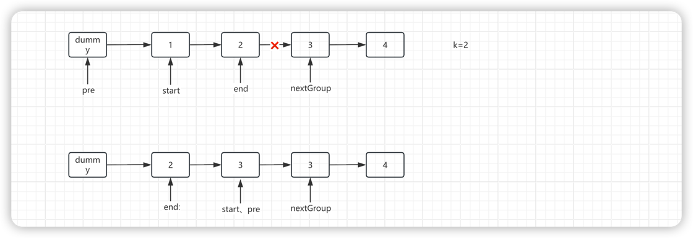

# 8.8.6 K个一组翻转链表

leetcode.25

## 1、反转链表

要求：将链表反转，返回头节点

```java
    public ListNode reverse(ListNode head){
        ListNode dummy=new ListNode(0);
        ListNode curr=head;
        while(curr != null){
            //暂存下一个节点
            ListNode next=curr.next;
            //头插法
            curr.next=dummy.next;
            dummy.next=curr;
            //处理下一个节点
            curr=next;
        }
        return dummy.next;
    }
```


## 2、K个一组翻转链表

**题目**：

给你链表的头节点 `head` ，每 `k` 个节点一组进行翻转，请你返回修改后的链表。

`k` 是一个正整数，它的值小于或等于链表的长度。如果节点总数不是 `k` 的整数倍，那么请将最后剩余的节点保持原有顺序。

你不能只是单纯的改变节点内部的值，而是需要实际进行节点交换。


**分析**：




**代码**：

```java
/**
 * Definition for singly-linked list.
 * public class ListNode {
 *     int val;
 *     ListNode next;
 *     ListNode() {}
 *     ListNode(int val) { this.val = val; }
 *     ListNode(int val, ListNode next) { this.val = val; this.next = next; }
 * }
 */
class Solution {
    public ListNode reverseKGroup(ListNode head, int k) {
        // 1. 初始化虚拟头节点（统一拼接逻辑）
        ListNode dummy = new ListNode(0);
        dummy.next = head;
        // pre：当前组的前驱节点（初始为dummy）
        ListNode pre = dummy;
        
        while (true) {
            // 2. 找到当前组的尾节点end（从pre.next开始走k-1步）
            ListNode end = pre;
            for (int i = 0; i < k; i++) {
                end = end.next;
                // 中途end为空，说明不足k个，直接返回结果
                if (end == null) {
                    return dummy.next;
                }
            }
            
            // 3. 记录关键节点：当前组头start，下一组头nextGroup
            ListNode start = pre.next;
            ListNode nextGroup = end.next;
            
            // 4. 断开当前组和下一组的连接（方便反转）
            end.next = null;
            // 5. 反转当前组（返回反转后的头节点）
            pre.next = reverse(start);
            // 6. 拼接：当前组的尾（原start）指向nextGroup
            start.next = nextGroup;
            
            // 7. 更新指针：pre移到当前组的尾（start），处理下一组
            pre = start;
        }
    }
     private ListNode reverse(ListNode head){
        ListNode dummy=new ListNode(0);
        ListNode curr=head;
        while(curr != null){
            //暂存下一个节点
            ListNode next=curr.next;
            //头插法
            curr.next=dummy.next;
            dummy.next=curr;
            //处理下一个节点
            curr=next;
        }
        return dummy.next;
    }   
}
```


