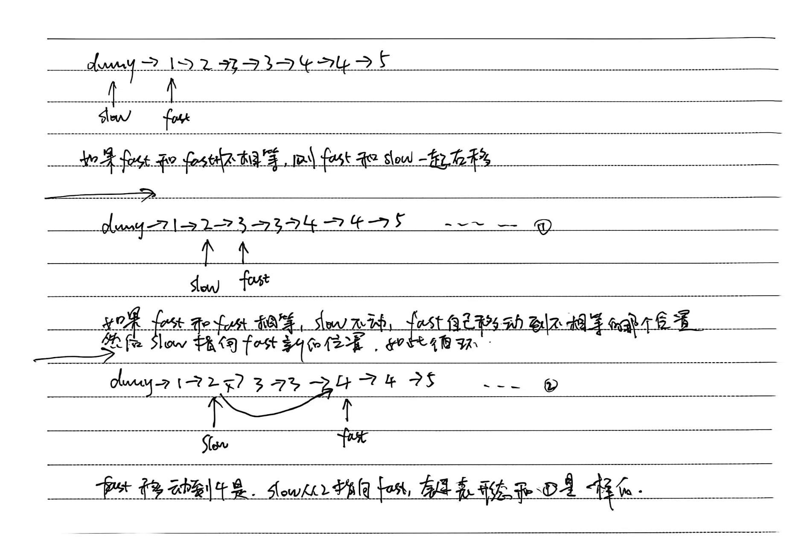

# 8.8.8 删除排序链表中的重复元素II

leetCode.82

**题目**：

给定一个已排序的链表的头 `head` ， *删除原始链表中所有重复数字的节点，只留下不同的数字* 。返回 *已排序的链表* 

**示例 1：**


```
输入：head = [1,2,3,3,4,4,5]
输出：[1,2,5]
```

**分析**：

双指针

- 如果fast和fast+1不相等，则fast和slow一起右移
- 如果fast和fast+1相等，slow不动，fast自己移动到不相等的那个位置
- 注意fast.next不能为空



**代码**：

```java
/**
 * Definition for singly-linked list.
 * public class ListNode {
 *     int val;
 *     ListNode next;
 *     ListNode() {}
 *     ListNode(int val) { this.val = val; }
 *     ListNode(int val, ListNode next) { this.val = val; this.next = next; }
 * }
 */
class Solution {
    public ListNode deleteDuplicates(ListNode head) {
        ListNode dummy=new ListNode(0);
        dummy.next=head;
        ListNode slow=dummy;
        ListNode fast=head;
        while (fast != null && fast.next != null){
            if (fast.val != fast.next.val){
                fast=fast.next;
                slow=slow.next;
            }else{
                while(fast.next != null && fast.val == fast.next.val){//注意这里需要再次判断fast.next!=null
                    fast=fast.next;
                }
                fast=fast.next;//注意：fast要再移动一下，才越过相等的元素
                slow.next=fast;
            }

        }
        return dummy.next;
    }
}
```

