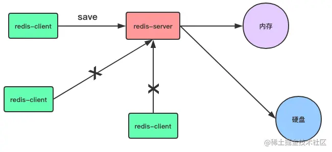
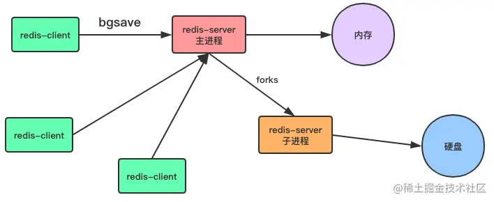
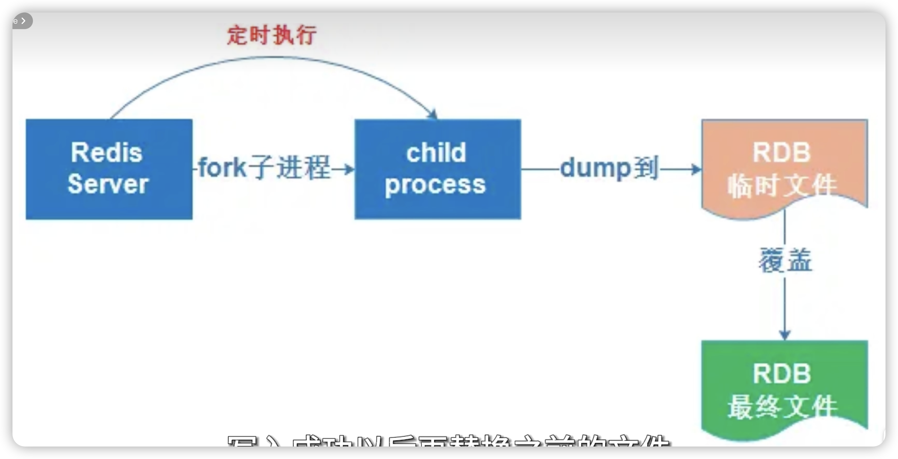
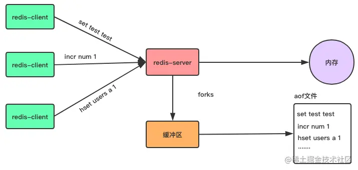
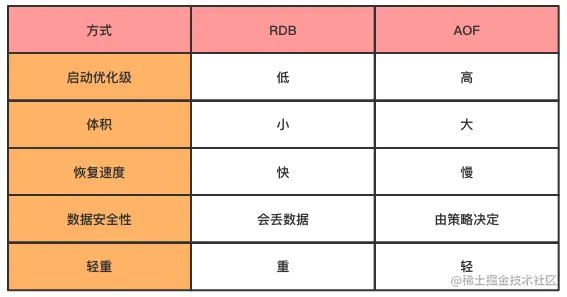

# 6.2 Redis持久化原理

Redis持久化方式有RDB和AOF

## 一、RDB

RDB 是⼀种快照存储持久化⽅式，具体就是将 Redis 某⼀时刻的内存数据保存到硬盘的⽂件当中，默认保存的⽂件名为 dump.rdb ，⽽在 Redis 服务器启动时，会重新加载 dump.rdb ⽂件的数据到内存当中恢复数据。

### 1、开启RDB持久化方式

- 命令生成：客户端可以通过向 Redis 服务器发送 save 或 bgsave 命令让服务器⽣成 rdb ⽂件
- 通过服务器配置⽂件指定触发 RDB 条件。

#### 1.1 命令生成方式

**save命令**：命令是⼀个同步操作，同步数据到磁盘上。当客户端向服务器发送 save 命令请求进⾏持久化时，服务器会阻塞 save 命令之后的其他客户端的请求，直到数据同步完成。

注意：如果数据量太⼤，同步数据会执⾏很久，⽽这期间Redis服务器也⽆法接收其他请求，所以，最好不要在⽣产环境使⽤ save 命令。

**bgsave命令**：bgsave 命令是⼀个异步操作，异步保存数据集到磁盘上

当客户端发服务发出 bgsave 命令时， Redis 服务器主进程会 forks ⼀个⼦进程来数据同步问题，在将数据保存到rdb⽂件之后，⼦进程会退出。

所以，与 save 命令相⽐， Redis 服务器在处理 bgsave 采⽤⼦线程进⾏IO写⼊，⽽主进程仍然可以接收其他请求。主进程其实会阻塞在fork()过程中，通常情况下该指令执行的速度比较快，对性能影响不大。

#### 1.2 服务器配置⽂件方式

**服务器配置⾃动触发：**除了通过客户端发送命令外，还有⼀种⽅式，就是在 Redis 配置⽂件中的 save 指定到达触发RDB持久化的条件，⽐如**【多少秒内⾄少达到多少写操作】就开启 RDB 数据同步。**

​		这种通过服务器配置⽂件触发RDB的⽅式，与bgsave命令类似，达到触发条件时，会forks⼀个⼦进程进⾏数据同步，不过最好不要通过这⽅式来触发RDB持久化，因为设置触发的时间太短，则容易频繁写⼊rdb⽂件，影响服务器性能，时间设置太⻓则会造成数据丢失。

### 2、RDB文件生成流程

前⾯介绍了三种让服务器⽣成rdb⽂件的⽅式，⽆论是由主进程⽣成还是⼦进程来⽣成，其过程如下：

1. ⽣成临时rdb⽂件，并写⼊数据。

2. 完成数据写⼊，⽤临时⽂代替代正式rdb⽂件。

3. 删除原来的db⽂件。

RDB默认⽣成的⽂件名为dump.rdb

### 3、RDB的优缺点

**优点：**

1. **恢复快。**与AOF⽅式相⽐，通过rdb⽂件恢复数据⽐较快。

2. **适合备份。**rdb⽂件⾮常紧凑，适合于数据备份。

3. **性能影响小。**通过RDB进⾏数据备，由于使⽤⼦进程⽣成，所以对Redis服务器性能影响较⼩。

4. **大规模。**适合⼤规模的数据恢复！

5. **完整性不高。**对数据的完整性要不⾼！

   **（又快又小，但完整性不高）**

**缺点：**

1. 宕机数据丢失。如果服务器宕机的话，采⽤ RDB 的⽅式会造成某个时段内数据的丢失，⽐如我们设置10分钟同步⼀次或5分钟达到1000次写⼊就同步⼀次，那么如果还没达到触发条件服务器就死机了，那么这个时间段的数据会丢失。
2. save阻塞。使⽤save命令会造成服务器阻塞，直接数据同步完成才能接收后续请求。
3. bgsave耗内存使⽤bgsave命令在forks⼦进程时，如果数据量太⼤，forks的过程也会发⽣阻塞，另外，forks⼦进程会耗费内存。

## 二、AOF

AOF(Append-only file) 。与 RDB 存储某个时刻的快照不同， AOF 持久化⽅式会记录客户端对服务器的每⼀次写操作命令，并将这些写操作以 Redis 协议追加保存到以后缀为 aof ⽂件末尾，在Redis服务器重启时，会加载并运⾏ aof ⽂件的命令，以达到恢复数据的⽬的。

### 1、开启AOF持久化方式

Redis默认不开启AOF持久化⽅式

**三种写入策略**

**always**：客户端的每⼀个写操作都保存到 aof ⽂件当，这种策略很安全，但是每个写请注都有IO操作，所以也很慢

**everysec**：appendfsync 的默认写⼊策略，每秒写⼊⼀次 aof ⽂件，因此，最多可能会丢失1s的数据。

**no**：Redis 服务器不负责写⼊ aof ，⽽是交由操作系统来处理什么时候写⼊ aof ⽂件。更快，但也是最不安全的选择，不推荐使⽤。

### 2、AOF重写

AOF将客户端的每⼀个写操作都追加到 aof ⽂件末尾，⽐如对⼀个key多次执⾏incr命令，这时候， aof 保存每⼀次命令到aof⽂件中，aof⽂件会变得⾮常⼤。

​		aof⽂件太⼤，加载aof⽂件恢复数据时，就会⾮常慢，为了解决这个问题，Redis⽀持aof⽂件重写，通过重写aof，可以⽣成⼀个恢复当前数据的最少命令集

重写的好处：1.、压缩aof⽂件，减少磁盘占⽤量。2、将aof的命令压缩为最⼩命令集，加快了数据恢复的速度。

### 3、AOF优缺点

**优点**：AOF只是追加⽇志⽂件，因此对服务器性能影响较⼩，速度⽐RDB要快，消耗的内存较少。
**（恢复慢、影响大，但是完整性更好）**

**缺点**：

1、 AOF⽅式⽣成的⽇志⽂件太⼤，即使通过AOF重写，⽂件体积仍然很⼤。
2、恢复数据的速度⽐RDB慢。

## 三、RDB和AOF对比

当RDB与AOF两种⽅式都开启时，Redis会优先使⽤AOF⽇志来恢复数据，因为AOF保存的⽂件⽐RDB⽂件更完整。

RDB特点：（又快又小，但完整性不高）
AOF特点：（恢复慢、影响大，但是完整性更好）

在实际应用中，可以同时开启RDB和AOF进行持久化，以便结合两者的优点

