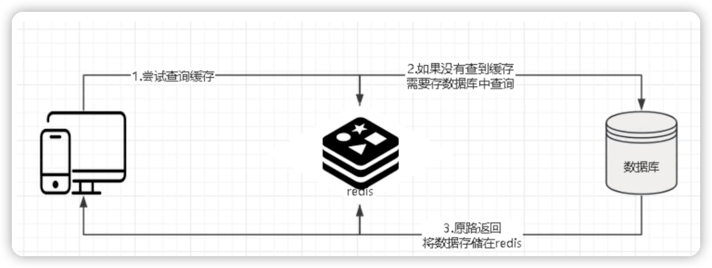
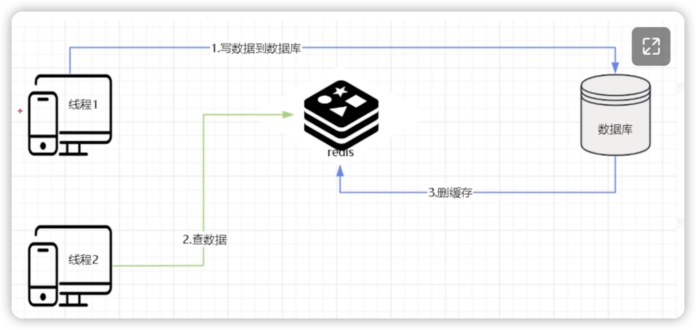
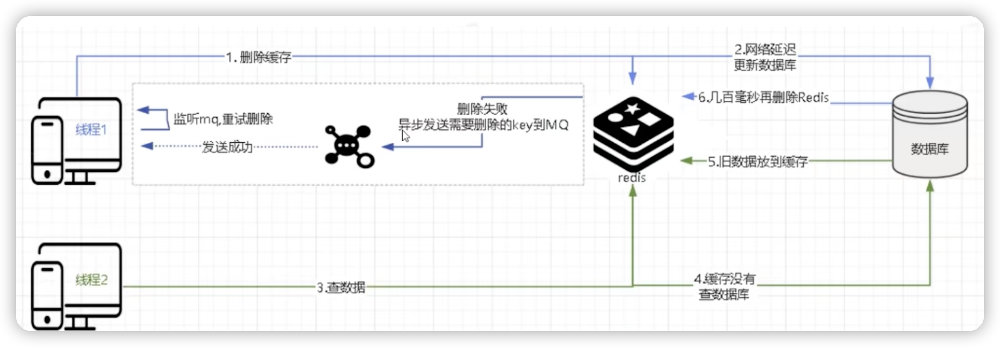

# 6.3 保证缓存和数据库的一致性

## 一、只读场景

**注意**：单独的只读去数据场景是不会出现不一致。只有读和写在一起才会出现。

逻辑如下：

1、当应用程序需要从数据库读取数据时，先检查缓存数据是否命中。
2、如果缓存命中，则查下数据库获取数据，同时将数据写到缓存中并设置过期时间，以便后续读取相同数据会命中缓存，最后再把数据返回给调用者。
3、如果缓存命中，直接返回。

## 二、并发读写数据场景

**先操作数据库再操作缓存**

线程1先修改数据库，修改过程中线程2查询数据，查的是老数据，然后返回。线程1最终会删掉redis，然后下一个线程进来，查到redis中没有，会把数据库中查询的新数据更新到redis，能保证最终一致性。所以更推荐先操作数据库，再操作缓存。

​		缺点是操作数据库的时候，其他线程进来查到的是修改前的脏数据，但最终还是保证了数据的最终一致性。

​		**先操作数据库再操作缓存还是存在问题，问题是删除缓存的时候失败了**，后面一直查到的都是老数据，必须要等待redis过期之后才能查到新数据。

​		针对删除失败的情况，可以采用删除重试的机制。

### 1、删除缓存重试机制

如果删除缓存失败怎么办？比如延迟双删的第二次删除失败，那岂不是无法删除脏数据。

使用重试机制，保证删除缓存成功。

比如重试3次，3次都失败则记录日志到数据库并发送警告让人工介入，在高并发的场景下，**重试最好使用异步方式**，比如发送消息到mq中间件，实现异步解耦。

第（6）步如果删除失败且未达到重试最大次数则将消息重新如对，直到删除成功，否则就记录到数据库，人工介入。

该方法有个**缺点**，就是**对业务代码中造成侵入，代码过于耦合**。如果要实现解耦的话，那么采用canal组件canal读取binlog异步删除。

