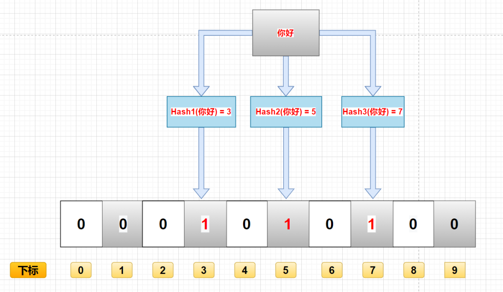
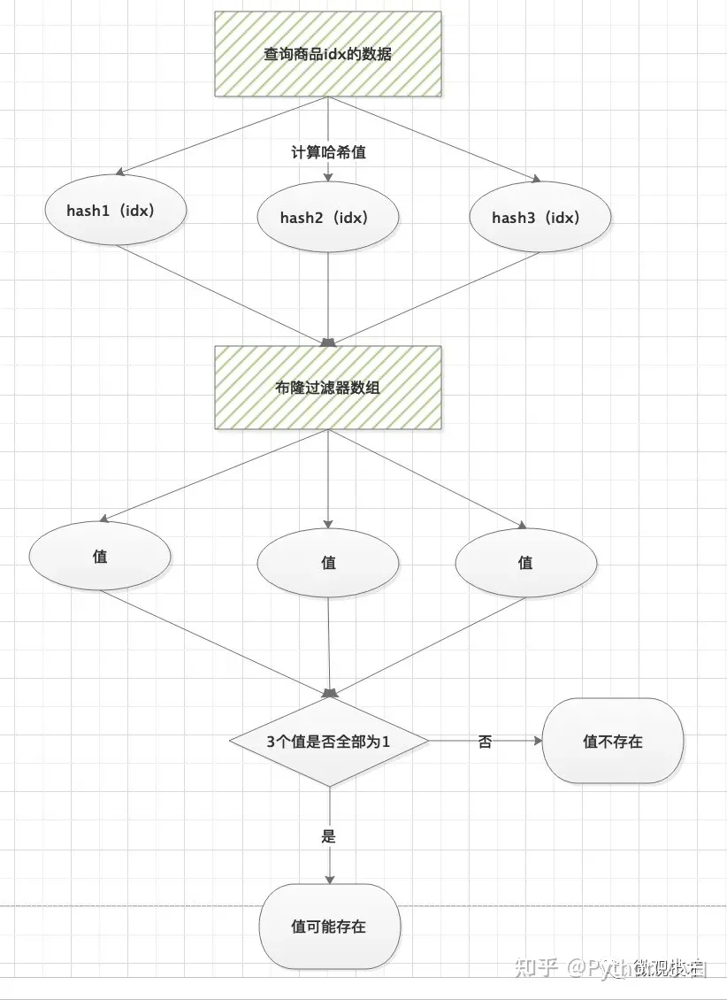
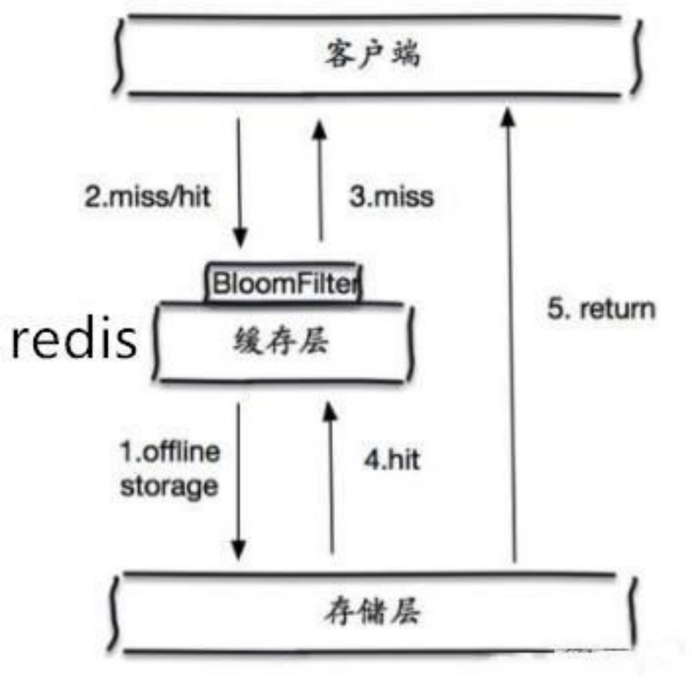
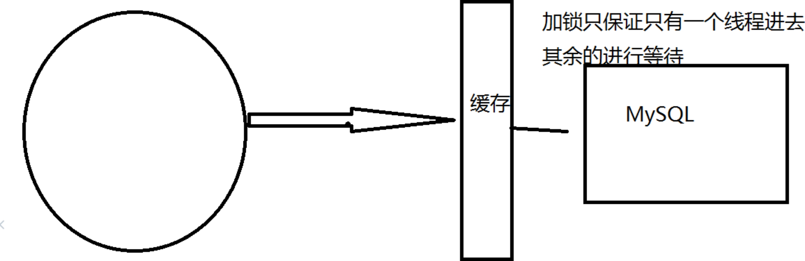
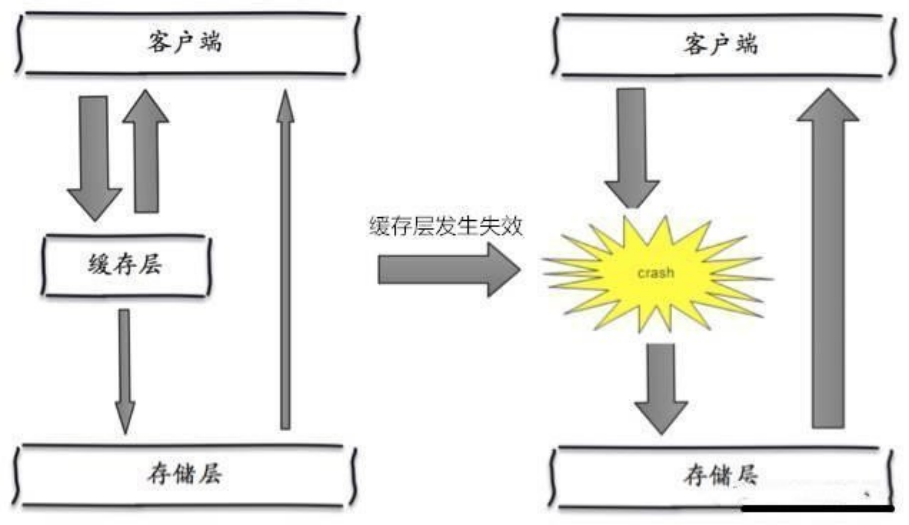

# 6.4 缓存穿透、缓存击穿、缓存雪崩

## 一、缓存穿透

**缓存穿透：**⽤户想要查询⼀个数据，发现redis内存数据库没有，也就是缓存没有命中，于是向持久层数据库查询，当⽤户很多的时候，缓存都没有命中，于是都去请求了持久层数据库。这会给持久层数据库造成很⼤的压⼒，这时候就相当于出现了缓存穿透。

解决方法是：**布隆过滤器**和**缓存空对象**

### 1、布隆过滤器

布隆过滤器是⼀种数据结构，对所有可能查询的参数以hash形式存储，可以用于检索一个元素是否在一个集合中，在控制层先进⾏校验，不符合则丢弃，从⽽避免了对底层存储系统的查询压⼒。

如果还是不太好理解的话，就可以把布隆过滤器理解为一个set集合，我们可以通过add往里面添加元素，通过contains来判断是否包含某个元素。

**用途**：

- 解决Redis缓存穿透（今天重点讲解）
- 在爬虫时，对爬虫网址进行过滤，已经存在布隆中的网址，不在爬取。
- 垃圾邮件过滤，对每一个发送邮件的地址进行判断是否在布隆的黑名单中，如果在就判断为垃圾邮件。

**布隆过滤器存入过程原理**：

布隆过滤器上面说了，就是一个二进制数据的集合。当一个数据加入这个集合时，经历如下洗礼（这里有缺点，下面会讲）：

- 通过K个哈希函数计算该数据，返回K个计算出的hash值
- 这些K个hash值映射到对应的K个二进制的数组下标
- 将K个下标对应的二进制数据改成1。

例如，第一个哈希函数返回x，第二个第三个哈希函数返回y与z，那么：X、Y、Z对应的二进制改成1。

**布隆过滤器查询过程原理：**

布隆过滤器主要作用就是查询一个数据，在不在这个二进制的集合中，查询过程如下：

- 通过K个哈希函数计算该数据，对应计算出的K个hash值
- 通过hash值找到对应的二进制的数组下标
- 判断：如果存在一处位置的二进制数据是0，那么该数据不存在。如果都是1，该数据存在集合中。（这里有缺点，下面会讲）

**布隆过滤器删除过程**

一般不能删除布隆过滤器里的数据，这是一个缺点之一，我们下面会分析。

**优点**

- 由于存储的是二进制数据，所以占用的空间很小
- 它的插入和查询速度是非常快的，时间复杂度是O（K），可以联想一下HashMap的过程
- 保密性很好，因为本身不存储任何原始数据，只有二进制数据
- 一个元素如果在布隆过滤器里判定结果为**不存在，则一定不存在**

**缺点**

- 存在误判：假如上面的图没有存"`hello`"，只存了"`你好`"，那么用"`hello`"来查询的时候，会判断"`hello`"存在集合中。

  因为“`你好`”和“`hello`”的hash值是相同的，通过相同的hash值，找到的二进制数据也是一样的，都是1。

- 删除困难

假设我们的Redis里存有一组用户的注册email，以email作为Key存在，同时它对应着DB里的User表的部分字段。

一般来说，一个合理的请求过来我们会先在Redis里判断这个用户是否是会员，因为从缓存里读数据返回快。如果这个会员在缓存中不存在那么我们会去DB中查询一下。

现在试想，有千万个不同IP的请求（不要以为没有，我们就在2018年和2019年碰到了，因为攻击的成本很低）带着Redis里根本不存在的key来访问你的网站，这时我们来设想一下：

请求到达Web服务器；
请求派发到应用层->微服务层；
请求去Redis捞数据，Redis内不存在这个Key；
于是请求到达DB层，在DB建立connection后进行一次查询
千万乃至上亿的DB连接请求，先不说Redis是否撑的住DB也会被瞬间打爆。这就是“Redis穿透”又被称为“缓存击穿”，它会打爆你的缓存或者是连DB一起打爆进而引起一系列的“雪崩效应”。

怎么防
那就是使用布隆过滤器，可以把所有的user表里的关键查询字段放于Redis的bloom过滤器内。有人会说，这不疯了，我有4000万会员？so what！
ps：布隆过滤器另一个用途——推荐去重
例如新闻客户端的推送去重功能，当推荐系统推荐新闻时会从每个用户的历史记录里进行筛选，过滤掉那些已经存在的记录。

### 2、缓存空对象

当存储层不命中后，即使返回的空对象也将其缓存起来，同时会设置⼀个过期时间，之后再访问这个数 据将会从缓存中获取，保护了后端数据源；但是这种⽅法会存在两个问题：
1、如果空值能够被缓存起来，这就意味着缓存需要更多的空间存储更多的键，因为这当中可能会有很多的空值的键；
2、即使对空值设置了过期时间，还是会存在缓存层和存储层的数据会有⼀段时间窗⼝的不⼀致，这对于 需要保持⼀致性的业务会有影响。

## 二、缓存击穿

​		**缓存击穿（量太⼤，缓存过期！）：**这⾥需要注意和缓存击穿的区别，缓存击穿，是指**⼀个key⾮常热点**，在不停的扛着⼤并发，⼤并发集中对这⼀个点进⾏访问，当这个key在失效的瞬间，持续的⼤并发就穿破缓存，直接请求数据库，就像在⼀个屏障上凿开了⼀个洞。由于缓存过期，会同时访问数据库来查询最新数据，并且回写缓存，会导使数据库瞬间压⼒过⼤。

解决方案1：设置热点数据永不过期

解决方案2：加互斥锁

​		分布式锁：使⽤分布式锁，保证对于每个key同时只有⼀个线程去查询后端服务，其他线程没有获得分布式锁的权限，因此只需要等待即可。这种⽅式将⾼并发的压⼒转移到了分布式锁，因此对分布式锁的考 验很⼤。

## 三、缓存雪崩

缓存雪崩，是指在某⼀个时间段，缓存集中过期失效。Redis 宕机！

​		产⽣雪崩的原因之⼀，⽐如在写本⽂的时候，⻢上就要到双⼗⼆零点，很快就会迎来⼀波抢购，这波商 品时间⽐较集中的放⼊了缓存，假设缓存⼀个⼩时。那么到了凌晨⼀点钟的时候，这批商品的缓存就都 过期了。⽽对这批商品的访问查询，都落到了数据库上，对于数据库⽽⾔，就会产⽣周期性的压⼒波 峰。于是所有的请求都会达到存储层，存储层的调⽤量会暴增，造成存储层也会挂掉的情况。

解决方案：

### redis高可用

​		这个思想的含义是，既然redis有可能挂掉，那我多增设⼏台redis，这样⼀台挂掉之后其他的还可以继续⼯作，其实就是搭建的集群。（异地多活！）

### 限流降级（在SpringCloud讲解过！）

​		这个解决⽅案的思想是，在缓存失效后，通过加锁或者队列来控制读数据库写缓存的线程数量。⽐如对 某个key只允许⼀个线程查询数据和写缓存，其他线程等待。（Java并发里面的**控制并发线程数Semaphore**)

### 数据预热

​		数据加热的含义就是在正式部署之前，我先把可能的数据先预先访问⼀遍，这样部分可能⼤量访问的数 据就会加载到缓存中。在即将发⽣⼤并发访问前⼿动触发加载缓存不同的key，设置不同的过期时间，让缓存失效的时间点尽量均匀。

