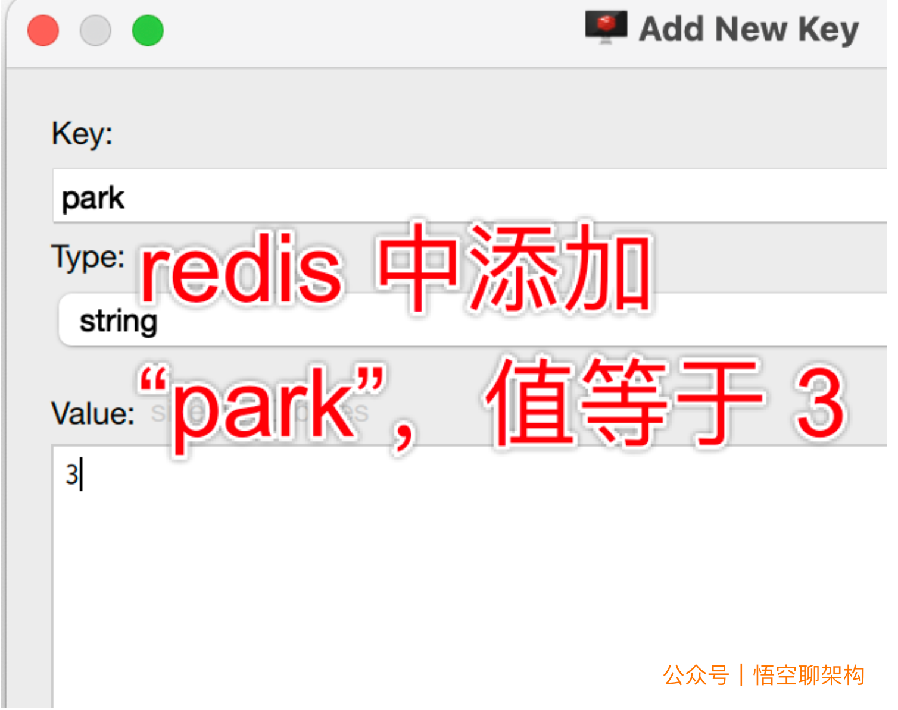

# 6.5 Redisson分布式锁

## 一、Redisson概念

**原理**

- 基于NIO的Netty框架
- 将Redis原生数据结构进行封装
- 分布式锁基础上还提供了读写锁、公平锁、红锁、信号量、闭锁等

**jedis和redisson分布式锁实现方式区别**

- Jedis锁不具有可重入性，redisson具有可重入性
- jedis是只支持单机的，redisson支持集群模式
- redisson`目前是官方唯一推荐的java版的分布式锁,他支持 `redlock

### 1、整合Redssion

**依赖**

```xml
<!-- https://mvnrepository.com/artifact/org.redisson/redisson -->
<dependency>
    <groupId>org.redisson</groupId>
    <artifactId>redisson</artifactId>
    <version>3.15.5</version>
</dependency>
```

**配置类**

```java
@Configuration
public class MyRedissonConfig {
    /**
     * 对 Redisson 的使用都是通过 RedissonClient 对象
     * @return
     * @throws IOException
     */
    @Bean(destroyMethod="shutdown") // 服务停止后调用 shutdown 方法。
    public RedissonClient redisson() throws IOException {
        // 1.创建配置
        Config config = new Config();
        // 集群模式
        // config.useClusterServers().addNodeAddress("127.0.0.1:7004", "127.0.0.1:7001");
        // 2.根据 Config 创建出 RedissonClient 示例。
        config.useSingleServer().setAddress("redis://127.0.0.1:6379");
        return Redisson.create(config);
    }
}

```

### 2、分布式可重入锁

- 可重入锁是阻塞的。例如线程A获取锁还未释放锁的状态下，线程B获取同一把锁会处于阻塞状态，直到A释放锁（线程B也可以尝试的获取锁，也就是说获取不到可以直接返回）
- Redis服务停了，Redisson会自动释放锁。如果线程A还未释放锁，Redis服务就突然停了，如果不释放的话，就会成为死锁，阻塞其它线程获取锁。Redssion有看门狗锁检查机制，它的作用是在 Redisson 实例被关闭前，不断的延长锁的有效期。如果我们未制定 lock 的超时时间，就使用 30 秒作为看门狗的默认时间。只要占锁成功，就会启动一个`定时任务`：每隔 10 秒重新给锁设置过期的时间，过期时间为 30 秒。

### 3、设置锁过期时间

我们也可以通过给锁设置过期时间，让其自动解锁。

```java
lock.lock(8, TimeUnit.SECONDS);
```

## 二、Redisson的实现

示例代码：

```java
// 1.设置分布式锁
RLock lock = redisson.getLock("lock");
// 2.占用锁
lock.lock();
try {
        // 3.执行业务
    } catch (Exception e) {
        //TODO
    } finally {
        // 3.解锁
        lock.unlock();
    }
```


### 1、分布式读写锁

读写锁相关概念参考文章：[读写锁](https://ranqingisfine.github.io/myBlog/%E5%9B%9B%E3%80%81%E5%B9%B6%E5%8F%91%E7%BC%96%E7%A8%8B/4.5%20Java%E4%B8%AD%E7%9A%84%E9%94%81/4.5.4%20%E8%AF%BB%E5%86%99%E9%94%81.html)

基于 Redis 的 Redisson 分布式可重入读写锁`RReadWriteLock` Java 对象实现了`java.util.concurrent.locks.ReadWriteLock`接口。其中读锁和写锁都继承了 `RLock`接口。

写锁是一个拍他锁（互斥锁），读锁是一个共享锁。

- 读锁 + 读锁：相当于没加锁，可以并发读。
- 读锁 + 写锁：写锁需要等待读锁释放锁。
- 写锁 + 写锁：互斥，需要等待对方的锁释放。
- 写锁 + 读锁：读锁需要等待写锁释放。


 Redisson 还通过加锁的方法提供了`leaseTime`的参数来指定加锁的时间。超过这个时间后锁便自动解开了。

```java
// 10秒钟以后自动解锁
// 无需调用unlock方法手动解锁
rwlock.readLock().lock(10, TimeUnit.SECONDS);
// 或
rwlock.writeLock().lock(10, TimeUnit.SECONDS);
// 尝试加锁，最多等待100秒，上锁以后10秒自动解锁
boolean res = rwlock.readLock().tryLock(100, 10, TimeUnit.SECONDS);
// 或
boolean res = rwlock.writeLock().tryLock(100, 10, TimeUnit.SECONDS);
...
lock.unlock();
```

### 2、分布式信号量

关于信号量的使用大家可以想象一下这个场景，有三个停车位，当三个停车位满了后，其他车就不停了。可以把车位比作信号，现在有三个信号，停一次车，用掉一个信号，车离开就是释放一个信号。


我们用 Redisson 来演示上述停车位的场景。
先定义一个占用停车位的方法：

```java
/**
* 停车，占用停车位
* 总共 3 个车位
*/
@ResponseBody
@RequestMapping("park")
public String park() throws InterruptedException {
  // 获取信号量（停车场）
  RSemaphore park = redisson.getSemaphore("park");
  // 获取一个信号（停车位）
  park.acquire();

  return "OK";
}

```

再定义一个离开车位的方法：

```java
/**
 * 释放车位
 * 总共 3 个车位
 */
@ResponseBody
@RequestMapping("leave")
public String leave() throws InterruptedException {
    // 获取信号量（停车场）
    RSemaphore park = redisson.getSemaphore("park");
    // 释放一个信号（停车位）
    park.release();

    return "OK";
}

```

为了简便，我用 Redis 客户端添加了一个 key：“park”，值等于 3，代表信号量为 park，总共有三个值。



**注意**：多次执行释放信号量操作，剩余信号量会一直增加，而不是到 3 后就封顶了。


### 3、其他分布式锁

- 公平锁（Fair Lock）
- 联锁（MultiLock）
- 红锁（RedLock）
- 读写锁（ReadWriteLock）
- 可过期性信号量（PermitExpirableSemaphore）
- 闭锁（CountDownLatch）


参考文章：https://xie.infoq.cn/article/d8e897f768eb1a358a0fd6300

