# OpenClaw本地化部署

```
- windows11专业版
- ubuntu
- Clash Verge
```

## 一、安装WSL

任务管理器里面查看是否已启用虚拟化，若已启用，则支持在windows11 wsl支持直接安装ubuntu

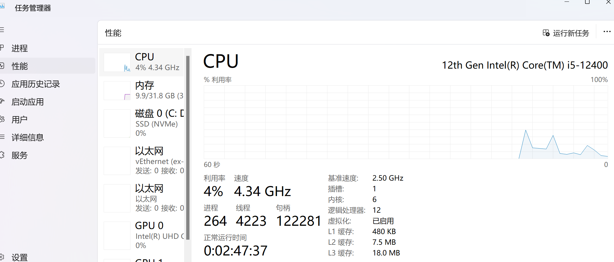

以管理员身份运行powershell，

```shell
# 安装wsl
wsl --install
# 重启电脑
wsl --install ubuntu-24.04
```

Q&A：

- 安装wsl 无法解析服务器的名称或地址	--host文件新增解析地址185.199.108.133 raw.githubusercontent.com


## 二、网络设置

需要让ubuntu具备访问外网的能力

获取订阅地址https://xxx

复制订阅配置链接，然后在clash verge里导入此配置链接[Clash Verge 使用教程『从入门到精通』 - Clash中文官网](https://clashare.com.cn/windows-tutorial/602.html)，开启**系统代理**后，win就可以访问google了。

接下来在wsl里面配置，让ubuntu也能访问google

- 获取win宿主机的正确ip，在 WSL 终端里执行这条命令，就能直接拿到 Windows 的 IP：

  ```shell
  HOST_IP=$(ip route show default | awk '{print $3}')
  echo $HOST_IP
  ```

- 配置clash verge，勾选局域网连接，确认端口7890

  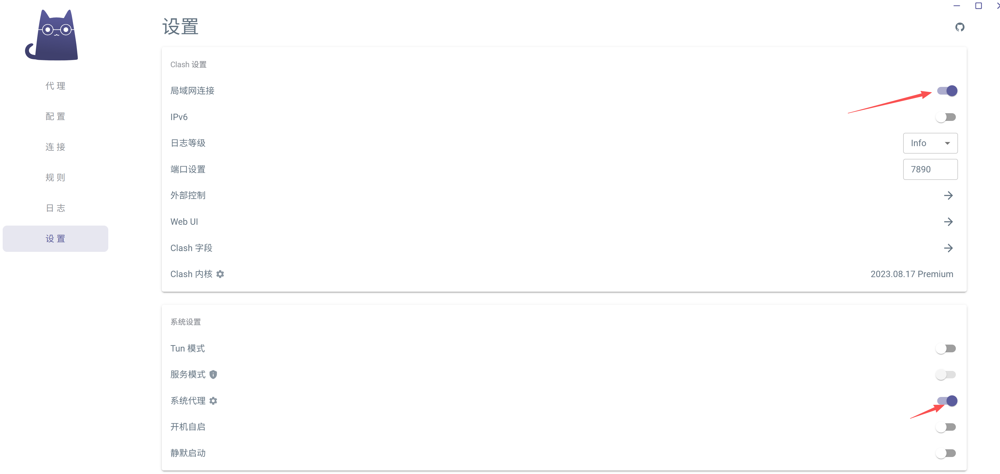

- 配置WSL代理，编辑 `~/.bashrc` 文件，把上面的 `export` 命令加在末尾，这样每次打开终端都会自动配置代理：

  ```shell
  nano ~/.bashrc
  # 在文件末尾粘贴（替换 HOST_IP 为你的实际 IP）
  export http_proxy="http://HOST_IP:7890"
  export https_proxy="http://HOST_IP:7890"
  export all_proxy="socks5://HOST_IP:7890"
  export no_proxy="localhost,127.0.0.1,::1,172.16.0.0/12"
  # 保存退出后执行
  source ~/.bashrc
  ```


## 三、安装openclaw

```shell
# wsl终端执行
curl -fssL https://openclaw.ai/install.sh | bash
```

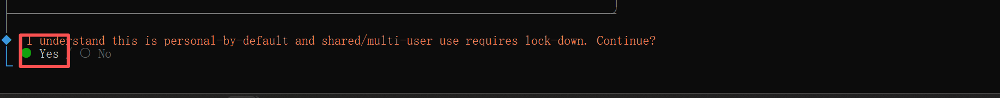

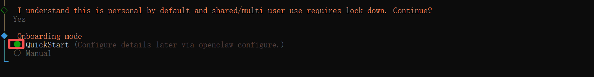

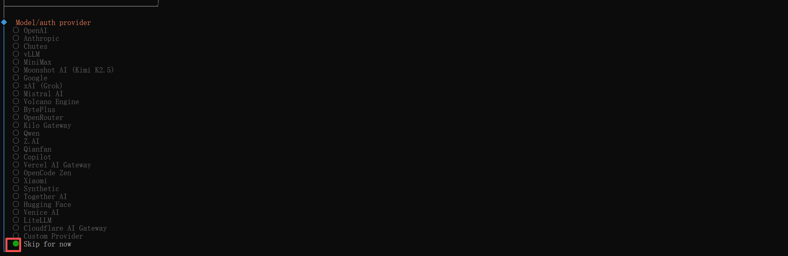

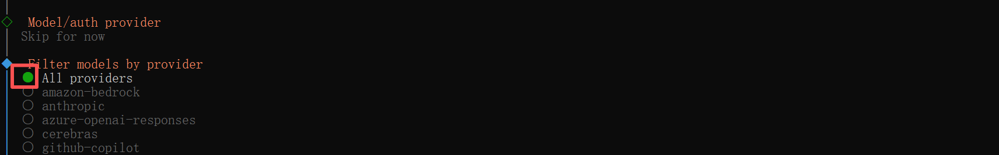

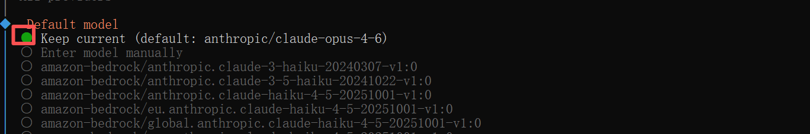

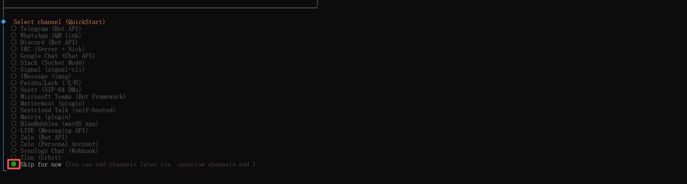

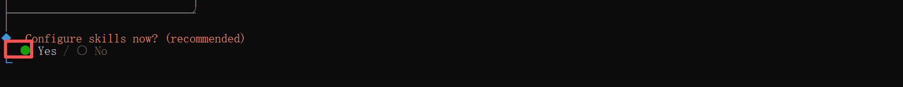

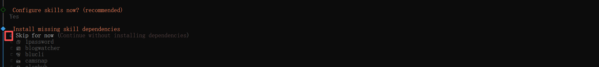

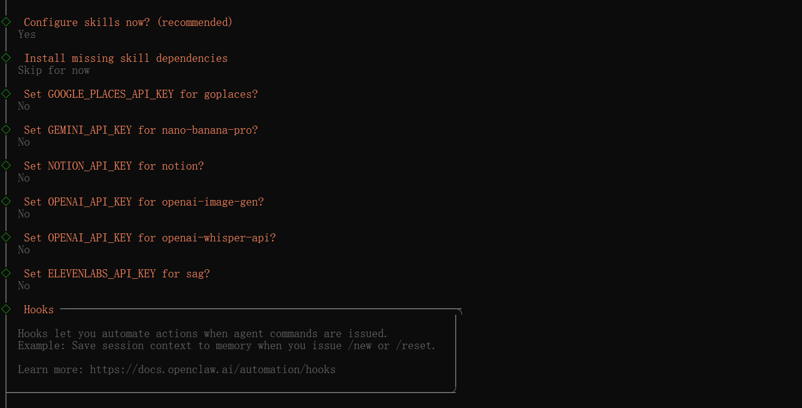

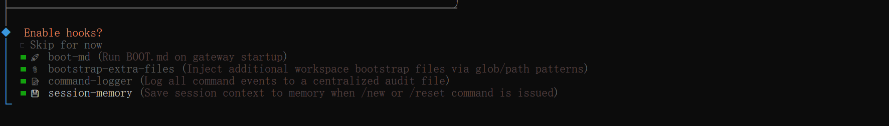

这时会遇到问题：Error: systemctl is-enabled unavailable: Command failed: systemctl --user is-enabled openclaw-gateway.service

解决办法：

- 确保wsl已开启systemd

  ```shell
  # 编辑 WSL systemd 配置
  sudo nano /etc/wsl.conf
  ```

  确认为true

  ```shell
  [boot]
  systemd=true
  ```

- 手动安装并激活网关服务

  ```shell
  # 1. 重新安装网关服务（核心步骤，修复"not installed"问题）
  openclaw gateway install
  
  # 2. 重新加载 systemd 用户配置
  systemctl --user daemon-reload
  
  # 3. 启用并立即启动网关服务
  systemctl --user enable --now openclaw-gateway.service
  
  # 4. 检查服务状态（验证是否启动成功）
  systemctl --user status openclaw-gateway.service
  ```

- doctor验证修复结果

  ```shell
  openclaw doctor --fix
  ```

- 回到一开始配置openclaw的位置

  ```shell
  openclaw onboard --install-daemon
  ```

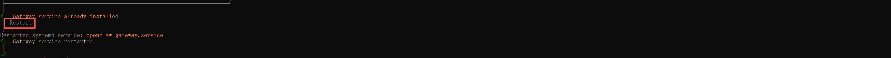

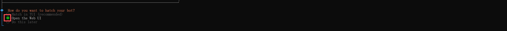

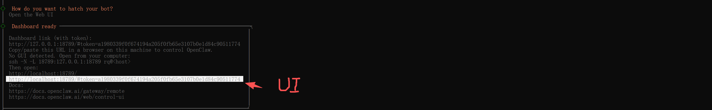

## 四、LLM配置

```shell
# 终端配置
openclaw config
```

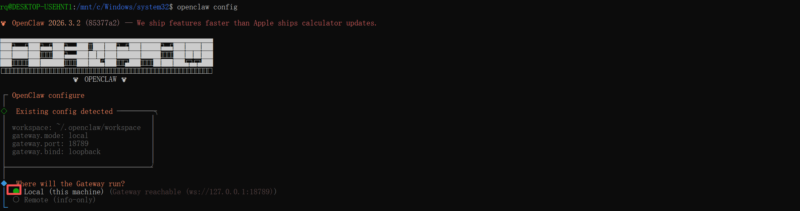

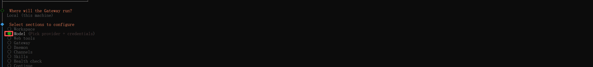

模型选择，我想要免费且性能好的，这里我选择Qwen（不用科学上网也能调），打开链接，用google账号登陆即可

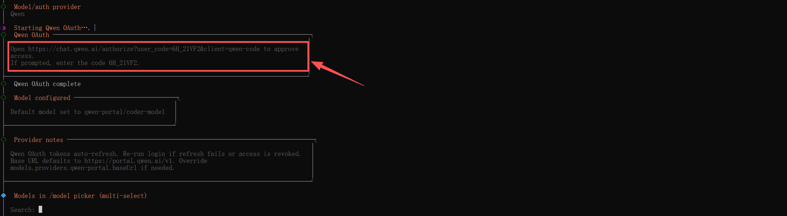

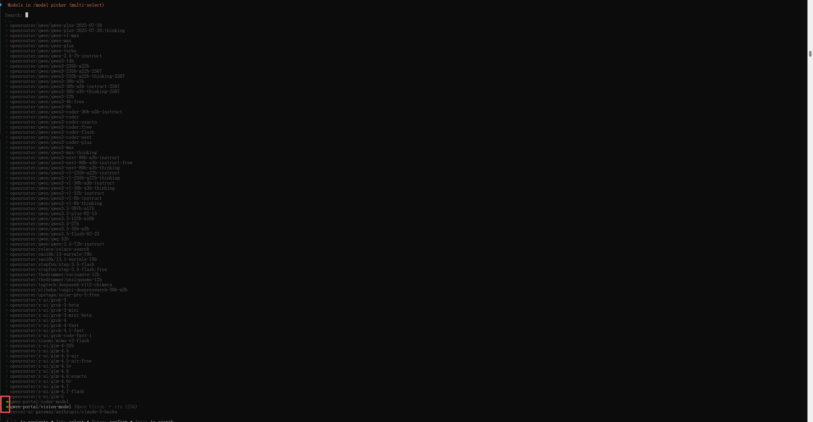

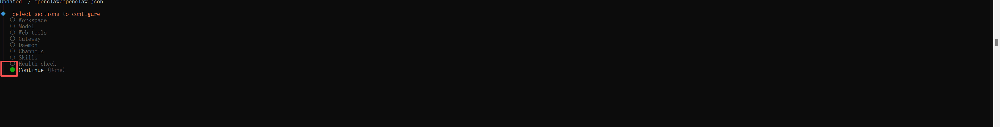

```shell
# 查看当前大模型的配置
openclaw models status
```


## 五、连接聊天工具

```shell
# 终端配置
openclaw config
```

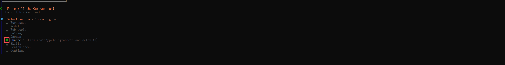

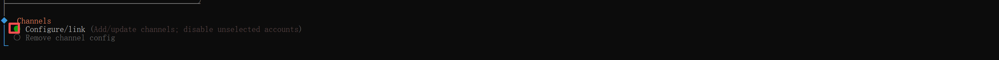

telegram注册要收7块的短信费，且收不到短信（无语。。。），WhatsApp也无法收到短信，遂放弃，用飞书就可以了

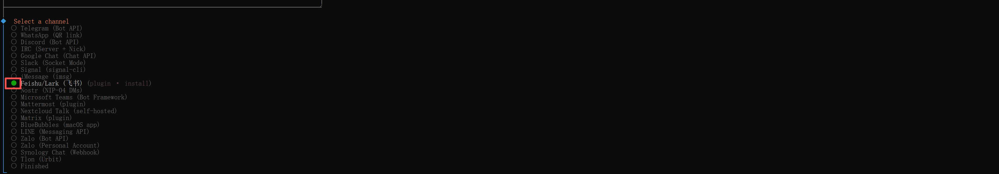

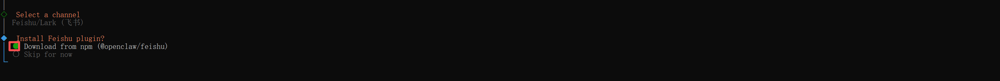

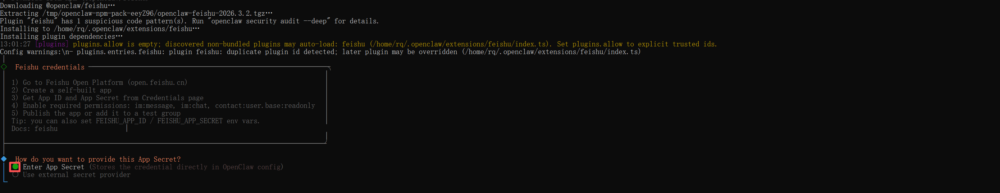

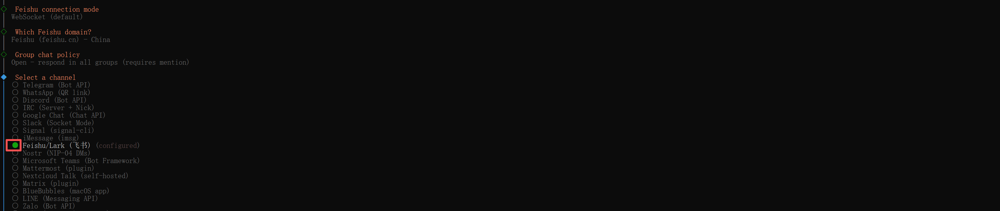

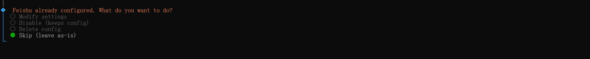

参考这篇文章更好：[(99+ 封私信 / 80 条消息) 从零配置 OpenClaw 飞书机器人：我的踩坑与成功之旅 - 知乎](https://zhuanlan.zhihu.com/p/2010300549166307318)
