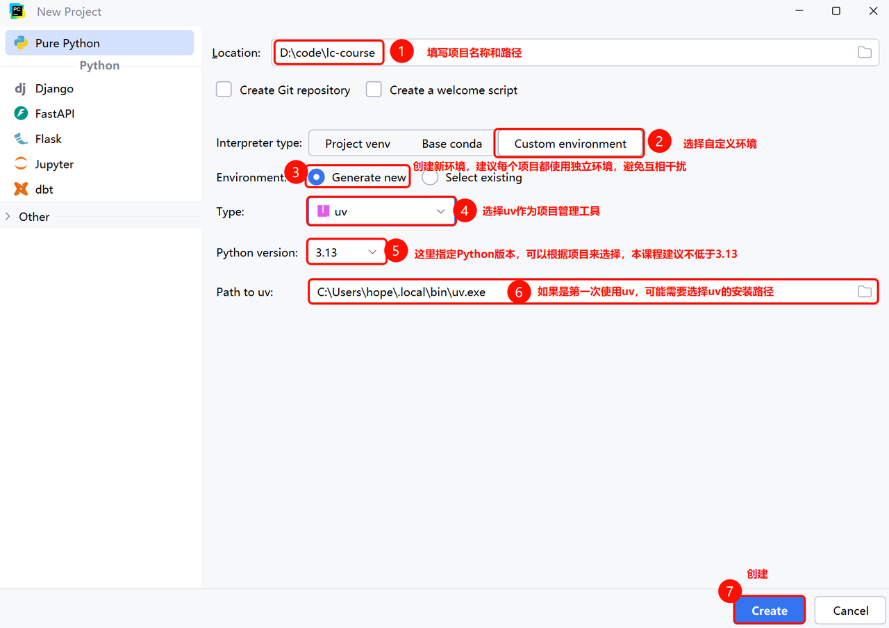
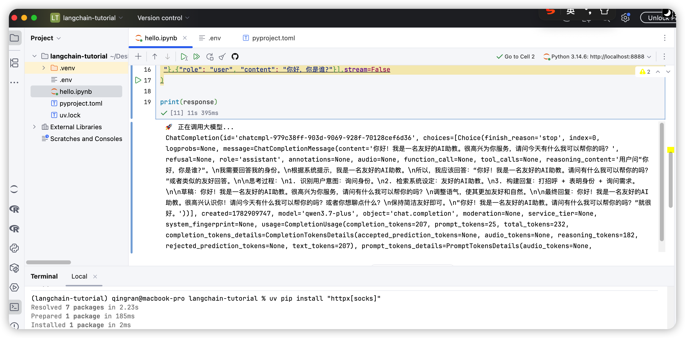
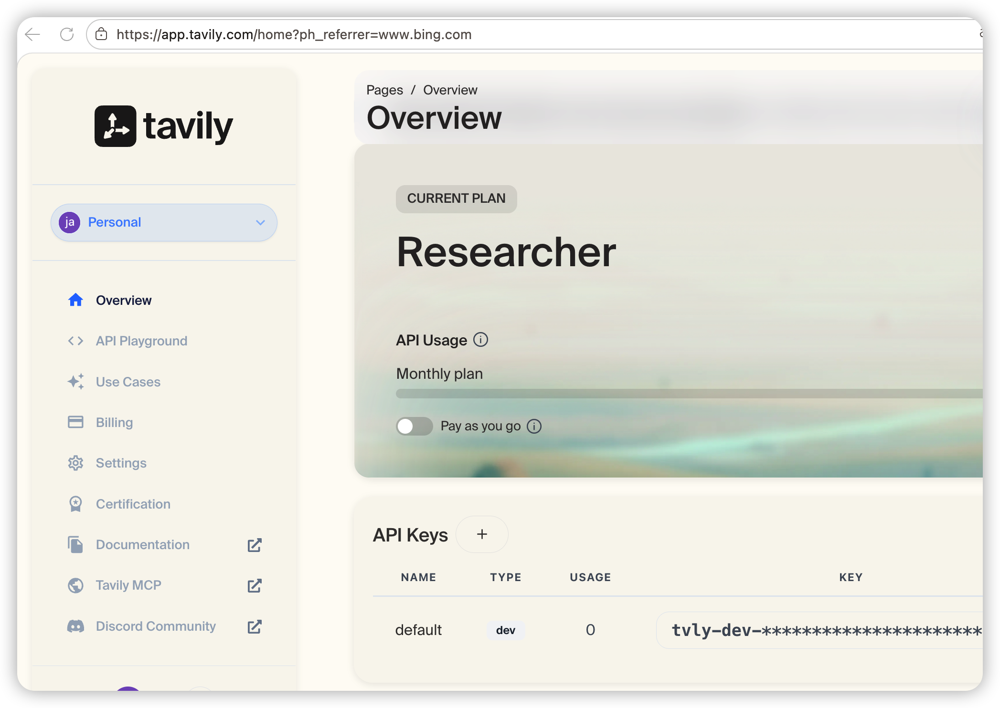
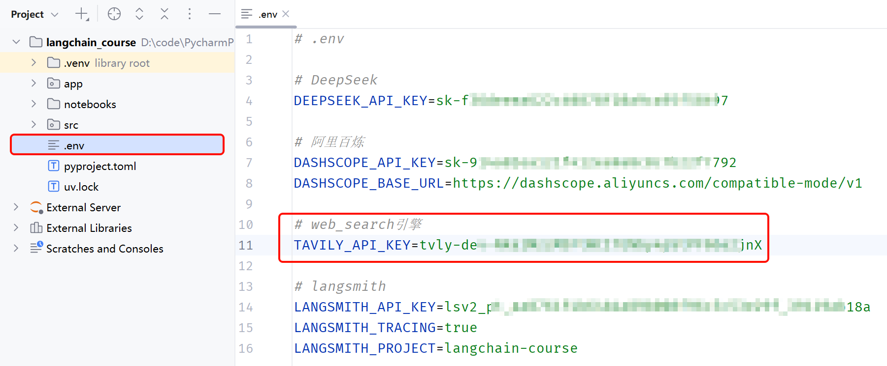

# Agent开发实战

Agent入门：

- AI通识
- LangChain组件
- Agent开发
- LangSmith监控调试
- 私厨管家项目实战

Agent进阶：

- Runtime
- Middleware
- MCP 
- Multi-Agent
- Agent-Chat-UI
- 邮件助手项目实战

RAG Agent：

- RAG原理
- Milvus
- 查询优化
- 知识检索优化
- 系统评估
- 个人知识库

LangGraph：

- 基本概念
- 流程控制
- 记忆管理
- 常见workFlow
- 个人智能助手实战

## 一、LangChain基础

### 1、概述

Agent = 模型 + 框架。LangChain 提供 `create_agent` ：一个极简且高度可配置的框架。该框架涵盖模型循环之外的所有要素：提示词、工具以及任何塑造行为的中间件。从基础原语出发，组合出完全契合您用例的方案。支持 OpenAI、Anthropic、Google 等更多平台。

**LangChain vs. LangGraph vs. Deep Agents**

```
- 若需“开箱即用”的智能体（具备自动上下文压缩、虚拟文件系统及子智能体生成等功能），请从 Deep Agents 入手。Deep Agents 基于 LangChain 智能体构建，您也可直接使用 LangChain 智能体。
- 使用 LangChain（ create_agent ）构建高度可定制的框架，轻松适配您的用例和数据。
- 使用 LangGraph（我们的底层编排框架）满足高级需求，结合确定性工作流与智能体工作流。
- 使用 LangSmith 追踪、调试和评估基于上述任一框架构建的智能体。请参照追踪快速入门指南完成设置。我们还建议您配置    	LangSmith Engine，用于监控追踪数据、检测问题并提出修复方案
```

**创建智能体**

本示例演示了如何使用自定义工具创建一个简单的 LangChain 代理：

```python
# pip install -qU langchain "langchain[openai]"
from langchain.agents import create_agent

def get_weather(city: str) -> str:
    """Get weather for a given city."""
    return f"It's always sunny in {city}!"

agent = create_agent(
    model="openai:gpt-5.5",
    tools=[get_weather],
    system_prompt="You are a helpful assistant",
)

result = agent.invoke(
    {"messages": [{"role": "user", "content": "What's the weather in San Francisco?"}]}
)
print(result["messages"][-1].content_blocks)
```

使用 LangSmith 追踪请求、调试智能体行为并评估输出。设置 `LANGSMITH_TRACING=true` 和您的 API 密钥即可开始使用。

LangChain核心优势：

- 使用统一接口调用不同提供商的聊天模型、嵌入模型等功能。只需极少的代码更改即可切换模型，并随着需求演变保持应用的可移植性
- 从 `create_agent` 这一最小化框架起步，通过中间件逐步扩展功能。仅组合您的用例所需组件，涵盖防护机制、重试策略、路由逻辑及自定义工具策略等。
- LangChain 的代理构建于 LangGraph 之上。这使我们能够利用 LangGraph 的持久执行、人机协同支持、状态持久化等功能
- 在一个地方检查追踪、工具调用、状态转换和延迟。利用执行数据发现故障模式、评估质量并改进智能体行为

### 2、快速入门

#### 2.1 开发环境准备

- 选择uv作为项目管理工具，参考官网进行安装[安装UV](https://docs.astral.sh/uv/)

- 添加镜像源

  ```shell
  # mac or linux
  echo 'export UV_DEFAULT_INDEX=https://pypi.tuna.tsinghua.edu.cn/simple' >> ~/.zshrc && source ~/.zshrc
  # 阿里云
  https://mirrors.aliyun.com/pypi/simple/
  # 腾讯云
  https://mirrors.cloud.tencent.com/pypi/simple/
  # 火山引擎
  https://mirrors.volces.com/pypi/simple/
  # 华为云
  https://mirrors.huaweicloud.com/repository/pypi/simple/
  # 清华大学
  https://pypi.tuna.tsinghua.edu.cn/simple/
  # 中国科学技术大学
  https://pypi.mirrors.ustc.edu.cn/simple/
  
  ```

- 创建项目

  打开PyCharm，创建Project

  

为了方便学习，使用jupyter，所以需要在项目中引入notebook依赖。

```shell
uv add notebook
```

可以新建一个notebook进行测试


#### 2.2 安装OpenAI的SDK

使用uv安装

```bash
uv add openai
```

接下来，就可以使用SDK调用任何兼容OpenAI规范的模型了，只要将base_url和api_key设定为对应的模型提供者的url和api_key即可：

```python
from openai import OpenAI
client = OpenAI(
    api_key="sfxxxxx",
    base_url="https://api.deepseek.com"
)

print("🚀 正在调用大模型...")
response = client.chat.completions.create(
    model="deepseek-chat",
    messages=[
        {"role": "system", "content": "你是一名友好的AI助教。"},
        {"role": "user", "content": "你好，你是谁?"}
    ],
    stream=False
)

print(response)
```

**API Key配置在环境变量里**

将api_key直接写在代码中非常危险，所以通常我们都将其写入环境变量，程序运行时加载。

- 配置环境变量，在项目根目录创建一个.env文件：

  

​	在其中配置自己的API_KEY，我们以Deepseek为例：

```properties
# deepseek
DEEPSEEK_API_KEY=sk-1234567890

# 阿里云
DASHSCOPE_API_KEY=sk-1234567890
```

- 安装python-dotenv，在项目中，我们通过`python-dotenv`库来读取环境变量，所以要先安装依赖。

  ```bash
  uv add python-dotenv
  ```

  安装成功后，会在pyproject.toml中看到新添加的依赖：

  ```java
  [project]
  name = "lc-course"
  version = "0.1.0"
  description = "Add your description here"
  requires-python = ">=3.13"
  dependencies = [
      "notebook>=7.5.5",
      "openai>=2.28.0",
      "python-dotenv>=1.2.2",
  ]
  ```

- 读取环境变量，最后，我们就可以在代码中读取环境变量了：

  ```python
  from openai import OpenAI
  from dotenv import load_dotenv
  import os
  
  # 加载环境变量
  load_dotenv()
  
  client = OpenAI(
      api_key=os.getenv("DEEPSEEK_API_KEY"),
      base_url="https://api.deepseek.com"
  )
  
  print("🚀 正在调用大模型...")
  response = client.chat.completions.create(
      model="deepseek-chat",
      messages=[
          {"role": "system", "content": "你是一名友好的AI助教。"},
          {"role": "user", "content": "你好，你是谁?"}
      ],
      stream=False
  )
  
  print(response)

响应：



#### 2.3 构建基础智能体

首先，要使用LangChain必须先安装依赖，命令如下：

```bash
uv add langchain
```

LangChain支持各种不同的模型，而且提供了对应的兼容SDK，不过也都需要安装对应依赖，你可以按需添加：

```bash
# 集成 DeepSeek
uv add langchain-deepseek

# 集成 OpenAI(阿里百炼用这个)
uv add langchain-openai

# 集成 Anthropic
uv add langchain-anthropic
```

示例：

首先创建一个简单的智能体，它能够回答问题并调用工具。本示例中的智能体使用了选定的语言模型、一个基础的天气函数作为工具，以及一个用于引导其行为的简单提示词：

```python
from langchain.agents import create_agent
from langchain_core.tools import tool
from langchain.chat_models import init_chat_model
from dotenv import load_dotenv

load_dotenv()
# 1、加载环境变量
# 非支持模型无法自动加载环境遍历，我们需要自己加载环境变量中的base_url和api_key
import os
base_url = os.getenv("DASHSCOPE_BASE_URL")
api_key = os.getenv("DASHSCOPE_API_KEY")
# 2、定义工具，基础版，通过注释描述工具
@tool
def getWeather(location: str) -> str:
    """
    Get the weather in a given location.
    Args:
        location: city name or coordinates
    """
    return "Current weather in {location} is sunny"

# 3、初始化模型
model = init_chat_model(
    model="qwen3.7-plus", # 模型名称，这里可以自定义，我们用的是阿里的qwen-max
    model_provider="openai", # 如果是Langchain不支持的模型，需要指定模型提供者（虽然我们用的是阿里，但是阿里兼容openai，所以这里用openai，就是默认采用openai的API规范）
    base_url=base_url,
    api_key=api_key,
    http_client=httpx.Client(trust_env=False)
)

# 4、定义agent，使用初始化好的model创建智能体
agent = create_agent(model=model,
                     tools=[getWeather] # 工具集
)
# 5、调用模型
print("🚀 正在调用大模型...")
response = agent.invoke({
    "messages": [
        {"role": "user", "content": "杭州今天天气如何?"}
    ]
})

# 6、打印结果
print(response)
```


### 3、智能体

#### 3.1 智能体工作流程

智能体则可以调用工具与外界交互，获取实时信息，工作流程

.png)

流程如下：

1. 用户提问（Input）：杭州今天天气如何？
2. 模型分析（Reasoning）：用户询问杭州天气，我不知道，需要调用查询天气的工具`get_weather`
3. 调用工具（Action）：调用工具，get_weather，传入城市"杭州"
4. 分析结果（Observation）：工具返回结果，模型分析结果，判断是否足以回答用户问题
   1. 是：整理生成响应结果
   2. 否：重复前面步骤
5. 生成结果（Output）：根据工具的结果生成响应给用户

那么，模型是如何知道工具的信息的呢？其实，在大模型提供的API接口中，有一个tools参数，描述了工具的详细信息，LangChain会帮助我们把tool的信息封装为此tool参数，与message一起发送给大模型，大模型就了解tool的详细信息，根据用户需求判断是否需要调用tool，需要调用哪个tool.

那么问题来了，当大模型决定调用某个tool时，该如何调用呢？毕竟，tool是我们定义的，模型是没有调用能力的。模型确实不能直接调用tool，只能返回字符串。但是它可以把要调用的tool信息、参数信息都以Json格式返回，LangChain就会帮我们解析响应结果中的Function信息，也就是tool信息，就知道了要调用哪个函数，以及参数是什么了。LangChain就会执行该函数，再把得到的结果再次发送给大模型

具体的工作流程如图：

.png)

OK，弄明白了Agent的原理，我们不难发现，Agent中最重要的两个部分，就是：

- Model：负责推理分析、思考，相当于Agent的大脑
- Tools：负责执行任务，相当于Agent与外界交互的手脚

当然，Agent中肯定不止这两个部分，接下来，我们就逐一解析Agent创建的各个细节。

#### 3.2 智能体核心组件


- Model 模型，传入模型标识符字符串（ `"provider:model"` ）或已初始化的模型实例，以选择您的代理所使用的模型
- Tools 工具，要为代理提供工具，可以传入任何 Python 可调用对象、LangChain 工具或工具字典
- System prompt 系统提示词，塑造智能体处理任务的方式。系统提示参数接受字符串或 `SystemMessage` 。若需在运行时使用动态提示，请使用中间件
- Structured output 结构化输出，使用 `response_format=` 从代理返回经过验证的模式


### 4、模型（Models）

LLMs 是强大的人工智能工具，能够像人类一样理解和生成文本。它们用途广泛，无需针对每项任务进行专门训练，即可撰写内容、翻译语言、总结摘要以及回答问题

除了文本生成之外，许多模型还支持：

- 工具调用——调用外部工具（例如数据库查询或 API 调用），并在其响应中使用结果。
- 结构化输出——即模型的响应被限制为遵循定义的格式。
- 多模态 - 处理并返回文本以外的数据，例如图像、音频和视频。
- 推理 - 模型执行多步推理以得出结论。

模型是智能体的推理引擎。它们驱动智能体的决策过程，决定调用哪些工具、如何解释结果以及何时提供最终答案。

所选模型的质量和性能直接影响智能体的基础可靠性和表现。不同的模型擅长不同的任务——有些更善于遵循复杂指令，有些更擅长结构化推理，还有一些支持更大的上下文窗口以处理更多信息。

LangChain 的标准模型接口让您能够接入众多不同的提供商集成，从而轻松尝试并切换不同模型，以找到最适合您用例的方案

```
LangSmith 会追踪每次模型调用，以便您比较不同提供商、检查工具路由并调试失败情况。请跟随追踪快速入门指南完成设置。
我们还建议您设置 LangSmith Engine，它可以监控您的追踪记录、检测问题并提出修复方案。
```


#### 4.1 初始化模型

langchain提供了两种常见方法用来初始化模型：

- 使用`init_chat_model`函数，由langchain自动创建模型对象
- 使用不同模型对应的Model类，手动创建模型对象

##### 4.1.1 init_chat_model

在LangChain中开始使用独立模型的最简单方法是使用`init_chat_model`函数。

调用`init_chat_model`函数时，你需要从langchain支持的**模型提供者**（**Model Provider**）中选择一个模型，而langchain会自动初始化这个模型，非常方便。

例如，我要使用阿里百炼平台的qwen3.7-plus模型

- 首先需要安装模型的依赖：

  ```bash
  uv add langchain-openai 
  ```

- 然后，确保在项目的.env环境中配置好api_key

  ```properties
  DASHSCOPE_API_KEY=sk-11111
  DASHSCOPE_BASE_URL=https://xxx/v1
  ```

- 最后，就可以直接使用init_chat_model初始化模型了：

  ```python
  from langchain.agents import create_agent
  from langchain_core.tools import tool
  from langchain.chat_models import init_chat_model
  from dotenv import load_dotenv
  
  load_dotenv()
  # 加载环境变量
  # 非支持模型无法自动加载环境遍历，我们需要自己加载环境变量中的base_url和api_key
  import os
  base_url = os.getenv("DASHSCOPE_BASE_URL")
  api_key = os.getenv("DASHSCOPE_API_KEY")
  # 初始化模型
  model = init_chat_model(
      model="qwen3.7-plus", # 模型名称，这里可以自定义，我们用的是阿里的qwen-max
      model_provider="openai", # 如果是Langchain不支持的模型，需要指定模型提供者（虽然我们用的是阿里，但是阿里兼容openai，所以这里用openai，就是默认采用openai的API规范）
      base_url=base_url,
      api_key=api_key,
      http_client=httpx.Client(trust_env=False)
  )
  ```

**如果要切换其它模型，我们只需要安装其它模型依赖，然后配置API_KEY，改变模型名称即可，其它代码不用动。**

`init_chat_model`默认会根据模型名称自动确定**模型的提供者**、其`base_url`，并从env读取`api_key`，但前提是必须是langchain支持的模型提供者([支持模型参考链接](https://reference.langchain.com/python/langchain/chat_models/base/init_chat_model))，例如：

- Openai
- Deepseek
- Google
- Anthropic
-  ...

对于其它不支持的模型，我们必须自定义模型参数来访问。

例如，我们要访问阿里云百炼的qwen-max，它就是不被langchain支持的模型，我们必须自定义模型参数来访问。

- 我们需要在环境变量中定义**api_key**和**base_url**
- 然后在`init_chat_model`中指定**model**、**model_provider**、**base_url**和**api_key**

除了修改模型提供者以外，`init_chat_model`方法允许我们调整模型参数，例如：

- temperature: 控制生成文本的随机性，值越小越确定，值越大越随机
- max_tokens: 控制生成文本的最大长度
- top_p: 控制生成文本的多样性，值越小越多样，值越大越确定
- timeout: 控制生成文本的超时时间
- max_retries: 控制生成文本的最大重试次数
- ...

##### 4.1.2 使用Model类

其实`init_chat_model`方法底层就是帮我们利用Model类创建对象。但只支持有限的模型。而在langchain的社区，除了langchain官方提供的Model，还有些类是社区提供，更丰富多样。

具体支持的模型，可以查看官网地址：https://docs.langchain.com/oss/python/integrations/chat

例如，我们使用社区版本的Model类来访问阿里云百炼的通义千问模型：

1. 首先，我们需要安装依赖

   - LangChain社区依赖：

   1. ```Bash
       uv add langchain-community
      ```

   - 阿里云百炼依赖：

   1. ```Bash
       uv add dashscope
      ```

2. 然后，我们就可以使用Model类初始化模型了

   1. ```Python
      from langchain_community.chat_models.tongyi import ChatTongyi
      
      # 使用Model类初始化模型
      model = ChatTongyi(
          model="qwen-plus"
          # 其它模型参数...
      )
      ```

3. 测试，查看生成的模型类型：

   1. ```Python
      print(type(model)) # <class 'langchain_community.chat_models.tongyi.ChatTongyi'>
      ```


#### 4.2 直接访问模型

LangChain提供了两个不同的方法来访问模型：

- invoke：阻塞式访问
- stream：流式访问

注意：这里说的是访问模型，不是访问智能体，智能体也分为阻塞式访问和流式访问，内容在后面

##### 4.2.1 invoke（阻塞式）

invoke方法是阻塞式调用，需要等待模型生成全部结果才会返回，等待时间较长。例如

```python
# 调用invoke方法
response = model.invoke("月亮的首都是哪里？")
# 查看响应结果
print(response)
```

##### 4.2.2 stream（流式）

阻塞式调用需要等待较长时间才能看到AI返回的结果，而流式调用则可以实时看到AI返回的一个个词。例如：

```python
from langchain.agents import create_agent
from langchain_core.tools import tool
from langchain.chat_models import init_chat_model
from dotenv import load_dotenv

load_dotenv()
# 1、加载环境变量
# 非支持模型无法自动加载环境遍历，我们需要自己加载环境变量中的base_url和api_key
import os
base_url = os.getenv("DASHSCOPE_BASE_URL")
api_key = os.getenv("DASHSCOPE_API_KEY")
# 2、定义工具，基础版，通过注释描述工具
@tool
def getWeather(location: str) -> str:
    """
    Get the weather in a given location.
    Args:
        location: city name or coordinates
    """
    return "Current weather in {location} is sunny"

# 3、初始化模型
model = init_chat_model(
    model="qwen3.7-plus", # 模型名称，这里可以自定义，我们用的是阿里的qwen-max
    model_provider="openai", # 如果是Langchain不支持的模型，需要指定模型提供者（虽然我们用的是阿里，但是阿里兼容openai，所以这里用openai，就是默认采用openai的API规范）
    base_url=base_url,
    api_key=api_key,
    http_client=httpx.Client(trust_env=False)
)
# 4、通过.stream方法实现流式访问
stream = model.stream("月亮的首都是哪里？")

# stream调用返回的结果是一个generator，方便我们循环获取结果
print(type(stream))

# 遍历stream结果，实时打印AI的回复
for chunk in stream:
    print(chunk.content, end="", flush=True)

```


#### 4.3、在Agent中使用模型

Langchain提供了一个`create_agent`方法用来快速创建智能体。当我们创建Agent的时候，可以直接使用创建好的Model，也可以指定模型名，让Langchain自动初始化模型。

##### 4.3.1 创建智能体

1、创建智能体，指定模型名，由Langchain初始化模型

```Python
from langchain.agents import create_agent

# 1.指定Model名称，由LangChain自动初始化模型
agent = create_agent(model="deepseek-chat")
```

2、创建智能体，并使用创建好的model

```Python
from langchain.agents import create_agent
from langchain_community.chat_models.tongyi import ChatTongyi

# 1.使用Model类初始化模型
model = init_chat_model(
    model="qwen3.7-plus", # 模型名称，这里可以自定义，我们用的是阿里的qwen-max
    model_provider="openai", # 如果是Langchain不支持的模型，需要指定模型提供者（虽然我们用的是阿里，但是阿里兼容openai，所以这里用openai，就是默认采用openai的API规范）
    base_url=base_url,
    api_key=api_key,
    http_client=httpx.Client(trust_env=False)
)

# 2.使用初始化好的model创建智能体
agent = create_agent(model=model,
                     tools=[getWeather] # 工具集
)
```


##### 4.3.2 阻塞式调用智能体

阻塞式调用，使用invoke方法：


```python
response = agent.invoke({
    "messages": [
        {"role": "user", "content": "杭州今天天气如何?"}
    ]
})
```


##### 4.3.3 流式调用智能体

流式调用，只需要把调用方式改为`stream`

```python
import os
import httpx

from langchain.agents import create_agent
from langchain_core.tools import tool
from langchain.chat_models import init_chat_model
from dotenv import load_dotenv

load_dotenv()

# 1、环境变量
base_url = os.getenv("DASHSCOPE_BASE_URL")
api_key = os.getenv("DASHSCOPE_API_KEY")

# 2、工具
@tool
def getWeather(location: str) -> str:
    """Get weather of a city"""
    return f"Current weather in {location} is sunny"

# 3、模型（关键：开启 streaming）
model = init_chat_model(
    model="qwen3.7-plus",
    model_provider="openai",
    base_url=base_url,
    api_key=api_key,
    http_client=httpx.Client(trust_env=False),
    streaming=True   # ⭐⭐⭐ 关键点
)

# 4、agent
agent = create_agent(
    model=model,
    tools=[getWeather]
)

print("🚀 正在调用大模型...")

# 5、流式调用
for chunk in agent.stream(
    {"messages": [{"role": "user", "content": "月亮的首都是哪里？"}]},
    stream_mode="messages"
):
    msg = chunk[0] if isinstance(chunk, tuple) else chunk
    if hasattr(msg, "content"):
        print(msg.content, end="", flush=True)
```

注意，只有流式访问模型才是逐字输出，而流式访问智能体是**分块（chunk）输出**

要注意，Agent的stream模式同样返回一个generator，但是其结构由`stream_mode`参数决定：

- messages: 返回LLM生成的每一个片段，是一个包含token和metadata的元组（Tuple）
- updates: 返回Agent运行过程中的每一次事件，例如与LLM的对话、工具的调用等
- custom: 返回通过stream writer记录的每一次自定义的输出

如果是为了流式输出AI返回的结果，使用messages模式即可。

### 5、消息（Messages）

#### 5.1 消息类型

在LangChain中，我们并不需要自己创建BaseMessage对象，LangChain已经把常见消息根据角色（Role）创建了对应的BaseMessage的子类：

- SystemMessage：role是system，代表系统消息，用于设定模型角色和交互背景
- HumanMessage：role是user，代表用户输入的消息
- AIMessage：role是assistant，代表LLM生成的响应，包含：文本、工具调用、元数据
- ToolMessage：role是tool，代表工具调用时产生的结果

示例：

```python
from langchain.agents import create_agent
from langchain_core.tools import tool
from langchain.chat_models import init_chat_model
from dotenv import load_dotenv

load_dotenv()
# 1、加载环境变量
# 非支持模型无法自动加载环境遍历，我们需要自己加载环境变量中的base_url和api_key
import os
base_url = os.getenv("DASHSCOPE_BASE_URL")
api_key = os.getenv("DASHSCOPE_API_KEY")
# 2、定义工具，基础版，通过注释描述工具
@tool
def getWeather(location: str) -> str:
    """
    Get the weather in a given location.
    Args:
        location: city name or coordinates
    """
    return "Current weather in {location} is sunny"

# 3、初始化模型
model = init_chat_model(
    model="qwen3.7-plus", # 模型名称，这里可以自定义，我们用的是阿里的qwen-max
    model_provider="openai", # 如果是Langchain不支持的模型，需要指定模型提供者（虽然我们用的是阿里，但是阿里兼容openai，所以这里用openai，就是默认采用openai的API规范）
    base_url=base_url,
    api_key=api_key,
    http_client=httpx.Client(trust_env=False)
)

# 4、定义agent，使用初始化好的model创建智能体
agent = create_agent(model=model,
                     tools=[getWeather] # 工具集
)
# 5、调用模型
print("🚀 正在调用大模型...")
# 5.1 invoke阻塞调用
response = agent.invoke({
    "messages": [
        {"role": "user", "content": "你好，我是多多"},
        {"role": "assistant","content":"你好，多多，很高兴认识你"},
        {"role": "user", "content": "我的名字叫什么？"}
    ]
})

# 6、打印结果
for message in response['messages']:
    message.pretty_print()
```

打印结果：

```
🚀 正在调用大模型...
================================ Human Message =================================

你好，我是多多
================================== Ai Message ==================================

你好，多多，很高兴认识你
================================ Human Message =================================

我的名字叫什么？
================================== Ai Message ==================================

你的名字是多多。
```

**提示**：通过刚才的实现可以发现，拼接message列表可以让AI记住会话历史，产生记忆。不过手动拼接Message太麻烦了，后面我们学习如何实现自动的会话记忆功能。


#### 5.2 多模态消息

之前我们都是向模型发送文本消息，但是 LangChain 也支持向模型发送多模态消息，比如图片、音频、视频、文本等。但前提是必须是多模态模型才支持。

一些支持多模态的模型有：

- qwen3.7-plus
- gpt-5-nano
- ...

我们以qwen3.7-plus为例，演示向模型发送图片消息

##### 5.2.1 在线图片

随便找一个在线图片，例如：


首先，我们演示如何发送一个在线图片给模型，也就是指定模型的url地址。消息格式如下：

```python
from langchain_core.messages import HumanMessage
from langchain.agents import create_agent
from langchain_core.tools import tool
from langchain.chat_models import init_chat_model
from dotenv import load_dotenv

load_dotenv()
# 1、加载环境变量
# 非支持模型无法自动加载环境遍历，我们需要自己加载环境变量中的base_url和api_key
import os
base_url = os.getenv("DASHSCOPE_BASE_URL")
api_key = os.getenv("DASHSCOPE_API_KEY")
# 2、定义工具，基础版，通过注释描述工具
@tool
def getWeather(location: str) -> str:
    """
    Get the weather in a given location.
    Args:
        location: city name or coordinates
    """
    return "Current weather in {location} is sunny"

# 3、初始化模型
model = init_chat_model(
    model="qwen3.7-plus", # 模型名称，这里可以自定义，我们用的是阿里的qwen-max
    model_provider="openai", # 如果是Langchain不支持的模型，需要指定模型提供者（虽然我们用的是阿里，但是阿里兼容openai，所以这里用openai，就是默认采用openai的API规范）
    base_url=base_url,
    api_key=api_key,
    http_client=httpx.Client(trust_env=False)
)

# 4、定义agent，使用初始化好的model创建智能体
agent = create_agent(model=model,
                     tools=[getWeather] # 工具集
)
# 5、调用模型
print("🚀 正在调用大模型...")
# 5.1 invoke阻塞调用
multimodal_message = HumanMessage(content=[{"type": "image_url","image_url": {"url": "https://d.ifengimg.com/w873_h576_q90_webp/x0.ifengimg.com/ucms/2026_27/59E03D9235979DBEF6AF367E4B97D10A1EDEE9F2_size984_w873_h576.png"}},{
"type": "text","text": "这些图描绘了什么内容？"}])

# 调用Agent，发送多模态消息
for token, metadata in agent.stream({
    "messages": [multimodal_message]
}, stream_mode="messages"):
    if token.content:
        print(token.content, end="", flush=True)
```

结果：

```
🚀 正在调用大模型...
这张图片描绘了一位身穿**法国国家队10号球衣**的足球运动员，他双臂高高举起，右手食指指向天空，似乎在**庆祝进球或胜利**。

从球衣样式（蓝色条纹设计、法国队徽、耐克标志）和球员的外貌特征来看，这位球员是法国著名球星**基利安·姆巴佩（Kylian Mbappé）**。背景是模糊的体育场观众席，可以看出比赛现场气氛热烈。

姆巴佩是当今世界足坛最顶尖的球员之一，曾帮助法国队夺得2018年世界杯冠军，并多次获得重要赛事的最佳射手荣誉。
```


#### 5.2.2 本地图片

所谓本地图片，就是用户上传的图片数据或者本地存在的图片，而不是图片的url地址。我们需要将图片数据转换成base64字符串，然后发送给模型。

在/Users/qingran/Downloads/test.jpg放一张C罗的图片


```python
from langchain_core.messages import HumanMessage
from langchain.agents import create_agent
from langchain_core.tools import tool
from langchain.chat_models import init_chat_model
from dotenv import load_dotenv

load_dotenv()
# 1、加载环境变量
# 非支持模型无法自动加载环境遍历，我们需要自己加载环境变量中的base_url和api_key
import os
base_url = os.getenv("DASHSCOPE_BASE_URL")
api_key = os.getenv("DASHSCOPE_API_KEY")
# 2、定义工具，基础版，通过注释描述工具
@tool
def getWeather(location: str) -> str:
    """
    Get the weather in a given location.
    Args:
        location: city name or coordinates
    """
    return "Current weather in {location} is sunny"

# 3、初始化模型
model = init_chat_model(
    model="qwen3.7-plus", # 模型名称，这里可以自定义，我们用的是阿里的qwen-max
    model_provider="openai", # 如果是Langchain不支持的模型，需要指定模型提供者（虽然我们用的是阿里，但是阿里兼容openai，所以这里用openai，就是默认采用openai的API规范）
    base_url=base_url,
    api_key=api_key,
    http_client=httpx.Client(trust_env=False)
)

# 4、定义agent，使用初始化好的model创建智能体
agent = create_agent(model=model,
                     tools=[getWeather] # 工具集
)
# 5、调用模型
print("🚀 正在调用大模型...")
# 5.1 invoke阻塞调用
import base64

file_path = "/Users/qingran/Downloads/test.jpg"

with open(file_path, "rb") as f:
    image_bytes = f.read()
    image_base64 = base64.b64encode(image_bytes).decode("utf-8")

multimodal_message = HumanMessage(content=[{"type": "image","base64":image_base64,"mime_type": "image/jpeg"},{
"type": "text","text": "图片这个人在哪里？"}])

# 调用Agent，发送多模态消息
for token, metadata in agent.stream({
    "messages": [multimodal_message]
}, stream_mode="messages"):
    if token.content:
        print(token.content, end="", flush=True)
```

输出：

```
🚀 正在调用大模型...
图片中的人是著名的足球运动员**克里斯蒂亚诺·罗纳尔多（Cristiano Ronaldo，简称C罗）**。

从图片细节来看，他所在的位置是**老特拉福德球场（Old Trafford）**，这是英超球队**曼联（Manchester United）**的主场，位于英国曼彻斯特。

**具体分析如下：**
1.  **人物与球衣：** C罗身穿的是曼联2022-23赛季的**客场球衣**（白色上衣和短裤，号码为7号）。球衣上有赞助商“TeamViewer”和“DXC Technology”的标志。
2.  **场景判断：** 虽然曼联的主场球衣通常是红色，但在季前热身赛或特定客场比赛中会穿白色球衣。这张照片很可能拍摄于**2022年7月13日**曼联在老特拉福德对阵巴列卡诺（Rayo Vallecano）的季前友谊赛，或者是2022-23赛季初期的某场比赛。

3.  **背景细节：** 背景中的广告牌（写着巨大的红色“TRADE”）和看台风格符合老特拉福德球场的特征。

所以，他在**英国曼彻斯特的老特拉福德足球场**内。
```


### 6、提示词（Prompts）

发送给大模型的所有消息都可以称为**提示词（Prompt）**，它直接影响模型的输出结果**。**

其中，SystemMessage尤为重要，我们把SystemMessage称为**系统提示词**（**System Prompt**），它可以给模型设定角色和本次聊天的背景，对模型生成的内容有很大的影响。

#### 6.1 系统提示词

在创建智能体时，我们可以直接设定system prompt，不必在每次发送消息时指定。

```python
from langchain.agents import create_agent
from langchain_core.tools import tool
from langchain.chat_models import init_chat_model
from dotenv import load_dotenv

load_dotenv()
# 1、加载环境变量
# 非支持模型无法自动加载环境遍历，我们需要自己加载环境变量中的base_url和api_key
import os
base_url = os.getenv("DASHSCOPE_BASE_URL")
api_key = os.getenv("DASHSCOPE_API_KEY")
# 2、定义工具，基础版，通过注释描述工具
@tool
def getWeather(location: str) -> str:
    """
    Get the weather in a given location.
    Args:
        location: city name or coordinates
    """
    return "Current weather in {location} is sunny"

# 3、初始化模型
model = init_chat_model(
    model="qwen3.7-plus", # 模型名称，这里可以自定义，我们用的是阿里的qwen-max
    model_provider="openai", # 如果是Langchain不支持的模型，需要指定模型提供者（虽然我们用的是阿里，但是阿里兼容openai，所以这里用openai，就是默认采用openai的API规范）
    base_url=base_url,
    api_key=api_key,
    http_client=httpx.Client(trust_env=False)
)

# 4、定义agent，使用初始化好的model创建智能体
agent = create_agent(model=model,
                     tools=[getWeather,] # 工具集
                    ,system_prompt="像相声演员一样说话." #系统提示词
)
# 5、调用模型
print("🚀 正在调用大模型...")
# 5.1 invoke阻塞调用
for token, metadata in agent.stream(
    {"messages": [HumanMessage(content="你是谁？")]},
    stream_mode="messages"
):
    print(token.content, end="", flush=True)
```

输出

```
🚀 正在调用大模型...
哎哟喂，这位衣食父母，您问我是谁？好家伙，我这还没醒木一拍、折扇一打呢，您先查起我的户口来了！

您猜怎么着？鄙人呐，不是德云社的角儿，也不是天桥底下的艺人，我是您身边儿那个能说会道、上知天文下知地理的AI小助手！

您要是想听乐子，我给您抖个包袱；您要是想问点正经事儿，我也能给您掰扯得明明白白、妥妥帖帖。总之啊，您就把我当成您屏幕里养的一个“电子捧哏”。您站逗哏的位置，我给您量活！咱们今儿个就在这儿，给您解解闷儿，逗个乐子！

您看我这底细交代得，还算地道不？您今儿个想聊点什么，尽管吩咐！
```


#### 6.2 提示词工程

通过优化System Prompt从而让模型输出更理想的结果的这一过程，我们称为**提示词工程（Prompt Engineering）。**

也就是说，提示词优化不是一锤子买卖，而是一个不断优化、测试、再优化的过程。那么，提示词到底该怎么写呢？

从**内容**来说，提示词通常包含以下几个部分，通常按此顺序排列：

- **身份（Identity）**：描述AI的职责、沟通风格和总体目标。
- **说明（Instructions）**：请指导模型如何生成所需的响应。它应该遵循哪些规则？模型应该做什么，以及模型绝对不能做什么？
- **示例（Examples）**：提供可能的输入示例，以及模型期望的输出。
- **背景信息（Context）**：向模型提供生成响应所需的任何额外信息，例如RAG的额外知识库数据，或您认为特别相关的任何其他数据。

从**格式**来说，在编写System Prompt时，您可以使用Markdown格式和XML 标签的组合来帮助模型理解提示和上下文数据的逻辑边界。

- **Markdown** 的标题和列表有助于标记提示的不同部分，并向模型传达层级结构。它们还可以提高开发过程中提示的可读性。
- **XML** 标签可以帮助明确区分一段内容（例如用作参考的辅助文档、对话示例等）的起始和结束位置。

示例：

```mariadb
# Identity

You are a helpful assistant that labels short product reviews as
Positive, Negative, or Neutral.

# Instructions

* Only output a single word in your response with no additional formatting
  or commentary.
* Your response should only be one of the words "Positive", "Negative", or
  "Neutral" depending on the sentiment of the product review you are given.

# Examples

<product_review id="example-1">
I absolutely love this headphones — sound quality is amazing!
</product_review>

<assistant_response id="example-1">
Positive
</assistant_response>

<product_review id="example-2">
Battery life is okay, but the ear pads feel cheap.
</product_review>

<assistant_response id="example-2">
Neutral
</assistant_response>

<product_review id="example-3">
Terrible customer service, I'll never buy from them again.
</product_review>

<assistant_response id="example-3">
Negative
</assistant_response>
```


##### 6.2.1 设定角色和详细指令

**角色**可以帮助模型认清自己的身份，以对应的身份来回答问题。

**指令**则告诉模型需要遵循哪些规则，应该做什么，不应该做什么

例如：

```python
from langchain.agents import create_agent
from langchain_core.tools import tool
from langchain.chat_models import init_chat_model
from dotenv import load_dotenv

load_dotenv()
# 1、加载环境变量
# 非支持模型无法自动加载环境遍历，我们需要自己加载环境变量中的base_url和api_key
import os
base_url = os.getenv("DASHSCOPE_BASE_URL")
api_key = os.getenv("DASHSCOPE_API_KEY")
# 2、定义工具，基础版，通过注释描述工具
@tool
def getWeather(location: str) -> str:
    """
    Get the weather in a given location.
    Args:
        location: city name or coordinates
    """
    return "Current weather in {location} is sunny"

# 3、初始化模型
model = init_chat_model(
    model="qwen3.7-plus", # 模型名称，这里可以自定义，我们用的是阿里的qwen-max
    model_provider="openai", # 如果是Langchain不支持的模型，需要指定模型提供者（虽然我们用的是阿里，但是阿里兼容openai，所以这里用openai，就是默认采用openai的API规范）
    base_url=base_url,
    api_key=api_key,
    http_client=httpx.Client(trust_env=False)
)
system_prompt = """
# 身份
- 你是一个编程助手，你帮助用户编写Python代码。

# 指令
- 定义变量时，使用snake case命名法，而不是camel case命名法。
- 不要返回markdown格式说明，仅仅返回代码即可。

"""

# 4、定义agent，使用初始化好的model创建智能体
agent = create_agent(model=model,
                     tools=[getWeather,] # 工具集
                    ,system_prompt=system_prompt #系统提示词
)
# 5、调用模型
print("🚀 正在调用大模型...")
# 5.1 invoke阻塞调用
for token, metadata in agent.stream(
    {"messages": [HumanMessage(content="怎样定义String变量记录公司名称？")]},
    stream_mode="messages"
):
    print(token.content, end="", flush=True)
```

输出：

```
🚀 正在调用大模型...
company_name = "公司名称"
```


##### 6.2.2 Few short examples

有的时候我们希望模型按照固定的风格来回答问题，而这种风格又不太好描述，那我们就可以通过举例的方式让模型学习例子来回答。

用户只需在输入提示（Prompt）中提供几个输入-输出示例，模型就能理解任务模式并生成符合预期的输出：

```python
from langchain.agents import create_agent
from langchain_core.tools import tool
from langchain.chat_models import init_chat_model
from dotenv import load_dotenv

load_dotenv()
# 1、加载环境变量
# 非支持模型无法自动加载环境遍历，我们需要自己加载环境变量中的base_url和api_key
import os
base_url = os.getenv("DASHSCOPE_BASE_URL")
api_key = os.getenv("DASHSCOPE_API_KEY")
# 2、定义工具，基础版，通过注释描述工具
@tool
def getWeather(location: str) -> str:
    """
    Get the weather in a given location.
    Args:
        location: city name or coordinates
    """
    return "Current weather in {location} is sunny"

# 3、初始化模型
model = init_chat_model(
    model="qwen3.7-plus", # 模型名称，这里可以自定义，我们用的是阿里的qwen-max
    model_provider="openai", # 如果是Langchain不支持的模型，需要指定模型提供者（虽然我们用的是阿里，但是阿里兼容openai，所以这里用openai，就是默认采用openai的API规范）
    base_url=base_url,
    api_key=api_key,
    http_client=httpx.Client(trust_env=False)
)
system_prompt = """
# 身份
- 你是一个科幻作家，根据用户的要求创建一个太空之都。

# 示例
user：月球的首都是什么？
assistant：月华城（Lunara）—— 镶嵌在月球静海环形山中的水晶穹顶都市，其核心是一座利用月球潮汐能驱动的巨型生态循环塔。

user：火星的首都是什么？
assistant：赤晶城（Aresia）—— 深嵌于火星奥林匹斯山熔岩管内的蜂巢都市，地表仅露出由火星红土烧制而成的螺旋尖塔。

"""

# 4、定义agent，使用初始化好的model创建智能体
agent = create_agent(model=model,
                     tools=[getWeather,] # 工具集
                    ,system_prompt=system_prompt #系统提示词
)
# 5、调用模型
print("🚀 正在调用大模型...")
# 5.1 invoke阻塞调用
for token, metadata in agent.stream(
    {"messages": [HumanMessage(content="木星的首都是什么？")]},
    stream_mode="messages"
):
    print(token.content, end="", flush=True)
```

输出结果：

```
🚀 正在调用大模型...
渊穹城（Jovia）—— 悬浮于木星赤道平流层深处的浮空都市，其外壳由抗强辐射的液态金属与碳纳米气囊编织而成，核心是一座汲取木星狂暴磁层能量以维持永恒悬浮的巨型反重力引擎。
```


##### 6.2.3 结构化输出

由于传统程序识别结构化的数据会更加方便，所以有时候我们希望LLM也能输出固定结构的内容，方便我们解析。这同样可以通过系统提示词来实现。

```python
from langchain.agents import create_agent
from langchain_core.tools import tool
from langchain.chat_models import init_chat_model
from dotenv import load_dotenv

load_dotenv()
# 1、加载环境变量
# 非支持模型无法自动加载环境遍历，我们需要自己加载环境变量中的base_url和api_key
import os
base_url = os.getenv("DASHSCOPE_BASE_URL")
api_key = os.getenv("DASHSCOPE_API_KEY")
# 2、定义工具，基础版，通过注释描述工具
@tool
def getWeather(location: str) -> str:
    """
    Get the weather in a given location.
    Args:
        location: city name or coordinates
    """
    return "Current weather in {location} is sunny"

# 3、初始化模型
model = init_chat_model(
    model="qwen3.7-plus", # 模型名称，这里可以自定义，我们用的是阿里的qwen-max
    model_provider="openai", # 如果是Langchain不支持的模型，需要指定模型提供者（虽然我们用的是阿里，但是阿里兼容openai，所以这里用openai，就是默认采用openai的API规范）
    base_url=base_url,
    api_key=api_key,
    http_client=httpx.Client(trust_env=False)
)
system_prompt = """
# 身份
- 你是一个科幻作家，根据用户的要求创建一个太空之都。

# 指令
- 请务必以JSON格式输出，不要加任何markdown样式。

# 示例：
user: 月球的首都是什么？
assistant:
{
    "name": "月华市（Lunaria）",
    "location": "位于月球正面赤道附近的静海基地遗址之上，依托巨大的穹顶与地下网络建成",
    "vibe": "冷冽、高效、革新",
    "economy": "氦-3能源开采、量子通信枢纽、尖端生物圈农业"
}
"""

# 4、定义agent，使用初始化好的model创建智能体
agent = create_agent(model=model,
                     tools=[getWeather,] # 工具集
                    ,system_prompt=system_prompt #系统提示词
)
# 5、调用模型
print("🚀 正在调用大模型...")
# 5.1 invoke阻塞调用
for token, metadata in agent.stream(
    {"messages": [HumanMessage(content="木星的首都是什么？")]},
    stream_mode="messages"
):
    print(token.content, end="", flush=True)
```

输出：

```json
🚀 正在调用大模型...
{
    "name": "浮渊城·朱庇特之眼（Jovis Oculus）",
    "location": "悬浮于木星大气层云顶之下50公里处的温和气压带，依托巨大的反重力引擎与磁流体动力学锚点，漂浮在狂暴的氢氦海洋之上",
    "vibe": "宏伟、狂野、深邃，充满巨物恐惧与工业征服的壮美感",
    "economy": "金属氢提炼与室温超导材料制造、深层大气同位素采集、木星磁层能量抽取、外太阳系引力弹弓航运枢纽"
}
```


### 7、工具（Tools）

一个完整的Agent至少要包含两个关键的部分：

- **模型**：是Agent的大脑，负责推理、分析，规划任务步骤
- **工具**：是Agent的手脚，负责执行任务，与外界交互

.png)


#### 7.1 基本用法

我们先通过一个案例快速回顾Agent定义的步骤，以及Agent的工作原理。

定义一个带有工具的Agent分为两步：

- 定义工具
- 定义Agent，绑定工具

例如：

```python
from langchain.agents import create_agent
from langchain_core.tools import tool
from langchain.chat_models import init_chat_model
from dotenv import load_dotenv

load_dotenv()
# 1、加载环境变量
# 非支持模型无法自动加载环境遍历，我们需要自己加载环境变量中的base_url和api_key
import os
base_url = os.getenv("DASHSCOPE_BASE_URL")
api_key = os.getenv("DASHSCOPE_API_KEY")
# 2、定义工具，基础版，通过注释描述工具
@tool
def getWeather(location: str) -> str:
    """
    Get the weather in a given location.
    Args:
        location: city name or coordinates
    """
    return "Current weather in {location} is sunny"

# 3、初始化模型
model = init_chat_model(
    model="qwen3.7-plus", # 模型名称，这里可以自定义，我们用的是阿里的qwen-max
    model_provider="openai", # 如果是Langchain不支持的模型，需要指定模型提供者（虽然我们用的是阿里，但是阿里兼容openai，所以这里用openai，就是默认采用openai的API规范）
    base_url=base_url,
    api_key=api_key,
    http_client=httpx.Client(trust_env=False)
)

# 4、定义agent，使用初始化好的model创建智能体
agent = create_agent(model=model,
                     tools=[getWeather] # 工具集
)
# 5、调用模型
print("🚀 正在调用大模型...")
# 5.1 invoke阻塞调用
response = agent.invoke({
    "messages": [
        {"role": "user", "content": "杭州今天天气如何?"}
    ]
})

# 6、打印结果
for message in response['messages']:
    message.pretty_print()
```

输出：

```
Tool Calls:
  getWeather (call_b2bdf9eb3b4e48bca4882e83)
 Call ID: call_b2bdf9eb3b4e48bca4882e83
  Args:
    location: 杭州
================================= Tool Message =================================
Name: getWeather

Current weather in {location} is sunny
================================== Ai Message ==================================

杭州今天天气晴朗，是个好天气！
```

.png)

由此可见，所谓的工具，本质就是一个**可调用的函数**，要想让Agent知道有哪些工具可调用，该如何调用这些工具，就必须把这个函数的详细信息发送给模型。包括：

- 函数名
- 函数的作用
- 函数的参数和返回值信息

所以，定义工具的时候，关键就是把这些信息描述清楚即可。

#### 7.2 自定义工具

在LangChain中，定义工具的过程被大大简化，与定义普通函数几乎没什么差别，只是在一些细节上需要注意。

首先，定义工具需要在函数上添加`@tool`装饰器。

例如，我们定义一个计算平方根的数学工具：

```python
# 定义工具
from langchain.tools import tool

@tool
def square_root(x: float) -> float:
    """计算指定数字的平方根"""
    return x ** 0.5
```

智能体在工作时，需要将函数的名称、输入、作用传递给大模型，默认情况下这些信息的来源是：

- 工具名称：函数名
- 工具输入：函数入参
- 工具作用：函数的注释

当然，我们可以通过tool装饰器来覆盖上述信息：

- 通过装饰器定义工具名称

```Python
@tool("square_root")
def tool1(x: float) -> float:
    """Calculate the square root of a number"""
    return x ** 0.5
```

- 通过装饰器定义工具作用描述

```Python
@tool("square_root", description="Calculate the square root of a number")
def tool1(x: float) -> float:
    return x ** 0.5
```

- 通过装饰器定义工具入参约束

如果要覆盖工具的入参信息则会复杂很多，我们要借助于Pydantic或JSON约束。

例如，我们需要定义个查询天气的tool，借助于Pydantic来约束入参。

我们定义一个入参的模型，在模型中添加入参描述信息：

```Python
# 例如一个查询天气的tool
class WeatherInput(BaseModel):
    """查询天气的输入参数."""
    location: str = Field(description="City name or coordinates")
    units: Literal["celsius", "fahrenheit"] = Field(
        default="celsius",
        description="Temperature unit preference"
    )
    include_forecast: bool = Field(
        default=False,
        description="Include 5-day forecast"
    )
```

定义工具，使用定义的模型来约束入参：

```Python
# 定义一个查询天气的tool
@tool(args_schema=WeatherInput)
def get_weather(location: str, units: str = "celsius", include_forecast: bool = False) -> str:
    """Get current weather and optional forecast."""
    temp = 22 if units == "celsius" else 72
    result = f"Current weather in {location}: {temp} degrees {units[0].upper()}"
    if include_forecast:
        result += "\nNext 5 days: Sunny"
    return result
```

工具定义好之后，调用方式与普通函数类似：

```Bash
# 调用数学工具
tool1.invoke({"x": 467})

# 调用查询天气工具
get_weather.invoke({"location": "杭州", "include_forecast": True})
```

**注意**：

在LangChain中，作为工具的函数**有两个保留的参数名**，你的自定义参数不能与之重复！他们是：

- **config**：用来传递运行时配置
- **runtime**：用来传递运行时上下文

具体可参考官方文档：[保留参数名（Reserved argument names）](https://docs.langchain.com/oss/python/langchain/tools#reserved-argument-names)，后续我们会讲到这两个参数的用法。

当我们创建智能体时，可以把定义好的工具传递给智能体，将来模型就能得到工具信息，并根据情况判断是否需要调用工具，需要调用哪个工具了。

```Bash
from langchain.agents import create_agent

# 创建智能体，并添加工具
agent = create_agent(
    model="deepseek-chat",
    tools=[tool1, get_weather],
    system_prompt="你是一个智能助手，你使用工具来解决用户问题。"
)
```

接下来，调用智能体，向其提问，模型会自动根据用户问题判断：

- 是否需要调用工具？
- 该调用哪个工具？
- 该传递那些参数？

并且在调用工具之后，根据工具执行结果给用户生成响应。

```Python
# 调用智能体
for token, metadata in agent.stream(
    {"messages": [HumanMessage(content="467的平方根是多少?")]},
    stream_mode="messages"
):
    print(token.content, end="", flush=True)
    

for token, metadata in agent.stream(
    {"messages": [HumanMessage(content="北京和杭州接下来几天天气如何?")]},
    stream_mode="messages"
):
    print(token.content, end="", flush=True)
```

如果采用stream模式的updates模式，可以看到工具调用的具体步骤：

```Python
for chunk in agent.stream(
    {"messages": [HumanMessage(content="467、529的平方根是多少?")]},
    stream_mode="updates"
):
    for step, data in chunk.items():
        print(f"step: {step}")
        print(f"content: {data['messages'][-1].content_blocks}")
        print()
```

输出如下：

```SQL
step: model
content: [{'type': 'text', 'text': '我来帮你计算这两个数的平方根。'}, {'type': 'tool_call', 'id': 'call_00_oWChR8Xgo21mmWKW0SP9uOS9', 'name': 'square_root', 'args': {'x': 467}}, {'type': 'tool_call', 'id': 'call_01_UqzhGeRNcoSoidItA0gScaoY', 'name': 'square_root', 'args': {'x': 529}}]

step: tools
content: [{'type': 'text', 'text': '21.61018278497431'}]

step: tools
content: [{'type': 'text', 'text': '23.0'}]

step: model
content: [{'type': 'text', 'text': '计算结果如下：\n\n- **467的平方根** ≈ 21.6102\n- **529的平方根** = 23.0（因为23 × 23 = 529，所以529是完全平方数）\n\n所以：\n- √467 ≈ 21.6102\n- √529 = 23'}]
```

工作流程如图：

.png)


#### 7.3 预定义工具

LangChain中提供了很多预定义好的工具，方便我们使用，可使用的预定义工具列表可参考官网：

https://docs.langchain.com/oss/python/integrations/tools

例如，模型本身只能根据本身的训练数据回答问题，无法获取实时信息。但如果我们给它提供了web搜索的工具，那么你的Agent就如同具备了实时web搜索的能力，回答会更加准确。

有一个专门用于给Agent提供Web搜索的工具，叫做Tavily，官网如下：

在LangChain中也提供了对Tavily的支持：

https://docs.langchain.com/oss/python/integrations/tools/tavily_search

要使用这个工具，步骤如下：

##### 7.3.1 注册账号

tavily访问地址：https://www.tavily.com/

使用google邮箱登录



可以看到一个默认api_key

##### 7.3.2 配置环境变量

接下来，我们需要把这个KEY配置到我们的.env文件中：




##### 7.3.3 安装依赖

然后，我们需要安装langchain-tavily的依赖：

```Bash
# 使用uv的环境
uv add langchain-tavily
```


##### 7.3.4 使用工具

接下来，就可以使用tavily来做web搜索了：

```python
from langchain.agents import create_agent
from langchain_core.tools import tool
from langchain.chat_models import init_chat_model
import httpx
from dotenv import load_dotenv
# 使用tavily作为web搜索工具
from langchain_tavily import TavilySearch

load_dotenv()
# 1、加载环境变量
# 非支持模型无法自动加载环境遍历，我们需要自己加载环境变量中的base_url和api_key
import os
base_url = os.getenv("DASHSCOPE_BASE_URL")
api_key = os.getenv("DASHSCOPE_API_KEY")

# 2、定义工具，基础版，通过注释描述工具
@tool
def getWeather(location: str) -> str:
    """
    Get the weather in a given location.
    Args:
        location: city name or coordinates
    """
    return "Current weather in {location} is sunny"

# 预定义工具
# 初始化工具，并设置参数，具体参数设置参考官网
tool = TavilySearch(
    max_results=5,
    topic="general",
    # include_answer=False,
    # include_raw_content=False,
    # include_images=False,
    # include_image_descriptions=False,
    # search_depth="basic",
    # time_range="day",
    # include_domains=None,
    # exclude_domains=None
)
# 试试直接调用工具
tool.invoke("重庆今天天气如何？")
```

输出：

```
{'query': '重庆今天天气如何？',
 'follow_up_questions': None,
 'answer': None,
 'images': [],
 'results': [{'url': 'https://chinaweather.org/zh-hans/chongqing',
   'title': '重庆 今日天气预报',
   'content': '# 重庆， 中国 天气. ## 目前情况. 风: **S - 3 km/h**. ## 天气预报. ## 30 天平均值和极值. ## 昨天的数据. ## 未来 12 小时内重庆的气温和降雨可能性. ## 未来几天重庆的气温和降雨可能性. ## 未来几天重庆将有降雨. ## 重庆 Climate Summary. 重庆 features a None (Köppen classification: Cfa), with an average annual temperature of 17.03ºC (62.65ºF), which is about 高于 2.41% the national average for 中国. 该市每年都会经历约 79.54 毫米（3.13 英寸）的降雨量，分布在 128.36 个雨天，占全年的 35.17%。. | 常年低温 | 12.04ºC (53.67ºF) |. | 最热月份 | 七月 29.62ºC (85.32ºF) |. | 年降水量 | 79.54mm (3.13in) |. | 有降雨的日子 | 128.36 天 (35.17%) |. ## 每月天气平均值. | 月 | 高/低（°C） | 雨 |. | 二月 | 12.45° / 4.1° | 2.0 天 |. ## 重庆的天气. ## 常见问题. 七月 的月平均气温最高（日平均值为 29.62°C），二月 的月平均气温最低（日平均值为 4.1°C）。. 今天 重庆 天气非常炎热，气温高于 26°C (78.8°F)，请考虑穿：. Unhealthy for Sensitive Groups air quality, health effects possible for sensitive people, general public usually unaffected. ### 日出/日落. ### 重庆 气象图. 版权 © 2026 Chinaweather.Org - 天气和气候网络成员.',
   'score': 0.8497846,
   'raw_content': None},
  {'url': 'https://weather.cma.cn/web/weather/57516.html',
   'title': '重庆 - 中国气象局-天气预报-城市预报',
   'content': '7天天气预报（2026/07/01 20:00发布）. | 时间 | 05:00 | 08:00 | 11:00 | 14:00 | 17:00 | 20:00 | 23:00 | 02:00 |. | 气温 | 25.3℃ | 24.6℃ | 24.8℃ | 24.8℃ | 25.9℃ | 25.9℃ | 25.4℃ | 25.1℃ |. | 降水 | 2.9mm | 3.1mm | 1.7mm | 0.4mm | 0.2mm | 0.3mm | 0.5mm | 无降水 |. | 风速 | 2.9m/s | 2.8m/s | 3m/s | 3.3m/s | 3.2m/s | 3.2m/s | 3.3m/s | 3m/s |. | 风向 | 东南风 | 西南风 | 西北风 | 西北风 | 东北风 | 东北风 | 西北风 | 西北风 |. | 降水 | 无降水 | 1.2mm | 1.2mm | 1.2mm | 1.2mm | 1.2mm | 1.2mm | 1.2mm |. | 降水 | 1.2mm | 无降水 | 无降水 | 无降水 | 无降水 | 无降水 | 无降水 | 无降水 |. | 风向 | 东南风 | 东南风 | 东南风 | 东南风 | 西南风 | 东南风 | 东北风 | 东北风 |.',
   'score': 0.74697095,
   'raw_content': None},
  {'url': 'https://weathernew.pae.baidu.com/weathernew/pc?query=%E9%87%8D%E5%BA%86%E5%A4%A9%E6%B0%94&srcid=4982',
   'title': '重庆',
   'content': '今天. 25 ~ 28°C 小雨. 东北风1级. 优 · 03. 24 ~ 28°C 小雨. 西南风1级. 优 · 04. 24 ~ 31°C 阴. 东南风1级. 良 · 05. 25 ~ 34°C 晴. 东风2级. 良.',
   'score': 0.7443038,
   'raw_content': None},
  {'url': 'https://www.weather.com.cn/weather1d/101040100.shtml',
   'title': '重庆天气预报,重庆7天天气预报,重庆15天天气预报,重庆天气查询',
   'content': '首页 预报 预警 雷达 云图 天气地图 专业产品 资讯 视频 节气. 台风路径 空间天气 图片 专题 环境 旅游 碳中和 气象科普 一带一路 产创平台. :   北京 上海 成都 杭州 南京 天津 深圳 重庆 西安 广州 青岛 武汉. :   故宫 阳朔漓江 龙门石窟 野三坡 颐和园 九寨沟 东方明珠 凤凰古城 秦始皇陵 桃花源. :   佘山 春城湖畔 华彬庄园 观澜湖 依必朗 旭宝 博鳌 玉龙雪山 番禺南沙 东方明珠. :   曼谷 东京 首尔 吉隆坡 新加坡 巴黎 罗马 伦敦 雅典 柏林 纽约 温哥华 墨西哥城 哈瓦那 圣何塞 巴西利亚 布宜诺斯艾利斯 圣地亚哥 利马 基多 悉尼 墨尔本 惠灵顿 奥克兰 苏瓦 开罗 内罗毕 开普敦 维多利亚 拉巴特. :   梅雨持续！今明天浙江北部等局地有暴雨 后天雨势将明显减弱  中国天气网 2026-07-01 14:49. :   冷感拉满 青海兴海县7月飞雪  中国天气网青海站 2026-07-01 11:47. :   北京现超清晰日晕 好似天空“大眼睛”  张慧、陈曦 2026-07-01 12:38. :   盛夏花开热烈 秋英虞美人“抢镜”  中国天气网 2026-07-01 11:23. :   轮转不停！今明天长江中下游仍有大暴雨 华南新一轮降雨将无缝衔接  中国天气网 2026-07-01 10:40. # 周边地区 *|* 周边景点 *2026-07-01 11:30更新*. **南海热带低压趋向粤琼沿海 广东徐闻气象部门全力做好防范** **盛夏花开热烈 秋英虞美人“抢镜”** **冷感拉满 青海兴海县7月飞雪** **北京现超清晰日晕 好似天空“大眼睛”** **山西平陆强对流天气来袭作物受损 多部门联动保农复产**. 未来3天，云贵高原至江南中北部一带强降雨仍将持续，多地有暴雨、大暴雨，华北、东北的强对流天气也依然频繁。同时，未来三天我国多地热意增强。. 今天起，南方新一轮强降雨来袭，长江中下游一带以及贵州、广西、云南等地需警惕暴雨致灾，同时东北、华北一带仍将维持多雨格局。. 今天（6月27日），南方降降雨主要集中在华南和西南地区，雨势较前期有所减弱。明天起，南方主雨带东段将北抬至江南北部，需注意防范。. 今天（6月27日），南方降雨将减弱，华南等地部分地区有大到暴雨。明后天，南方主雨带将北抬。在北方，华北、东北等地未来三天多雷雨天气出没。. 今天（6月24日），南方主雨带的东段将继续减弱并南落，但西段的广西、贵州、云南交界一带仍将有暴雨或大暴雨。. 今明两天（6月23日至24日），长江中下游一带仍有强降雨，降水强度呈减弱趋势。24日后，南方的降雨将南压至贵州、广西北部到江南中南部一带，强度继续减弱。. 今起三天（6月22日至24日），我国主雨带仍将集中在长江沿线，公众需关注预警预报信息。同时，江南南部、华南等地炎热天气持续，将现成片高温。. 今明两天，长江中下游一带的降雨会再度增强；同时，东北地区的降雨也仍将持续。而在华南和江南南部一带，明天起会迎来成片的高温天气。. 端午假期后两天，南方大部和东北地区降雨仍然较多，其中长江中下游明天雨势较强。此外，今天起江南南部和华南一带的高温闷热天气将快速发展。. 端午节假期期间，长江中下游一带多地雨势强劲，同时东北、华北、黄淮的降雨或强对流天气也将较为频繁。此外，未来七天南北多地气温将有所下滑。. 今天（6月18日）开始，随着副热带高压北抬，南方强降雨的重心将从华南一带逐渐向江南、长江中下游转移。与此同时，在阴雨天气的压制下，上述地区气温将有所下滑，炎热褪去。. 今天（6月17日），华南一带仍有强降雨，明天起南方主雨带将北抬至长江中下游等地，华南多地高温闷热天气逐渐发展。. # 更多>>高清图集. * 三亚 雷阵雨转多云 35/26℃ 一般. * 九寨沟 阵雨 32/16℃ 适宜. * 张家界 小雨转多云 26/20℃ 适宜. * 青岛 小雨 25/22℃ 适宜. 中国天气网版权所有，未经书面授权禁止使用\xa0\xa0\xa0\xa0\xa0\xa0\xa0\xa0Copyright©中国气象局公共气象服务中心 All Rights Reserved (2008-2026).',
   'score': 0.73322314,
   'raw_content': None},
  {'url': 'https://www.weather.com.cn/weather/101040100.shtml',
   'title': '重庆天气预报,重庆7天天气预报,重庆15天天气预报,重庆天气查询',
   'content': '首页 预报 预警 雷达 云图 天气地图 专业产品 资讯 视频 节气. 台风路径 空间天气 图片 专题 环境 旅游 碳中和 气象科普 一带一路 产创平台. :   北京 上海 成都 杭州 南京 天津 深圳 重庆 西安 广州 青岛 武汉. :   故宫 阳朔漓江 龙门石窟 野三坡 颐和园 九寨沟 东方明珠 凤凰古城 秦始皇陵 桃花源. :   佘山 春城湖畔 华彬庄园 观澜湖 依必朗 旭宝 博鳌 玉龙雪山 番禺南沙 东方明珠. :   明起三天广东受热带气旋影响风雨强劲 局地有特大暴雨或11级阵风  中国天气网 2026-07-02 14:40. :   6月南方强降水过程频繁 7月有2至3个台风登陆或影响沿海地区  中国天气网 2026-07-02 15:24. :   官厅水库开启腾容 水位下降滩涂裸露  中国天气网 2026-07-02 10:42. :   未来三天湖南降雨频繁局地有大暴雨 部分地区气温较高体感闷热  中国天气网 2026-07-02 10:50. :   台风预警：南海热带低压将于12小时内发展为台风 明天或登陆海南  中国天气网 2026-07-02 10:25. # 周边地区 *|* 周边景点 *2026-07-02 11:30更新*. # 高清图集. **冷感拉满 青海兴海县7月飞雪** **盛夏花开热烈 秋英虞美人“抢镜”** **江西靖安遭遇强降雨 出现山体塌方** **北京现超清晰日晕 好似天空“大眼睛”** **官厅水库开启腾容 水位下降滩涂裸露**. 今明两天（7月2日至3日），长江中下游等地仍将有明显降雨，并且华南一带的雨势明天起也将再度增强，。此外，未来三天新疆等地酷热程度将进一步加剧。. 未来3天，云贵高原至江南中北部一带强降雨仍将持续，多地有暴雨、大暴雨，华北、东北的强对流天气也依然频繁。同时，未来三天我国多地热意增强。. 今天起，南方新一轮强降雨来袭，长江中下游一带以及贵州、广西、云南等地需警惕暴雨致灾，同时东北、华北一带仍将维持多雨格局。. 今天（6月27日），南方降降雨主要集中在华南和西南地区，雨势较前期有所减弱。明天起，南方主雨带东段将北抬至江南北部，需注意防范。. 今天（6月27日），南方降雨将减弱，华南等地部分地区有大到暴雨。明后天，南方主雨带将北抬。在北方，华北、东北等地未来三天多雷雨天气出没。. 今天（6月24日），南方主雨带的东段将继续减弱并南落，但西段的广西、贵州、云南交界一带仍将有暴雨或大暴雨。. 今明两天（6月23日至24日），长江中下游一带仍有强降雨，降水强度呈减弱趋势。24日后，南方的降雨将南压至贵州、广西北部到江南中南部一带，强度继续减弱。. 今起三天（6月22日至24日），我国主雨带仍将集中在长江沿线，公众需关注预警预报信息。同时，江南南部、华南等地炎热天气持续，将现成片高温。. 今明两天，长江中下游一带的降雨会再度增强；同时，东北地区的降雨也仍将持续。而在华南和江南南部一带，明天起会迎来成片的高温天气。. 端午假期后两天，南方大部和东北地区降雨仍然较多，其中长江中下游明天雨势较强。此外，今天起江南南部和华南一带的高温闷热天气将快速发展。. 端午节假期期间，长江中下游一带多地雨势强劲，同时东北、华北、黄淮的降雨或强对流天气也将较为频繁。此外，未来七天南北多地气温将有所下滑。. 今天（6月18日）开始，随着副热带高压北抬，南方强降雨的重心将从华南一带逐渐向江南、长江中下游转移。与此同时，在阴雨天气的压制下，上述地区气温将有所下滑，炎热褪去。. * 三亚 雷阵雨 33/25℃ 一般. * 九寨沟 阵雨 26/15℃ 适宜. * 张家界 中雨转大雨 28/23℃ 一般. * 桂林 阵雨转多云 32/25℃ 适宜. * 青岛 多云 25/23℃ 适宜. 中国天气网版权所有，未经书面授权禁止使用\xa0\xa0\xa0\xa0\xa0\xa0\xa0\xa0Copyright©中国气象局公共气象服务中心 All Rights Reserved (2008-2026).',
   'score': 0.72884524,
   'raw_content': None}],
 'response_time': 1.89,
 'request_id': 'e9c30490-819c-411d-ae1e-2a1c1f022ceb'}
```


##### 7.3.5 智能体使用Tavily搜索工具

结合智能体来使用Tavily搜索工具：

```python
from langchain.agents import create_agent
from langchain_core.tools import tool
from langchain.chat_models import init_chat_model
import httpx
from dotenv import load_dotenv
# 使用tavily作为web搜索工具
from langchain_tavily import TavilySearch
from langchain_core.messages import HumanMessage

load_dotenv()
# 1、加载环境变量
# 非支持模型无法自动加载环境遍历，我们需要自己加载环境变量中的base_url和api_key
import os
base_url = os.getenv("DASHSCOPE_BASE_URL")
api_key = os.getenv("DASHSCOPE_API_KEY")


# 预定义工具
# 初始化工具，并设置参数，具体参数设置参考官网
tool = TavilySearch(
    max_results=5,
    topic="general",
    # include_answer=False,
    # include_raw_content=False,
    # include_images=False,
    # include_image_descriptions=False,
    # search_depth="basic",
    # time_range="day",
    # include_domains=None,
    # exclude_domains=None
)

# 3、初始化模型
model = init_chat_model(
    model="qwen3.7-plus", # 模型名称，这里可以自定义，我们用的是阿里的qwen-max
    model_provider="openai", # 如果是Langchain不支持的模型，需要指定模型提供者（虽然我们用的是阿里，但是阿里兼容openai，所以这里用openai，就是默认采用openai的API规范）
    base_url=base_url,
    api_key=api_key,
    http_client=httpx.Client(trust_env=False)
)

# 4、定义agent，使用初始化好的model创建智能体
agent = create_agent(model=model,
                     tools=[tool], # 工具集
                    system_prompt="你是一个智能助手，你使用工具来解决用户问题。"
)

# 调用工具
for chunk in agent.stream(
    {"messages": [HumanMessage(content="重庆接下来5天天气如何?")]},
    stream_mode="updates"
):
    for step, data in chunk.items():
        print(f"step: {step}")
        print(f"content: {data['messages'][-1].content_blocks}")
        print()
```

输出结果：

```
step: model
content: [{'type': 'tool_call', 'name': 'tavily_search', 'args': {'query': '重庆 未来5天 天气预报', 'time_range': 'day'}, 'id': 'call_ba784c8cd19045f5ba7ef5ab'}]

step: tools
content: [{'type': 'text', 'text': '{"query": "重庆 未来5天 天气预报", "follow_up_questions": null, "answer": null, "images": [], "results": [{"url": "https://qq.ip138.com/weather/chongqing/10tian.htm", "title": "重庆天气预报,重庆未来10天天气预报", "content": "天气预报 天气历史记录 全国列车时刻表 火车票代售点大全 免费在线多语言互译. ## 重庆未来10天天气预报. | 星期一  2026-06-29 |  | 小雨转阴 | 23℃ ～ 25℃ | 东风转北风 <3级 |. | 星期二  2026-06-30 |  | 小雨 | 23℃ ～ 25℃ | 北风转西风 <3级 |. | 星期三  2026-07-01 |  | 小雨转多云 | 21℃ ～ 28℃ | 南风 <3级 |. | 星期四  2026-07-02 |  | 多云 | 23℃ ～ 32℃ | 东风转东北风 <3级 |. | 星期五  2026-07-03 |  | 晴 | 23℃ ～ 32℃ | 南风转东风 <3级 |. | 星期六  2026-07-04 |  | 晴 | 25℃ ～ 34℃ | 东风 <3级 |. | 星期一  2026-07-06 |  | 雨 | 25℃ ～ 35℃ | 东北风转南风 <3级 |. | 星期二  2026-07-07 |  | 雨转多云 | 25℃ ～ 35℃ | 东北风转东南风 <3级 |. | 星期三  2026-07-08 |  | 多云转晴 | 25℃ ～ 35℃ | 东南风 <3级 |. 天气更新时间：2026-06-29 04:26:13. ### 重庆历史天气查询. 如果您觉得本站对您的朋友有帮助，别忘了告诉他（她）们哟 ^\\\\_^.", "score": 0.71305263, "raw_content": null}, {"url": "https://www.weather.com.cn/html/weather/101040100.shtml", "title": "【重庆天气】重庆天气预报,蓝天,蓝天预报,雾霾,雾霾消散,天气预报一周,天气预报15天查询", "content": "首页 预报 预警 雷达 云图 天气地图 专业产品 资讯 视频 节气. 台风路径 空间天气 图片 专题 环境 旅游 碳中和 气象科普 一带一路 产创平台. :   北京 上海 成都 杭州 南京 天津 深圳 重庆 西安 广州 青岛 武汉. :   故宫 阳朔漓江 龙门石窟 野三坡 颐和园 九寨沟 东方明珠 凤凰古城 秦始皇陵 桃花源. :   佘山 春城湖畔 华彬庄园 观澜湖 依必朗 旭宝 博鳌 玉龙雪山 番禺南沙 东方明珠. :   曼谷 东京 首尔 吉隆坡 新加坡 巴黎 罗马 伦敦 雅典 柏林 纽约 温哥华 墨西哥城 哈瓦那 圣何塞 巴西利亚 布宜诺斯艾利斯 圣地亚哥 利马 基多 悉尼 墨尔本 惠灵顿 奥克兰 苏瓦 开罗 内罗毕 开普敦 维多利亚 拉巴特. :   亚洲 欧洲 北美洲 南美洲 非洲 大洋洲. ### 蓝天预报综合天气现象、能见度、空气质量等因子，预测未来一周的天空状况。. # 天气资讯. :   山洪灾害气象预警：浙江江西局部地区发生山洪灾害可能性较大  中国天气网 2026-07-01 18:05. :   暴雨蓝色预警：11省区市部分地区有大到暴雨 江西浙江局地大暴雨  中国天气网 2026-07-01 18:05. :   台风蓝色预警：南海热带低压将于3日登陆海南至广东一带沿海  中国天气网 2026-07-01 18:05. :   地质灾害气象风险预警：浙江安徽等7省市部分地区风险较高  中国天气网 2026-07-01 17:30. :   破纪录！数据盘点6月南方下了多少雨 华南台风雨即将来袭  中国天气网 2026-07-01 17:01. # 周边地区 *|* 周边景点 *2026-07-01 18:00更新*. **冷感拉满 青海兴海县7月飞雪** **盛夏花开热烈 秋英虞美人“抢镜”** **江西靖安遭遇强降雨 出现山体塌方** **北京现超清晰日晕 好似天空“大眼睛”** **山西平陆强对流天气来袭作物受损 多部门联动保农复产**. 今天起至7日，南方将连续出现强降雨过程，江南、华南等地有大到暴雨，局地大暴雨，并伴有雷暴大风等强对流天气。. 预计，未来三天，南方雨水仍不停歇，江南中南部、华南中北部等地的部分地区有大雨，局地有暴雨或大暴雨，并伴有雷暴大风等强对流天气。. ## 南方新一轮降雨开启 北方大风降温持续. 今天（29日）南方新一轮降雨开启，今天是此次降雨过程的最强时段，湖南、江西、浙江局地有大暴雨。在北方，大风、降温仍将持续，华北北部、东北地区还将自西向东出现阵性降雨。. 今天（27日），南方雨水范围继续收缩，但云南、台湾等地部分地区仍有强降水。在北方，未来几天多大风天气，气温波动明显，明后两天局地有高温出现，周末气温再下降。. # 更多>>高清图集. # 热点 *视频* *图片* *文章*. 中国天气网版权所有，未经书面授权禁止使用\xa0\xa0\xa0\xa0\xa0\xa0\xa0\xa0Copyright©中国气象局公共气象服务中心 All Rights Reserved (2008-2026).", "score": 0.67758125, "raw_content": null}, {"url": "https://www.weather.com.cn/weather40d/101040100.shtml", "title": "【重庆天气】重庆40天天气预报,重庆更长预报,重庆天气日历,重庆日历 ...", "content": "首页 预报 预警 雷达 云图 天气地图 专业产品 资讯 视频 节气. 台风路径 空间天气 图片 专题 环境 旅游 碳中和 气象科普 一带一路 产创平台. :   北京 上海 成都 杭州 南京 天津 深圳 重庆 西安 广州 青岛 武汉. :   故宫 阳朔漓江 龙门石窟 野三坡 颐和园 九寨沟 东方明珠 凤凰古城 秦始皇陵 桃花源. :   佘山 春城湖畔 华彬庄园 观澜湖 依必朗 旭宝 博鳌 玉龙雪山 番禺南沙 东方明珠. 16-40天预报数据来源于国家气候中心，是根据全球数值天气预报模式客观预报系统加工而成，未经预报员主观订正，反应未来一段时间内天气变化趋势，具有一定的不确定性，供公众参考，欲知更加准确的天气预报需随时关注短期天气预报和最新预报信息更新。. :   南海热带低压逼近 海南琼海渔船回港避风  中国天气网 2026-07-02 17:17. :   为应对南海热带低压 广东电白气象部门全面巡检观测设备  中国天气网 2026-07-02 16:47. :   40℃！明后天河北暑热进一步升级 多地有雷阵雨伴强对流天气  中国天气网 2026-07-02 15:58. :   明起三天广东受热带气旋影响风雨强劲 局地有特大暴雨或11级阵风  中国天气网 2026-07-02 14:40. :   6月南方强降水过程频繁 7月有2至3个台风登陆或影响沿海地区  中国天气网 2026-07-02 15:24. # 周边地区 *|* 周边景点 *2026-07-02 18:00更新*. # 高清图集. **江西靖安遭遇强降雨 出现山体塌方** **盛夏花开热烈 秋英虞美人“抢镜”** **南海热带低压逼近 海南琼海渔船回港避风** **北京现超清晰日晕 好似天空“大眼睛”** **为应对南海热带低压 广东电白气象部门全面巡检观测设备**. 今明两天（7月2日至3日），长江中下游等地仍将有明显降雨，并且华南一带的雨势明天起也将再度增强，。此外，未来三天新疆等地酷热程度将进一步加剧。. 未来3天，云贵高原至江南中北部一带强降雨仍将持续，多地有暴雨、大暴雨，华北、东北的强对流天气也依然频繁。同时，未来三天我国多地热意增强。. 今天起，南方新一轮强降雨来袭，长江中下游一带以及贵州、广西、云南等地需警惕暴雨致灾，同时东北、华北一带仍将维持多雨格局。. 今天（6月27日），南方降降雨主要集中在华南和西南地区，雨势较前期有所减弱。明天起，南方主雨带东段将北抬至江南北部，需注意防范。. 今天（6月27日），南方降雨将减弱，华南等地部分地区有大到暴雨。明后天，南方主雨带将北抬。在北方，华北、东北等地未来三天多雷雨天气出没。. 今天（6月24日），南方主雨带的东段将继续减弱并南落，但西段的广西、贵州、云南交界一带仍将有暴雨或大暴雨。. 今明两天（6月23日至24日），长江中下游一带仍有强降雨，降水强度呈减弱趋势。24日后，南方的降雨将南压至贵州、广西北部到江南中南部一带，强度继续减弱。. 今起三天（6月22日至24日），我国主雨带仍将集中在长江沿线，公众需关注预警预报信息。同时，江南南部、华南等地炎热天气持续，将现成片高温。. 今明两天，长江中下游一带的降雨会再度增强；同时，东北地区的降雨也仍将持续。而在华南和江南南部一带，明天起会迎来成片的高温天气。. 端午假期后两天，南方大部和东北地区降雨仍然较多，其中长江中下游明天雨势较强。此外，今天起江南南部和华南一带的高温闷热天气将快速发展。. 端午节假期期间，长江中下游一带多地雨势强劲，同时东北、华北、黄淮的降雨或强对流天气也将较为频繁。此外，未来七天南北多地气温将有所下滑。. 今天（6月18日）开始，随着副热带高压北抬，南方强降雨的重心将从华南一带逐渐向江南、长江中下游转移。与此同时，在阴雨天气的压制下，上述地区气温将有所下滑，炎热褪去。. * 三亚 雷阵雨 24/31℃ 一般. * 九寨沟 多云转阵雨 16/28℃ 适宜. * 大理 中雨 15/20℃ 一般. * 张家界 大雨转小雨 22/28℃ 较不宜. * 桂林 阵雨 26/34℃ 适宜. * 青岛 多云 24/27℃ 适宜. 中国天气网版权所有，未经书面授权禁止使用\xa0\xa0\xa0\xa0\xa0\xa0\xa0\xa0Copyright©中国气象局公共气象服务中心 All Rights Reserved (2008-2026).", "score": 0.6549173, "raw_content": null}, {"url": "https://www.qweather.com/weather30d/chongqing-101040100.html", "title": "重庆市未来30天天气预报", "content": "重庆市. 中国. 2026-07-02. 未来30天将有17天下雨，有4天温度超过35°，最高温37°（07月15日，07月16日），最低温24°（07月03日，07月04日，07月10日，07月11日，07月12日）。", "score": 0.6257817, "raw_content": null}, {"url": "https://e.weather.com.cn/d/15days/101040100.shtml", "title": "【重庆天气预报15天_重庆天气预报15天查询】-中国天气网", "content": "| 东南风<3级  东北风<3级 |  |  | 详情 |. | 西风<3级  西南风<3级 |  |  | 详情 |. | 中心位置： | 18.6N/120.1E |. 天气  推荐 直播 图集 短视频 生活.", "score": 0.562874, "raw_content": null}], "response_time": 0.9, "request_id": "f1ce2244-3077-4036-b4c0-33ef5aff582d"}'}]

step: model
content: [{'type': 'text', 'text': '根据搜索结果，以下是**重庆未来5天的天气预报**：\n\n| 日期 | 天气 | 温度 | 风力 |\n|------|------|------|------|\n| 今天（7月2日） | 多云 | 23℃～32℃ | 东风转东北风 <3级 |\n| 明天（7月3日） | 晴 | 23℃～32℃ | 南风转东风 <3级 |\n| 7月4日（周六） | 晴 | 25℃～34℃ | 东风 <3级 |\n| 7月6日（周一） | 雨 | 25℃～35℃ | 东北风转南风 <3级 |\n| 7月7日（周二） | 雨转多云 | 25℃～35℃ | 东北风转东南风 <3级 |\n\n**总体趋势：**\n- 🌡️ **气温较高**：未来几天重庆气温持续偏高，最高温可达32℃～35℃\n- ☀️ **先晴后雨**：近两天以晴好天气为主，下周一开始有降雨\n- 💨 **风力较小**：整体风力不大，多为3级以下\n\n**温馨提示：**\n- 天气炎热，注意防暑降温，多补充水分\n- 周末出行可趁晴好天气安排户外活动\n- 下周初有降雨，外出记得携带雨具'}]
```


##### 7.3.6 优化

注意，LangChain提供的TavilySearch工具描述非常复杂，参数也很多。会有额外的网络消耗。如果我们仅仅是需要query参数，建议自定义工具。

像这样：

```Python
# 使用tavily作为web搜索工具
tavily = TavilySearch(
    max_results=5,
    topic="general"
)

@tool
def web_search(query: str):
    """Search the web for information"""
    return tavily.invoke(query)
```

默认情况下AI回答的结果不包含信息来源，这样回答的可信度就不高。我们可以自定义结构化输出，让AI在回答时包含信息来源。

```python
from langchain.agents import create_agent
from langchain.chat_models import init_chat_model
from langchain_tavily import TavilySearch
from langchain_core.messages import HumanMessage
from pydantic import BaseModel, Field

import httpx
import os
from dotenv import load_dotenv

load_dotenv()

base_url = os.getenv("DASHSCOPE_BASE_URL")
api_key = os.getenv("DASHSCOPE_API_KEY")


# tool
search_tool = TavilySearch(max_results=5)


# model
model = init_chat_model(
    model="qwen-plus",# 注意，这里用qwen3.7-plus不得行，因为不适合 agent + tools
    model_provider="openai",
    base_url=base_url,
    api_key=api_key,
    http_client=httpx.Client(trust_env=False),
    temperature=0,
    model_kwargs={
        "tool_choice": "auto"
    }
)


# schema
class Reference(BaseModel):
    title: str
    url: str

class AnswerInfo(BaseModel):
    answer: str
    reference: list[Reference]


# agent
agent = create_agent(
    model=model,
    tools=[search_tool],
    system_prompt="你是一个智能助手，你使用工具来解决用户问题。",
    response_format=AnswerInfo
)


# run
response = agent.invoke(
    {"messages": [HumanMessage(content="潘嘎之交是什么梗？")]}
)

print(response["structured_response"])
```

输出：

```
answer='“潘嘎之交”是2021年爆火的网络热梗，源自演员潘长江与谢孟伟（《小兵张嘎》中“嘎子”的饰演者）的一场直播连麦事件。当时谢孟伟因直播卖酒（被质疑卖假酒、抬高价格等）陷入舆论危机，潘长江以“前辈”身份连线劝诫，语重心长地说：“网上的东西都是虚拟的，你把握不住啊孩子，因为这里水很深……”谢孟伟当场落泪并承诺不再卖酒。\n\n然而不久后，潘长江本人也开启直播带货，主推“黄金酒”等贴牌酒类产品，甚至单场销售额达2000万元。网友发现其言行矛盾，遂戏称二人关系为“潘嘎之交”，化用成语“管鲍之交”，讽刺性地指代：行业前辈以“为你好”为名，实则通过劝退后辈来清除竞争对手、抢占市场，是一种表面温情、实则功利的“塑料情谊”。\n\n该梗迅速衍生出大量二次创作（如B站鬼畜视频《听潘叔的话》）、仿写成语（如“潘出于嘎而胜于嘎”“潘承嘎业”“君子之交淡如水，潘嘎之交掺了水”），成为对虚伪人设、言行不一、流量变现失范现象的经典解构与嘲讽符号。' reference=[Reference(title='潘嘎之交_百度百科', url='https://baike.baidu.com/item/%E6%BD%98%E5%98%8E%E4%B9%8B%E4%BA%A4/56795675'), Reference(title='潘嘎之交是什么梗？', url='https://www.zhihu.com/question/455918865'), Reference(title='潘嘎之交，谁也劝不动谁-虎嗅网', url='https://m.huxiu.com/article/425695.html')]
```


### 8、记忆（memory）

对于智能体而言，记忆分为了两类：

- 短期记忆（short-term memory）
- 长期记忆（long-term memory)

注意，大家不要被字面上的意思误导了，很多人看到名字就误以为：*短期记忆就是临时记忆，断电就没了；长期记忆就是永久记忆，持久保存*。

对于智能体而言，这是完全错误的理解！！！

简单用一句话概括的话：

- **短期记忆**：当前任务或会话的上下文（Working Memory 或 Session Memory）
- **长期记忆**：跨任务或会话的**经验与知识**（Persistent Memory）


比如，一个公司数据分析的Agent。

用户提出需求：

> “帮我写Q1的销售分析报告”

Agent：

短期记忆：

- 对话历史
- 查询到Q1的销售数据
- 任务目标及执行状态

长期记忆：

- 公司的KPI算法
- 用户偏好的报告形式

总结：

|            | **短期记忆**     | **长期记忆**           |
| :--------- | :--------------- | :--------------------- |
| 生命周期   | 当前会话（短暂） | 跨任务、跨会话（永久） |
| 内容       | 当前任务状态     | 知识、经验、用户偏好   |
| 是否跨任务 | ❌                | ✅                      |
| 存储       | Redis/内存       | DB/Vector DB           |

接下来，我们先学习LangChain中的短期记忆管理。

#### 8.1 短期记忆

由于**短期记忆**通常生命周期是当前会话，所以我们也可以称为**会话记忆**。Agent的会话记忆通常包含三部分：

- 对话历史
- 查询结果
- 任务状态

对于简单的Agent来说，任务没有做拆分，也就不需要记录任务状态，只用考虑**会话历史**和**查询结果**就可以了。后续我们会学习如何自定义更复杂的Agent会话记忆。

LangChain提供了自动化的记忆管理方案：

- 首先，LangChain把会话记忆（也就是Messages列表）记录为**AgentState**的一部分
- AgentState通过**Checkpointer**对象来保存，每一次与AI的交互都会生成一个快照，记录为一个checkpoint，把同一会话的所有checkpoint组合在一起，就是完整的会话历史了。
- 为了区分不同的会话记忆，不同会话需要设定各自的`thread_id`，相同会话则使用相同`thread_id`
- 向Agent发起会话时必须指定自己的`thread_id`以唤起对应的会话记忆

.png)

接下来，我们以LangChain提供的基于内存的Checkpointer为例来演示会话记忆。

#### 8.2 InMemorySaver

基于内存存储

具体示例：

```python
from langchain.agents import create_agent
from langchain.chat_models import init_chat_model
from langchain_core.messages import HumanMessage
# langchain提供的checkpointer的默认实现，基于内存存储
from langgraph.checkpoint.memory import InMemorySaver

import httpx
import os
from dotenv import load_dotenv

load_dotenv()

base_url = os.getenv("DASHSCOPE_BASE_URL")
api_key = os.getenv("DASHSCOPE_API_KEY")


# model
model = init_chat_model(
    model="qwen-plus",# 注意，这里用qwen3.7-plus不得行，因为不适合 agent + tools
    model_provider="openai",
    base_url=base_url,
    api_key=api_key,
    http_client=httpx.Client(trust_env=False),
    temperature=0
)

# agent
agent = create_agent(
    model=model,
    tools=[search_tool],
    system_prompt="你是一个智能助手，你使用工具来解决用户问题。",
    checkpointer=InMemorySaver()# 创建智能体时指定checkpointer，LangChain会自动帮我们管理历史会话记忆
)

# 设定thread_id，作为会话标识
config = {"configurable": {"thread_id": "thread_1"}}

# 第一次调用，告知AI我的信息
response = agent.invoke(
    {"messages": [HumanMessage(content="你好，我叫多多，我在重庆")]},
    config # 调用时添加thread_id，区分不同会话
)
print(response)

# 第二次调用，询问我的信息，这次带上thread_id，唤起记忆
response = agent.invoke(
    {"messages": [HumanMessage(content="我在哪里")]},
    config # 调用时添加thread_id
)
print(response)

```

**注意**：

目前我们使用的checkpointer是基于内存的InMemorySaver，LangChain也提供了很多持久化存储的checkpointer，例如：

- SqlLiteSaver ：基于sqlite存储
- PostgresSaver ：基于Postgres存储
- CosmosDBSaver ：使用Azure Cosmos DB的实现

具体可以查看文档：

https://docs.langchain.com/oss/python/langgraph/persistence#checkpointer-libraries

#### 8.3 持久化Memory

LangChain也提供了很多持久化存储的checkpointer，例如：

- SqlLiteSaver ：基于sqlite存储
- PostgresSaver ：基于Postgres存储
- CosmosDBSaver ：使用Azure Cosmos DB的实现

例如以SqlLiteSaver 为例来讲解如何自定义Memory存储方案。

先安装依赖

```bash
# uv安装
uv add langgraph-checkpoint-sqlite
```


#### 8.4 记忆管理策略

由于会话记忆要保存会话的历史，并且在调用LLM时携带历史消息列表。而当会话越来越长时，历史消息就可能超过LLM的上下文限制。例如，DeepSeek的上下文不能超过128K.

一旦会话历史超过上下文窗口，就会出现上下文丢失的情况，从而导致丢失记忆。而且即便不丢失，太长的上下文容易让模型出现“注意力分散”问题，模型的响应速度、回答质量会大大降低。

未来解决这一问题，通常有以下几种手段：

.png)

具体可参考官网：https://docs.langchain.com/oss/python/langchain/short-term-memory#common-patterns

##### 8.4.1 修剪消息

修剪消息并不是真正的删除消息，在AgentState中的消息列表依然是完整的，只不过发送给LLM之前会进行修剪，只保留一部分消息

.png)

具体示例参考：

https://docs.langchain.com/oss/python/langchain/short-term-memory#trim-messages


##### 8.4.2 删除消息

删除消息与修剪不同：

- 修剪消息：只是从State中选取一部分消息发送给模型
- 删除消息：直接删除State中保存的消息，也就是说消息历史中不再存在！

所以一定要谨慎使用。

具体参考：

https://docs.langchain.com/oss/python/langchain/short-term-memory#delete-messages


##### 8.4.3 总结消息

不管是修剪还是删除，都会导致一部分消息丢失，从而丢失记忆。所以就有了第三种策略：**总结消息（Summarize Messages）**

它的思路很简单，就是把历史的消息利用大模型总结出摘要，然后把最新的消息拼接在一起作为新的消息列表发送给大模型，这样既不会超出模型的上下文窗口限制，还能尽量保留所有的记忆。

.png)

LangChain提供了总结消息的默认实现：**SummarizationMiddleware**

用法很简单：

1. 初始化SummarizationMiddleware和checkpointer
   1. ```Python
      rom langchain.agents import create_agent
      from langchain.agents.middleware import SummarizationMiddleware
      from langgraph.checkpoint.memory import InMemorySaver
      from langchain_core.runnables import RunnableConfig
      
      # 初始化checkpointer
      checkpointer = InMemorySaver()
      # 初始化中间件
      middleware = SummarizationMiddleware(
          model="deepseek-chat",
          trigger=("messages", 3), #  触发时机，当消息数超过3时，进行总结
          keep=("messages", 1) #  保留的会话数，超过2条
      )
      ```

   2.  注意这里SummarizationMiddleware的参数（详细内容参考官网链接：[summarization](https://docs.langchain.com/oss/python/langchain/middleware/built-in#summarization)）：

   3. model：会话摘要时要使用的模型
   4. trigger：会话摘要的触发时机，有三种设置：
      - `fraction` (float): 模型上下文大小的比例（0-1）
      - `tokens` (int): 令牌数量
      - `messages` (int): 消息数量
   5. keep：是指触发摘要后要保留的消息
      - `fraction` (float): 要保留的消息占模型上下文大小的比例（0-1）
      - `tokens` (int): 要保留的消息的令牌数量
      - `messages` (int): 要保留的消息数量
2. 创建Agent，设置middleware和checkpointer
   1. ```Python
      # 创建agent
      agent = create_agent(
          model="deepseek-chat",
          middleware=[middleware],
          checkpointer=checkpointer,
      )
      ```
3. 调用Agent即可
   1. ```Python
      config: RunnableConfig = {"configurable": {"thread_id": "1"}}
      # 制造长会话历史
      agent.invoke({"messages": "你好，我是虎哥."}, config)
      agent.invoke({"messages": "我最喜欢的运动是乒乓"}, config)
      agent.invoke({"messages": "我最喜欢的动物是猫猫"}, config)
      # 测试效果
      final_response = agent.invoke({"messages": "你还记得我吗？"}, config)
      
      
      for message in final_response["messages"]:
          message.pretty_print()
      ```

测试结果：

```Python
================================ Human Message =================================

Here is a summary of the conversation to date:

用户名为“虎哥”。最喜欢的运动是乒乓球。最喜欢的动物是猫。AI已询问用户打乒乓球的时长、偏好（单打/双打）以及是否有喜欢的运动员。AI也已询问用户是否养猫或“云吸猫”。用户尚未回答关于乒乓球的后续问题。
================================ Human Message =================================

你还记得我吗？
================================== Ai Message ==================================

当然记得，虎哥！你最喜欢的运动是乒乓球，最喜欢的动物是猫。之前我们聊到一半，还在等你分享打乒乓球的细节呢——比如打了多久、喜欢单打还是双打，有没有崇拜的运动员？另外也很好奇你是有自己的猫，还是喜欢“云吸猫”？

今天想继续聊乒乓球，还是想聊聊猫？或者有其他新话题？ 😄
```


### 9、AI私厨实战


