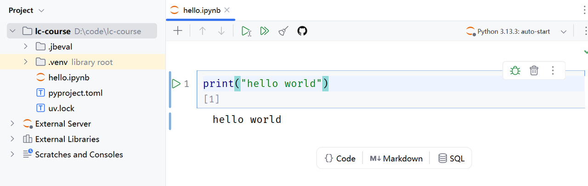
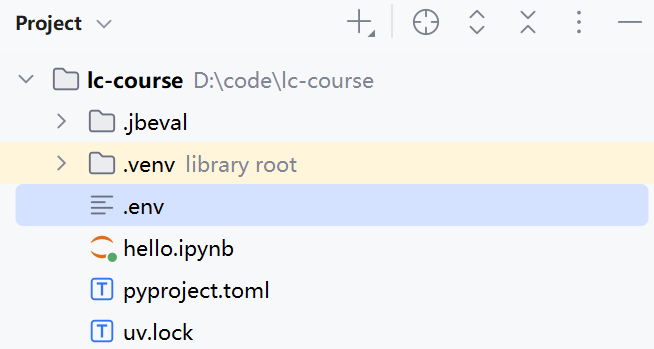

# 11.1.2 快速入门

## 1、开发环境准备

- 选择uv作为项目管理工具，参考官网进行安装[安装UV](https://docs.astral.sh/uv/)

- 添加镜像源

  ```shell
  # mac or linux
  echo 'export UV_DEFAULT_INDEX=https://pypi.tuna.tsinghua.edu.cn/simple' >> ~/.zshrc && source ~/.zshrc
  # 阿里云
  https://mirrors.aliyun.com/pypi/simple/
  # 腾讯云
  https://mirrors.cloud.tencent.com/pypi/simple/
  # 火山引擎
  https://mirrors.volces.com/pypi/simple/
  # 华为云
  https://mirrors.huaweicloud.com/repository/pypi/simple/
  # 清华大学
  https://pypi.tuna.tsinghua.edu.cn/simple/
  # 中国科学技术大学
  https://pypi.mirrors.ustc.edu.cn/simple/
  
  ```

- 创建项目

  打开PyCharm，创建Project

  

为了方便学习，使用jupyter，所以需要在项目中引入notebook依赖。

```shell
uv add notebook
```

可以新建一个notebook进行测试



## 2、安装OpenAI的SDK

使用uv安装

```bash
uv add openai
```

接下来，就可以使用SDK调用任何兼容OpenAI规范的模型了，只要将base_url和api_key设定为对应的模型提供者的url和api_key即可：

```python
from openai import OpenAI
client = OpenAI(
    api_key="sfxxxxx",
    base_url="https://api.deepseek.com"
)

print("🚀 正在调用大模型...")
response = client.chat.completions.create(
    model="deepseek-chat",
    messages=[
        {"role": "system", "content": "你是一名友好的AI助教。"},
        {"role": "user", "content": "你好，你是谁?"}
    ],
    stream=False
)

print(response)
```

**API Key配置在环境变量里**

将api_key直接写在代码中非常危险，所以通常我们都将其写入环境变量，程序运行时加载。

- 配置环境变量，在项目根目录创建一个.env文件：

  

​	在其中配置自己的API_KEY，我们以Deepseek为例：

```properties
# deepseek
DEEPSEEK_API_KEY=sk-1234567890

# 阿里云
DASHSCOPE_API_KEY=sk-1234567890
```

- 安装python-dotenv，在项目中，我们通过`python-dotenv`库来读取环境变量，所以要先安装依赖。

  ```bash
  uv add python-dotenv
  ```

  安装成功后，会在pyproject.toml中看到新添加的依赖：

  ```java
  [project]
  name = "lc-course"
  version = "0.1.0"
  description = "Add your description here"
  requires-python = ">=3.13"
  dependencies = [
      "notebook>=7.5.5",
      "openai>=2.28.0",
      "python-dotenv>=1.2.2",
  ]
  ```

- 读取环境变量，最后，我们就可以在代码中读取环境变量了：

  ```python
  from openai import OpenAI
  from dotenv import load_dotenv
  import os
  
  # 加载环境变量
  load_dotenv()
  
  client = OpenAI(
      api_key=os.getenv("DEEPSEEK_API_KEY"),
      base_url="https://api.deepseek.com"
  )
  
  print("🚀 正在调用大模型...")
  response = client.chat.completions.create(
      model="deepseek-chat",
      messages=[
          {"role": "system", "content": "你是一名友好的AI助教。"},
          {"role": "user", "content": "你好，你是谁?"}
      ],
      stream=False
  )
  
  print(response)
  ```

响应：


## 3、构建基础智能体

首先，要使用LangChain必须先安装依赖，命令如下：

```bash
uv add langchain
```

LangChain支持各种不同的模型，而且提供了对应的兼容SDK，不过也都需要安装对应依赖，你可以按需添加：

```bash
# 集成 DeepSeek
uv add langchain-deepseek

# 集成 OpenAI(阿里百炼用这个)
uv add langchain-openai

# 集成 Anthropic
uv add langchain-anthropic
```

示例：

首先创建一个简单的智能体，它能够回答问题并调用工具。本示例中的智能体使用了选定的语言模型、一个基础的天气函数作为工具，以及一个用于引导其行为的简单提示词：

```python
from langchain.agents import create_agent
from langchain_core.tools import tool
from langchain.chat_models import init_chat_model
from dotenv import load_dotenv

load_dotenv()
# 1、加载环境变量
# 非支持模型无法自动加载环境遍历，我们需要自己加载环境变量中的base_url和api_key
import os
base_url = os.getenv("DASHSCOPE_BASE_URL")
api_key = os.getenv("DASHSCOPE_API_KEY")
# 2、定义工具，基础版，通过注释描述工具
@tool
def getWeather(location: str) -> str:
    """
    Get the weather in a given location.
    Args:
        location: city name or coordinates
    """
    return "Current weather in {location} is sunny"

# 3、初始化模型
model = init_chat_model(
    model="qwen3.7-plus", # 模型名称，这里可以自定义，我们用的是阿里的qwen-max
    model_provider="openai", # 如果是Langchain不支持的模型，需要指定模型提供者（虽然我们用的是阿里，但是阿里兼容openai，所以这里用openai，就是默认采用openai的API规范）
    base_url=base_url,
    api_key=api_key,
    http_client=httpx.Client(trust_env=False)
)

# 4、定义agent，使用初始化好的model创建智能体
agent = create_agent(model=model,
                     tools=[getWeather] # 工具集
)
# 5、调用模型
print("🚀 正在调用大模型...")
response = agent.invoke({
    "messages": [
        {"role": "user", "content": "杭州今天天气如何?"}
    ]
})

# 6、打印结果
print(response)
```

