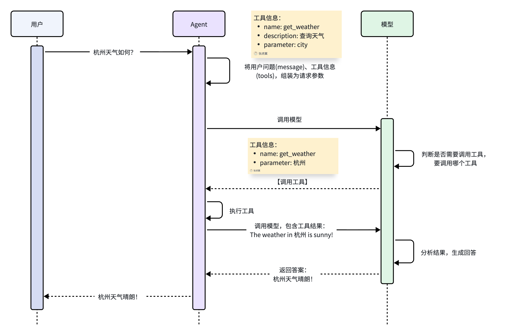

# 11.1.3 智能体

## 1、智能体工作流程

智能体则可以调用工具与外界交互，获取实时信息，工作流程

流程如下：

1. 用户提问（Input）：杭州今天天气如何？
2. 模型分析（Reasoning）：用户询问杭州天气，我不知道，需要调用查询天气的工具`get_weather`
3. 调用工具（Action）：调用工具，get_weather，传入城市"杭州"
4. 分析结果（Observation）：工具返回结果，模型分析结果，判断是否足以回答用户问题
   1. 是：整理生成响应结果
   2. 否：重复前面步骤
5. 生成结果（Output）：根据工具的结果生成响应给用户

那么，模型是如何知道工具的信息的呢？其实，在大模型提供的API接口中，有一个tools参数，描述了工具的详细信息，LangChain会帮助我们把tool的信息封装为此tool参数，与message一起发送给大模型，大模型就了解tool的详细信息，根据用户需求判断是否需要调用tool，需要调用哪个tool.

那么问题来了，当大模型决定调用某个tool时，该如何调用呢？毕竟，tool是我们定义的，模型是没有调用能力的。模型确实不能直接调用tool，只能返回字符串。但是它可以把要调用的tool信息、参数信息都以Json格式返回，LangChain就会帮我们解析响应结果中的Function信息，也就是tool信息，就知道了要调用哪个函数，以及参数是什么了。LangChain就会执行该函数，再把得到的结果再次发送给大模型

具体的工作流程如图：

OK，弄明白了Agent的原理，我们不难发现，Agent中最重要的两个部分，就是：

- Model：负责推理分析、思考，相当于Agent的大脑
- Tools：负责执行任务，相当于Agent与外界交互的手脚

当然，Agent中肯定不止这两个部分，接下来，我们就逐一解析Agent创建的各个细节。

## 2、智能体核心组件

- Model 模型，传入模型标识符字符串（ `"provider:model"` ）或已初始化的模型实例，以选择您的代理所使用的模型
- Tools 工具，要为代理提供工具，可以传入任何 Python 可调用对象、LangChain 工具或工具字典
- System prompt 系统提示词，塑造智能体处理任务的方式。系统提示参数接受字符串或 `SystemMessage` 。若需在运行时使用动态提示，请使用中间件
- Structured output 结构化输出，使用 `response_format=` 从代理返回经过验证的模式
