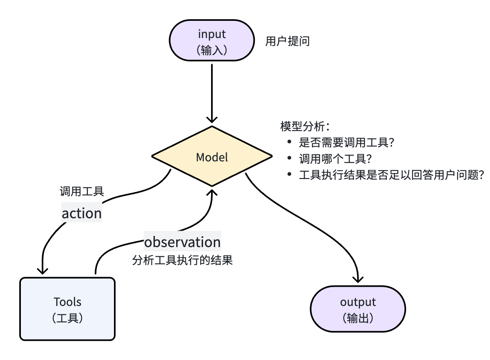
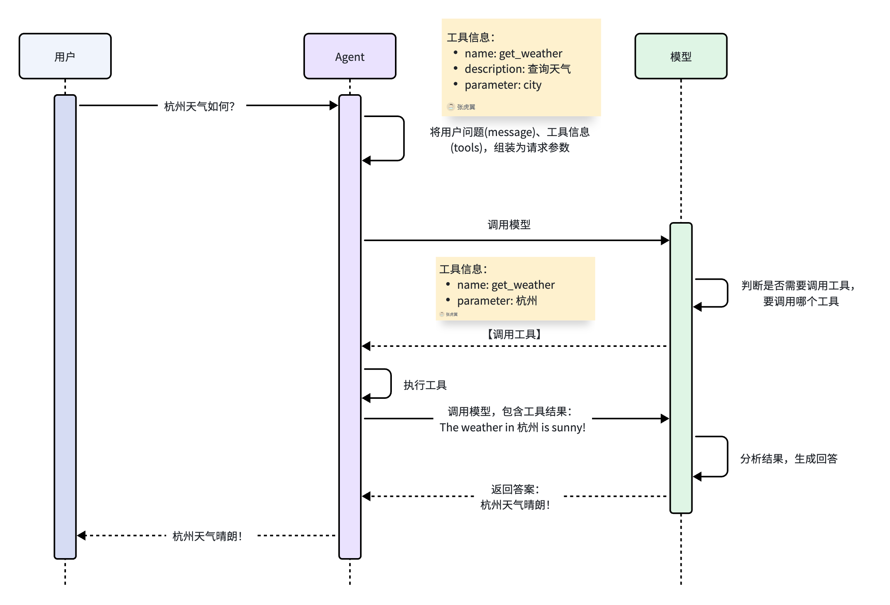
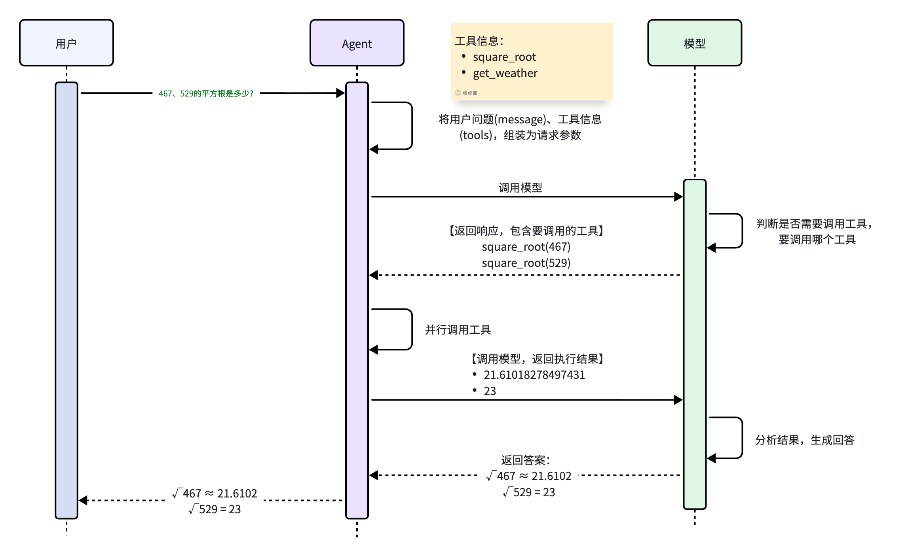

# 11.1.7 工具

一个完整的Agent至少要包含两个关键的部分：

- **模型**：是Agent的大脑，负责推理、分析，规划任务步骤
- **工具**：是Agent的手脚，负责执行任务，与外界交互



## 1、基本用法

我们先通过一个案例快速回顾Agent定义的步骤，以及Agent的工作原理。

定义一个带有工具的Agent分为两步：

- 定义工具
- 定义Agent，绑定工具

例如：

```python
from langchain.agents import create_agent
from langchain_core.tools import tool
from langchain.chat_models import init_chat_model
from dotenv import load_dotenv

load_dotenv()
# 1、加载环境变量
# 非支持模型无法自动加载环境遍历，我们需要自己加载环境变量中的base_url和api_key
import os
base_url = os.getenv("DASHSCOPE_BASE_URL")
api_key = os.getenv("DASHSCOPE_API_KEY")
# 2、定义工具，基础版，通过注释描述工具
@tool
def getWeather(location: str) -> str:
    """
    Get the weather in a given location.
    Args:
        location: city name or coordinates
    """
    return "Current weather in {location} is sunny"

# 3、初始化模型
model = init_chat_model(
    model="qwen3.7-plus", # 模型名称，这里可以自定义，我们用的是阿里的qwen-max
    model_provider="openai", # 如果是Langchain不支持的模型，需要指定模型提供者（虽然我们用的是阿里，但是阿里兼容openai，所以这里用openai，就是默认采用openai的API规范）
    base_url=base_url,
    api_key=api_key,
    http_client=httpx.Client(trust_env=False)
)

# 4、定义agent，使用初始化好的model创建智能体
agent = create_agent(model=model,
                     tools=[getWeather] # 工具集
)
# 5、调用模型
print("🚀 正在调用大模型...")
# 5.1 invoke阻塞调用
response = agent.invoke({
    "messages": [
        {"role": "user", "content": "杭州今天天气如何?"}
    ]
})

# 6、打印结果
for message in response['messages']:
    message.pretty_print()
```

输出：

```
Tool Calls:
  getWeather (call_b2bdf9eb3b4e48bca4882e83)
 Call ID: call_b2bdf9eb3b4e48bca4882e83
  Args:
    location: 杭州
================================= Tool Message =================================
Name: getWeather

Current weather in {location} is sunny
================================== Ai Message ==================================

杭州今天天气晴朗，是个好天气！
```



由此可见，所谓的工具，本质就是一个**可调用的函数**，要想让Agent知道有哪些工具可调用，该如何调用这些工具，就必须把这个函数的详细信息发送给模型。包括：

- 函数名
- 函数的作用
- 函数的参数和返回值信息

所以，定义工具的时候，关键就是把这些信息描述清楚即可。

## 2、自定义工具

在LangChain中，定义工具的过程被大大简化，与定义普通函数几乎没什么差别，只是在一些细节上需要注意。

首先，定义工具需要在函数上添加`@tool`装饰器。

例如，我们定义一个计算平方根的数学工具：

```python
# 定义工具
from langchain.tools import tool

@tool
def square_root(x: float) -> float:
    """计算指定数字的平方根"""
    return x ** 0.5
```

智能体在工作时，需要将函数的名称、输入、作用传递给大模型，默认情况下这些信息的来源是：

- 工具名称：函数名
- 工具输入：函数入参
- 工具作用：函数的注释

当然，我们可以通过tool装饰器来覆盖上述信息：

- 通过装饰器定义工具名称

```Python
@tool("square_root")
def tool1(x: float) -> float:
    """Calculate the square root of a number"""
    return x ** 0.5
```

- 通过装饰器定义工具作用描述

```Python
@tool("square_root", description="Calculate the square root of a number")
def tool1(x: float) -> float:
    return x ** 0.5
```

- 通过装饰器定义工具入参约束

如果要覆盖工具的入参信息则会复杂很多，我们要借助于Pydantic或JSON约束。

例如，我们需要定义个查询天气的tool，借助于Pydantic来约束入参。

我们定义一个入参的模型，在模型中添加入参描述信息：

```Python
# 例如一个查询天气的tool
class WeatherInput(BaseModel):
    """查询天气的输入参数."""
    location: str = Field(description="City name or coordinates")
    units: Literal["celsius", "fahrenheit"] = Field(
        default="celsius",
        description="Temperature unit preference"
    )
    include_forecast: bool = Field(
        default=False,
        description="Include 5-day forecast"
    )
```

定义工具，使用定义的模型来约束入参：

```Python
# 定义一个查询天气的tool
@tool(args_schema=WeatherInput)
def get_weather(location: str, units: str = "celsius", include_forecast: bool = False) -> str:
    """Get current weather and optional forecast."""
    temp = 22 if units == "celsius" else 72
    result = f"Current weather in {location}: {temp} degrees {units[0].upper()}"
    if include_forecast:
        result += "\nNext 5 days: Sunny"
    return result
```

工具定义好之后，调用方式与普通函数类似：

```Bash
# 调用数学工具
tool1.invoke({"x": 467})

# 调用查询天气工具
get_weather.invoke({"location": "杭州", "include_forecast": True})
```

**注意**：

在LangChain中，作为工具的函数**有两个保留的参数名**，你的自定义参数不能与之重复！他们是：

- **config**：用来传递运行时配置
- **runtime**：用来传递运行时上下文

具体可参考官方文档：[保留参数名（Reserved argument names）](https://docs.langchain.com/oss/python/langchain/tools#reserved-argument-names)，后续我们会讲到这两个参数的用法。

当我们创建智能体时，可以把定义好的工具传递给智能体，将来模型就能得到工具信息，并根据情况判断是否需要调用工具，需要调用哪个工具了。

```Bash
from langchain.agents import create_agent

# 创建智能体，并添加工具
agent = create_agent(
    model="deepseek-chat",
    tools=[tool1, get_weather],
    system_prompt="你是一个智能助手，你使用工具来解决用户问题。"
)
```

接下来，调用智能体，向其提问，模型会自动根据用户问题判断：

- 是否需要调用工具？
- 该调用哪个工具？
- 该传递那些参数？

并且在调用工具之后，根据工具执行结果给用户生成响应。

```Python
# 调用智能体
for token, metadata in agent.stream(
    {"messages": [HumanMessage(content="467的平方根是多少?")]},
    stream_mode="messages"
):
    print(token.content, end="", flush=True)
    

for token, metadata in agent.stream(
    {"messages": [HumanMessage(content="北京和杭州接下来几天天气如何?")]},
    stream_mode="messages"
):
    print(token.content, end="", flush=True)
```

如果采用stream模式的updates模式，可以看到工具调用的具体步骤：

```Python
for chunk in agent.stream(
    {"messages": [HumanMessage(content="467、529的平方根是多少?")]},
    stream_mode="updates"
):
    for step, data in chunk.items():
        print(f"step: {step}")
        print(f"content: {data['messages'][-1].content_blocks}")
        print()
```

输出如下：

```SQL
step: model
content: [{'type': 'text', 'text': '我来帮你计算这两个数的平方根。'}, {'type': 'tool_call', 'id': 'call_00_oWChR8Xgo21mmWKW0SP9uOS9', 'name': 'square_root', 'args': {'x': 467}}, {'type': 'tool_call', 'id': 'call_01_UqzhGeRNcoSoidItA0gScaoY', 'name': 'square_root', 'args': {'x': 529}}]

step: tools
content: [{'type': 'text', 'text': '21.61018278497431'}]

step: tools
content: [{'type': 'text', 'text': '23.0'}]

step: model
content: [{'type': 'text', 'text': '计算结果如下：\n\n- **467的平方根** ≈ 21.6102\n- **529的平方根** = 23.0（因为23 × 23 = 529，所以529是完全平方数）\n\n所以：\n- √467 ≈ 21.6102\n- √529 = 23'}]
```

工作流程如图：



## 3、预定义工具

LangChain中提供了很多预定义好的工具，方便我们使用，可使用的预定义工具列表可参考官网：

https://docs.langchain.com/oss/python/integrations/tools

例如，模型本身只能根据本身的训练数据回答问题，无法获取实时信息。但如果我们给它提供了web搜索的工具，那么你的Agent就如同具备了实时web搜索的能力，回答会更加准确。

有一个专门用于给Agent提供Web搜索的工具，叫做Tavily，官网如下：

在LangChain中也提供了对Tavily的支持：

https://docs.langchain.com/oss/python/integrations/tools/tavily_search

要使用这个工具，步骤如下：

### 3.1 注册账号

tavily访问地址：https://www.tavily.com/

使用google邮箱登录


可以看到一个默认api_key

### 3.2 配置环境变量

接下来，我们需要把这个KEY配置到我们的.env文件中：


### 3.3 安装依赖

然后，我们需要安装langchain-tavily的依赖：

```Bash
# 使用uv的环境
uv add langchain-tavily
```

### 3.4 使用工具

接下来，就可以使用tavily来做web搜索了：

```python
from langchain.agents import create_agent
from langchain_core.tools import tool
from langchain.chat_models import init_chat_model
import httpx
from dotenv import load_dotenv
# 使用tavily作为web搜索工具
from langchain_tavily import TavilySearch

load_dotenv()
# 1、加载环境变量
# 非支持模型无法自动加载环境遍历，我们需要自己加载环境变量中的base_url和api_key
import os
base_url = os.getenv("DASHSCOPE_BASE_URL")
api_key = os.getenv("DASHSCOPE_API_KEY")

# 2、定义工具，基础版，通过注释描述工具
@tool
def getWeather(location: str) -> str:
    """
    Get the weather in a given location.
    Args:
        location: city name or coordinates
    """
    return "Current weather in {location} is sunny"

# 预定义工具
# 初始化工具，并设置参数，具体参数设置参考官网
tool = TavilySearch(
    max_results=5,
    topic="general",
    # include_answer=False,
    # include_raw_content=False,
    # include_images=False,
    # include_image_descriptions=False,
    # search_depth="basic",
    # time_range="day",
    # include_domains=None,
    # exclude_domains=None
)
# 试试直接调用工具
tool.invoke("重庆今天天气如何？")
```

输出：

```
{'query': '重庆今天天气如何？',
 'follow_up_questions': None,
 'answer': None,
 'images': [],
 'results': [{'url': 'https://chinaweather.org/zh-hans/chongqing',
   'title': '重庆 今日天气预报',
   'content': '# 重庆， 中国 天气. ## 目前情况. 风: **S - 3 km/h**. ## 天气预报. ## 30 天平均值和极值. ## 昨天的数据. ## 未来 12 小时内重庆的气温和降雨可能性. ## 未来几天重庆的气温和降雨可能性. ## 未来几天重庆将有降雨. ## 重庆 Climate Summary. 重庆 features a None (Köppen classification: Cfa), with an average annual temperature of 17.03ºC (62.65ºF), which is about 高于 2.41% the national average for 中国. 该市每年都会经历约 79.54 毫米（3.13 英寸）的降雨量，分布在 128.36 个雨天，占全年的 35.17%。. | 常年低温 | 12.04ºC (53.67ºF) |. | 最热月份 | 七月 29.62ºC (85.32ºF) |. | 年降水量 | 79.54mm (3.13in) |. | 有降雨的日子 | 128.36 天 (35.17%) |. ## 每月天气平均值. | 月 | 高/低（°C） | 雨 |. | 二月 | 12.45° / 4.1° | 2.0 天 |. ## 重庆的天气. ## 常见问题. 七月 的月平均气温最高（日平均值为 29.62°C），二月 的月平均气温最低（日平均值为 4.1°C）。. 今天 重庆 天气非常炎热，气温高于 26°C (78.8°F)，请考虑穿：. Unhealthy for Sensitive Groups air quality, health effects possible for sensitive people, general public usually unaffected. ### 日出/日落. ### 重庆 气象图. 版权 © 2026 Chinaweather.Org - 天气和气候网络成员.',
   'score': 0.8497846,
   'raw_content': None},
  {'url': 'https://weather.cma.cn/web/weather/57516.html',
   'title': '重庆 - 中国气象局-天气预报-城市预报',
   'content': '7天天气预报（2026/07/01 20:00发布）. | 时间 | 05:00 | 08:00 | 11:00 | 14:00 | 17:00 | 20:00 | 23:00 | 02:00 |. | 气温 | 25.3℃ | 24.6℃ | 24.8℃ | 24.8℃ | 25.9℃ | 25.9℃ | 25.4℃ | 25.1℃ |. | 降水 | 2.9mm | 3.1mm | 1.7mm | 0.4mm | 0.2mm | 0.3mm | 0.5mm | 无降水 |. | 风速 | 2.9m/s | 2.8m/s | 3m/s | 3.3m/s | 3.2m/s | 3.2m/s | 3.3m/s | 3m/s |. | 风向 | 东南风 | 西南风 | 西北风 | 西北风 | 东北风 | 东北风 | 西北风 | 西北风 |. | 降水 | 无降水 | 1.2mm | 1.2mm | 1.2mm | 1.2mm | 1.2mm | 1.2mm | 1.2mm |. | 降水 | 1.2mm | 无降水 | 无降水 | 无降水 | 无降水 | 无降水 | 无降水 | 无降水 |. | 风向 | 东南风 | 东南风 | 东南风 | 东南风 | 西南风 | 东南风 | 东北风 | 东北风 |.',
   'score': 0.74697095,
   'raw_content': None},
  {'url': 'https://weathernew.pae.baidu.com/weathernew/pc?query=%E9%87%8D%E5%BA%86%E5%A4%A9%E6%B0%94&srcid=4982',
   'title': '重庆',
   'content': '今天. 25 ~ 28°C 小雨. 东北风1级. 优 · 03. 24 ~ 28°C 小雨. 西南风1级. 优 · 04. 24 ~ 31°C 阴. 东南风1级. 良 · 05. 25 ~ 34°C 晴. 东风2级. 良.',
   'score': 0.7443038,
   'raw_content': None},
  {'url': 'https://www.weather.com.cn/weather1d/101040100.shtml',
   'title': '重庆天气预报,重庆7天天气预报,重庆15天天气预报,重庆天气查询',
   'content': '首页 预报 预警 雷达 云图 天气地图 专业产品 资讯 视频 节气. 台风路径 空间天气 图片 专题 环境 旅游 碳中和 气象科普 一带一路 产创平台. :   北京 上海 成都 杭州 南京 天津 深圳 重庆 西安 广州 青岛 武汉. :   故宫 阳朔漓江 龙门石窟 野三坡 颐和园 九寨沟 东方明珠 凤凰古城 秦始皇陵 桃花源. :   佘山 春城湖畔 华彬庄园 观澜湖 依必朗 旭宝 博鳌 玉龙雪山 番禺南沙 东方明珠. :   曼谷 东京 首尔 吉隆坡 新加坡 巴黎 罗马 伦敦 雅典 柏林 纽约 温哥华 墨西哥城 哈瓦那 圣何塞 巴西利亚 布宜诺斯艾利斯 圣地亚哥 利马 基多 悉尼 墨尔本 惠灵顿 奥克兰 苏瓦 开罗 内罗毕 开普敦 维多利亚 拉巴特. :   梅雨持续！今明天浙江北部等局地有暴雨 后天雨势将明显减弱  中国天气网 2026-07-01 14:49. :   冷感拉满 青海兴海县7月飞雪  中国天气网青海站 2026-07-01 11:47. :   北京现超清晰日晕 好似天空“大眼睛”  张慧、陈曦 2026-07-01 12:38. :   盛夏花开热烈 秋英虞美人“抢镜”  中国天气网 2026-07-01 11:23. :   轮转不停！今明天长江中下游仍有大暴雨 华南新一轮降雨将无缝衔接  中国天气网 2026-07-01 10:40. # 周边地区 *|* 周边景点 *2026-07-01 11:30更新*. **南海热带低压趋向粤琼沿海 广东徐闻气象部门全力做好防范** **盛夏花开热烈 秋英虞美人“抢镜”** **冷感拉满 青海兴海县7月飞雪** **北京现超清晰日晕 好似天空“大眼睛”** **山西平陆强对流天气来袭作物受损 多部门联动保农复产**. 未来3天，云贵高原至江南中北部一带强降雨仍将持续，多地有暴雨、大暴雨，华北、东北的强对流天气也依然频繁。同时，未来三天我国多地热意增强。. 今天起，南方新一轮强降雨来袭，长江中下游一带以及贵州、广西、云南等地需警惕暴雨致灾，同时东北、华北一带仍将维持多雨格局。. 今天（6月27日），南方降降雨主要集中在华南和西南地区，雨势较前期有所减弱。明天起，南方主雨带东段将北抬至江南北部，需注意防范。. 今天（6月27日），南方降雨将减弱，华南等地部分地区有大到暴雨。明后天，南方主雨带将北抬。在北方，华北、东北等地未来三天多雷雨天气出没。. 今天（6月24日），南方主雨带的东段将继续减弱并南落，但西段的广西、贵州、云南交界一带仍将有暴雨或大暴雨。. 今明两天（6月23日至24日），长江中下游一带仍有强降雨，降水强度呈减弱趋势。24日后，南方的降雨将南压至贵州、广西北部到江南中南部一带，强度继续减弱。. 今起三天（6月22日至24日），我国主雨带仍将集中在长江沿线，公众需关注预警预报信息。同时，江南南部、华南等地炎热天气持续，将现成片高温。. 今明两天，长江中下游一带的降雨会再度增强；同时，东北地区的降雨也仍将持续。而在华南和江南南部一带，明天起会迎来成片的高温天气。. 端午假期后两天，南方大部和东北地区降雨仍然较多，其中长江中下游明天雨势较强。此外，今天起江南南部和华南一带的高温闷热天气将快速发展。. 端午节假期期间，长江中下游一带多地雨势强劲，同时东北、华北、黄淮的降雨或强对流天气也将较为频繁。此外，未来七天南北多地气温将有所下滑。. 今天（6月18日）开始，随着副热带高压北抬，南方强降雨的重心将从华南一带逐渐向江南、长江中下游转移。与此同时，在阴雨天气的压制下，上述地区气温将有所下滑，炎热褪去。. 今天（6月17日），华南一带仍有强降雨，明天起南方主雨带将北抬至长江中下游等地，华南多地高温闷热天气逐渐发展。. # 更多>>高清图集. * 三亚 雷阵雨转多云 35/26℃ 一般. * 九寨沟 阵雨 32/16℃ 适宜. * 张家界 小雨转多云 26/20℃ 适宜. * 青岛 小雨 25/22℃ 适宜. 中国天气网版权所有，未经书面授权禁止使用\xa0\xa0\xa0\xa0\xa0\xa0\xa0\xa0Copyright©中国气象局公共气象服务中心 All Rights Reserved (2008-2026).',
   'score': 0.73322314,
   'raw_content': None},
  {'url': 'https://www.weather.com.cn/weather/101040100.shtml',
   'title': '重庆天气预报,重庆7天天气预报,重庆15天天气预报,重庆天气查询',
   'content': '首页 预报 预警 雷达 云图 天气地图 专业产品 资讯 视频 节气. 台风路径 空间天气 图片 专题 环境 旅游 碳中和 气象科普 一带一路 产创平台. :   北京 上海 成都 杭州 南京 天津 深圳 重庆 西安 广州 青岛 武汉. :   故宫 阳朔漓江 龙门石窟 野三坡 颐和园 九寨沟 东方明珠 凤凰古城 秦始皇陵 桃花源. :   佘山 春城湖畔 华彬庄园 观澜湖 依必朗 旭宝 博鳌 玉龙雪山 番禺南沙 东方明珠. :   明起三天广东受热带气旋影响风雨强劲 局地有特大暴雨或11级阵风  中国天气网 2026-07-02 14:40. :   6月南方强降水过程频繁 7月有2至3个台风登陆或影响沿海地区  中国天气网 2026-07-02 15:24. :   官厅水库开启腾容 水位下降滩涂裸露  中国天气网 2026-07-02 10:42. :   未来三天湖南降雨频繁局地有大暴雨 部分地区气温较高体感闷热  中国天气网 2026-07-02 10:50. :   台风预警：南海热带低压将于12小时内发展为台风 明天或登陆海南  中国天气网 2026-07-02 10:25. # 周边地区 *|* 周边景点 *2026-07-02 11:30更新*. # 高清图集. **冷感拉满 青海兴海县7月飞雪** **盛夏花开热烈 秋英虞美人“抢镜”** **江西靖安遭遇强降雨 出现山体塌方** **北京现超清晰日晕 好似天空“大眼睛”** **官厅水库开启腾容 水位下降滩涂裸露**. 今明两天（7月2日至3日），长江中下游等地仍将有明显降雨，并且华南一带的雨势明天起也将再度增强，。此外，未来三天新疆等地酷热程度将进一步加剧。. 未来3天，云贵高原至江南中北部一带强降雨仍将持续，多地有暴雨、大暴雨，华北、东北的强对流天气也依然频繁。同时，未来三天我国多地热意增强。. 今天起，南方新一轮强降雨来袭，长江中下游一带以及贵州、广西、云南等地需警惕暴雨致灾，同时东北、华北一带仍将维持多雨格局。. 今天（6月27日），南方降降雨主要集中在华南和西南地区，雨势较前期有所减弱。明天起，南方主雨带东段将北抬至江南北部，需注意防范。. 今天（6月27日），南方降雨将减弱，华南等地部分地区有大到暴雨。明后天，南方主雨带将北抬。在北方，华北、东北等地未来三天多雷雨天气出没。. 今天（6月24日），南方主雨带的东段将继续减弱并南落，但西段的广西、贵州、云南交界一带仍将有暴雨或大暴雨。. 今明两天（6月23日至24日），长江中下游一带仍有强降雨，降水强度呈减弱趋势。24日后，南方的降雨将南压至贵州、广西北部到江南中南部一带，强度继续减弱。. 今起三天（6月22日至24日），我国主雨带仍将集中在长江沿线，公众需关注预警预报信息。同时，江南南部、华南等地炎热天气持续，将现成片高温。. 今明两天，长江中下游一带的降雨会再度增强；同时，东北地区的降雨也仍将持续。而在华南和江南南部一带，明天起会迎来成片的高温天气。. 端午假期后两天，南方大部和东北地区降雨仍然较多，其中长江中下游明天雨势较强。此外，今天起江南南部和华南一带的高温闷热天气将快速发展。. 端午节假期期间，长江中下游一带多地雨势强劲，同时东北、华北、黄淮的降雨或强对流天气也将较为频繁。此外，未来七天南北多地气温将有所下滑。. 今天（6月18日）开始，随着副热带高压北抬，南方强降雨的重心将从华南一带逐渐向江南、长江中下游转移。与此同时，在阴雨天气的压制下，上述地区气温将有所下滑，炎热褪去。. * 三亚 雷阵雨 33/25℃ 一般. * 九寨沟 阵雨 26/15℃ 适宜. * 张家界 中雨转大雨 28/23℃ 一般. * 桂林 阵雨转多云 32/25℃ 适宜. * 青岛 多云 25/23℃ 适宜. 中国天气网版权所有，未经书面授权禁止使用\xa0\xa0\xa0\xa0\xa0\xa0\xa0\xa0Copyright©中国气象局公共气象服务中心 All Rights Reserved (2008-2026).',
   'score': 0.72884524,
   'raw_content': None}],
 'response_time': 1.89,
 'request_id': 'e9c30490-819c-411d-ae1e-2a1c1f022ceb'}
```

### 3.5 智能体使用Tavily搜索工具

结合智能体来使用Tavily搜索工具：

```python
from langchain.agents import create_agent
from langchain_core.tools import tool
from langchain.chat_models import init_chat_model
import httpx
from dotenv import load_dotenv
# 使用tavily作为web搜索工具
from langchain_tavily import TavilySearch
from langchain_core.messages import HumanMessage

load_dotenv()
# 1、加载环境变量
# 非支持模型无法自动加载环境遍历，我们需要自己加载环境变量中的base_url和api_key
import os
base_url = os.getenv("DASHSCOPE_BASE_URL")
api_key = os.getenv("DASHSCOPE_API_KEY")


# 预定义工具
# 初始化工具，并设置参数，具体参数设置参考官网
tool = TavilySearch(
    max_results=5,
    topic="general",
    # include_answer=False,
    # include_raw_content=False,
    # include_images=False,
    # include_image_descriptions=False,
    # search_depth="basic",
    # time_range="day",
    # include_domains=None,
    # exclude_domains=None
)

# 3、初始化模型
model = init_chat_model(
    model="qwen3.7-plus", # 模型名称，这里可以自定义，我们用的是阿里的qwen-max
    model_provider="openai", # 如果是Langchain不支持的模型，需要指定模型提供者（虽然我们用的是阿里，但是阿里兼容openai，所以这里用openai，就是默认采用openai的API规范）
    base_url=base_url,
    api_key=api_key,
    http_client=httpx.Client(trust_env=False)
)

# 4、定义agent，使用初始化好的model创建智能体
agent = create_agent(model=model,
                     tools=[tool], # 工具集
                    system_prompt="你是一个智能助手，你使用工具来解决用户问题。"
)

# 调用工具
for chunk in agent.stream(
    {"messages": [HumanMessage(content="重庆接下来5天天气如何?")]},
    stream_mode="updates"
):
    for step, data in chunk.items():
        print(f"step: {step}")
        print(f"content: {data['messages'][-1].content_blocks}")
        print()
```

输出结果：

```
step: model
content: [{'type': 'tool_call', 'name': 'tavily_search', 'args': {'query': '重庆 未来5天 天气预报', 'time_range': 'day'}, 'id': 'call_ba784c8cd19045f5ba7ef5ab'}]

step: tools
content: [{'type': 'text', 'text': '{"query": "重庆 未来5天 天气预报", "follow_up_questions": null, "answer": null, "images": [], "results": [{"url": "https://qq.ip138.com/weather/chongqing/10tian.htm", "title": "重庆天气预报,重庆未来10天天气预报", "content": "天气预报 天气历史记录 全国列车时刻表 火车票代售点大全 免费在线多语言互译. ## 重庆未来10天天气预报. | 星期一  2026-06-29 |  | 小雨转阴 | 23℃ ～ 25℃ | 东风转北风 <3级 |. | 星期二  2026-06-30 |  | 小雨 | 23℃ ～ 25℃ | 北风转西风 <3级 |. | 星期三  2026-07-01 |  | 小雨转多云 | 21℃ ～ 28℃ | 南风 <3级 |. | 星期四  2026-07-02 |  | 多云 | 23℃ ～ 32℃ | 东风转东北风 <3级 |. | 星期五  2026-07-03 |  | 晴 | 23℃ ～ 32℃ | 南风转东风 <3级 |. | 星期六  2026-07-04 |  | 晴 | 25℃ ～ 34℃ | 东风 <3级 |. | 星期一  2026-07-06 |  | 雨 | 25℃ ～ 35℃ | 东北风转南风 <3级 |. | 星期二  2026-07-07 |  | 雨转多云 | 25℃ ～ 35℃ | 东北风转东南风 <3级 |. | 星期三  2026-07-08 |  | 多云转晴 | 25℃ ～ 35℃ | 东南风 <3级 |. 天气更新时间：2026-06-29 04:26:13. ### 重庆历史天气查询. 如果您觉得本站对您的朋友有帮助，别忘了告诉他（她）们哟 ^\\\\_^.", "score": 0.71305263, "raw_content": null}, {"url": "https://www.weather.com.cn/html/weather/101040100.shtml", "title": "【重庆天气】重庆天气预报,蓝天,蓝天预报,雾霾,雾霾消散,天气预报一周,天气预报15天查询", "content": "首页 预报 预警 雷达 云图 天气地图 专业产品 资讯 视频 节气. 台风路径 空间天气 图片 专题 环境 旅游 碳中和 气象科普 一带一路 产创平台. :   北京 上海 成都 杭州 南京 天津 深圳 重庆 西安 广州 青岛 武汉. :   故宫 阳朔漓江 龙门石窟 野三坡 颐和园 九寨沟 东方明珠 凤凰古城 秦始皇陵 桃花源. :   佘山 春城湖畔 华彬庄园 观澜湖 依必朗 旭宝 博鳌 玉龙雪山 番禺南沙 东方明珠. :   曼谷 东京 首尔 吉隆坡 新加坡 巴黎 罗马 伦敦 雅典 柏林 纽约 温哥华 墨西哥城 哈瓦那 圣何塞 巴西利亚 布宜诺斯艾利斯 圣地亚哥 利马 基多 悉尼 墨尔本 惠灵顿 奥克兰 苏瓦 开罗 内罗毕 开普敦 维多利亚 拉巴特. :   亚洲 欧洲 北美洲 南美洲 非洲 大洋洲. ### 蓝天预报综合天气现象、能见度、空气质量等因子，预测未来一周的天空状况。. # 天气资讯. :   山洪灾害气象预警：浙江江西局部地区发生山洪灾害可能性较大  中国天气网 2026-07-01 18:05. :   暴雨蓝色预警：11省区市部分地区有大到暴雨 江西浙江局地大暴雨  中国天气网 2026-07-01 18:05. :   台风蓝色预警：南海热带低压将于3日登陆海南至广东一带沿海  中国天气网 2026-07-01 18:05. :   地质灾害气象风险预警：浙江安徽等7省市部分地区风险较高  中国天气网 2026-07-01 17:30. :   破纪录！数据盘点6月南方下了多少雨 华南台风雨即将来袭  中国天气网 2026-07-01 17:01. # 周边地区 *|* 周边景点 *2026-07-01 18:00更新*. **冷感拉满 青海兴海县7月飞雪** **盛夏花开热烈 秋英虞美人“抢镜”** **江西靖安遭遇强降雨 出现山体塌方** **北京现超清晰日晕 好似天空“大眼睛”** **山西平陆强对流天气来袭作物受损 多部门联动保农复产**. 今天起至7日，南方将连续出现强降雨过程，江南、华南等地有大到暴雨，局地大暴雨，并伴有雷暴大风等强对流天气。. 预计，未来三天，南方雨水仍不停歇，江南中南部、华南中北部等地的部分地区有大雨，局地有暴雨或大暴雨，并伴有雷暴大风等强对流天气。. ## 南方新一轮降雨开启 北方大风降温持续. 今天（29日）南方新一轮降雨开启，今天是此次降雨过程的最强时段，湖南、江西、浙江局地有大暴雨。在北方，大风、降温仍将持续，华北北部、东北地区还将自西向东出现阵性降雨。. 今天（27日），南方雨水范围继续收缩，但云南、台湾等地部分地区仍有强降水。在北方，未来几天多大风天气，气温波动明显，明后两天局地有高温出现，周末气温再下降。. # 更多>>高清图集. # 热点 *视频* *图片* *文章*. 中国天气网版权所有，未经书面授权禁止使用\xa0\xa0\xa0\xa0\xa0\xa0\xa0\xa0Copyright©中国气象局公共气象服务中心 All Rights Reserved (2008-2026).", "score": 0.67758125, "raw_content": null}, {"url": "https://www.weather.com.cn/weather40d/101040100.shtml", "title": "【重庆天气】重庆40天天气预报,重庆更长预报,重庆天气日历,重庆日历 ...", "content": "首页 预报 预警 雷达 云图 天气地图 专业产品 资讯 视频 节气. 台风路径 空间天气 图片 专题 环境 旅游 碳中和 气象科普 一带一路 产创平台. :   北京 上海 成都 杭州 南京 天津 深圳 重庆 西安 广州 青岛 武汉. :   故宫 阳朔漓江 龙门石窟 野三坡 颐和园 九寨沟 东方明珠 凤凰古城 秦始皇陵 桃花源. :   佘山 春城湖畔 华彬庄园 观澜湖 依必朗 旭宝 博鳌 玉龙雪山 番禺南沙 东方明珠. 16-40天预报数据来源于国家气候中心，是根据全球数值天气预报模式客观预报系统加工而成，未经预报员主观订正，反应未来一段时间内天气变化趋势，具有一定的不确定性，供公众参考，欲知更加准确的天气预报需随时关注短期天气预报和最新预报信息更新。. :   南海热带低压逼近 海南琼海渔船回港避风  中国天气网 2026-07-02 17:17. :   为应对南海热带低压 广东电白气象部门全面巡检观测设备  中国天气网 2026-07-02 16:47. :   40℃！明后天河北暑热进一步升级 多地有雷阵雨伴强对流天气  中国天气网 2026-07-02 15:58. :   明起三天广东受热带气旋影响风雨强劲 局地有特大暴雨或11级阵风  中国天气网 2026-07-02 14:40. :   6月南方强降水过程频繁 7月有2至3个台风登陆或影响沿海地区  中国天气网 2026-07-02 15:24. # 周边地区 *|* 周边景点 *2026-07-02 18:00更新*. # 高清图集. **江西靖安遭遇强降雨 出现山体塌方** **盛夏花开热烈 秋英虞美人“抢镜”** **南海热带低压逼近 海南琼海渔船回港避风** **北京现超清晰日晕 好似天空“大眼睛”** **为应对南海热带低压 广东电白气象部门全面巡检观测设备**. 今明两天（7月2日至3日），长江中下游等地仍将有明显降雨，并且华南一带的雨势明天起也将再度增强，。此外，未来三天新疆等地酷热程度将进一步加剧。. 未来3天，云贵高原至江南中北部一带强降雨仍将持续，多地有暴雨、大暴雨，华北、东北的强对流天气也依然频繁。同时，未来三天我国多地热意增强。. 今天起，南方新一轮强降雨来袭，长江中下游一带以及贵州、广西、云南等地需警惕暴雨致灾，同时东北、华北一带仍将维持多雨格局。. 今天（6月27日），南方降降雨主要集中在华南和西南地区，雨势较前期有所减弱。明天起，南方主雨带东段将北抬至江南北部，需注意防范。. 今天（6月27日），南方降雨将减弱，华南等地部分地区有大到暴雨。明后天，南方主雨带将北抬。在北方，华北、东北等地未来三天多雷雨天气出没。. 今天（6月24日），南方主雨带的东段将继续减弱并南落，但西段的广西、贵州、云南交界一带仍将有暴雨或大暴雨。. 今明两天（6月23日至24日），长江中下游一带仍有强降雨，降水强度呈减弱趋势。24日后，南方的降雨将南压至贵州、广西北部到江南中南部一带，强度继续减弱。. 今起三天（6月22日至24日），我国主雨带仍将集中在长江沿线，公众需关注预警预报信息。同时，江南南部、华南等地炎热天气持续，将现成片高温。. 今明两天，长江中下游一带的降雨会再度增强；同时，东北地区的降雨也仍将持续。而在华南和江南南部一带，明天起会迎来成片的高温天气。. 端午假期后两天，南方大部和东北地区降雨仍然较多，其中长江中下游明天雨势较强。此外，今天起江南南部和华南一带的高温闷热天气将快速发展。. 端午节假期期间，长江中下游一带多地雨势强劲，同时东北、华北、黄淮的降雨或强对流天气也将较为频繁。此外，未来七天南北多地气温将有所下滑。. 今天（6月18日）开始，随着副热带高压北抬，南方强降雨的重心将从华南一带逐渐向江南、长江中下游转移。与此同时，在阴雨天气的压制下，上述地区气温将有所下滑，炎热褪去。. * 三亚 雷阵雨 24/31℃ 一般. * 九寨沟 多云转阵雨 16/28℃ 适宜. * 大理 中雨 15/20℃ 一般. * 张家界 大雨转小雨 22/28℃ 较不宜. * 桂林 阵雨 26/34℃ 适宜. * 青岛 多云 24/27℃ 适宜. 中国天气网版权所有，未经书面授权禁止使用\xa0\xa0\xa0\xa0\xa0\xa0\xa0\xa0Copyright©中国气象局公共气象服务中心 All Rights Reserved (2008-2026).", "score": 0.6549173, "raw_content": null}, {"url": "https://www.qweather.com/weather30d/chongqing-101040100.html", "title": "重庆市未来30天天气预报", "content": "重庆市. 中国. 2026-07-02. 未来30天将有17天下雨，有4天温度超过35°，最高温37°（07月15日，07月16日），最低温24°（07月03日，07月04日，07月10日，07月11日，07月12日）。", "score": 0.6257817, "raw_content": null}, {"url": "https://e.weather.com.cn/d/15days/101040100.shtml", "title": "【重庆天气预报15天_重庆天气预报15天查询】-中国天气网", "content": "| 东南风<3级  东北风<3级 |  |  | 详情 |. | 西风<3级  西南风<3级 |  |  | 详情 |. | 中心位置： | 18.6N/120.1E |. 天气  推荐 直播 图集 短视频 生活.", "score": 0.562874, "raw_content": null}], "response_time": 0.9, "request_id": "f1ce2244-3077-4036-b4c0-33ef5aff582d"}'}]

step: model
content: [{'type': 'text', 'text': '根据搜索结果，以下是**重庆未来5天的天气预报**：\n\n| 日期 | 天气 | 温度 | 风力 |\n|------|------|------|------|\n| 今天（7月2日） | 多云 | 23℃～32℃ | 东风转东北风 <3级 |\n| 明天（7月3日） | 晴 | 23℃～32℃ | 南风转东风 <3级 |\n| 7月4日（周六） | 晴 | 25℃～34℃ | 东风 <3级 |\n| 7月6日（周一） | 雨 | 25℃～35℃ | 东北风转南风 <3级 |\n| 7月7日（周二） | 雨转多云 | 25℃～35℃ | 东北风转东南风 <3级 |\n\n**总体趋势：**\n- 🌡️ **气温较高**：未来几天重庆气温持续偏高，最高温可达32℃～35℃\n- ☀️ **先晴后雨**：近两天以晴好天气为主，下周一开始有降雨\n- 💨 **风力较小**：整体风力不大，多为3级以下\n\n**温馨提示：**\n- 天气炎热，注意防暑降温，多补充水分\n- 周末出行可趁晴好天气安排户外活动\n- 下周初有降雨，外出记得携带雨具'}]
```

### 3.6 优化

注意，LangChain提供的TavilySearch工具描述非常复杂，参数也很多。会有额外的网络消耗。如果我们仅仅是需要query参数，建议自定义工具。

像这样：

```Python
# 使用tavily作为web搜索工具
tavily = TavilySearch(
    max_results=5,
    topic="general"
)

@tool
def web_search(query: str):
    """Search the web for information"""
    return tavily.invoke(query)
```

默认情况下AI回答的结果不包含信息来源，这样回答的可信度就不高。我们可以自定义结构化输出，让AI在回答时包含信息来源。

```python
from langchain.agents import create_agent
from langchain.chat_models import init_chat_model
from langchain_tavily import TavilySearch
from langchain_core.messages import HumanMessage
from pydantic import BaseModel, Field

import httpx
import os
from dotenv import load_dotenv

load_dotenv()

base_url = os.getenv("DASHSCOPE_BASE_URL")
api_key = os.getenv("DASHSCOPE_API_KEY")


# tool
search_tool = TavilySearch(max_results=5)


# model
model = init_chat_model(
    model="qwen-plus",# 注意，这里用qwen3.7-plus不得行，因为不适合 agent + tools
    model_provider="openai",
    base_url=base_url,
    api_key=api_key,
    http_client=httpx.Client(trust_env=False),
    temperature=0,
    model_kwargs={
        "tool_choice": "auto"
    }
)


# schema
class Reference(BaseModel):
    title: str
    url: str

class AnswerInfo(BaseModel):
    answer: str
    reference: list[Reference]


# agent
agent = create_agent(
    model=model,
    tools=[search_tool],
    system_prompt="你是一个智能助手，你使用工具来解决用户问题。",
    response_format=AnswerInfo
)


# run
response = agent.invoke(
    {"messages": [HumanMessage(content="潘嘎之交是什么梗？")]}
)

print(response["structured_response"])
```

输出：

```
answer='“潘嘎之交”是2021年爆火的网络热梗，源自演员潘长江与谢孟伟（《小兵张嘎》中“嘎子”的饰演者）的一场直播连麦事件。当时谢孟伟因直播卖酒（被质疑卖假酒、抬高价格等）陷入舆论危机，潘长江以“前辈”身份连线劝诫，语重心长地说：“网上的东西都是虚拟的，你把握不住啊孩子，因为这里水很深……”谢孟伟当场落泪并承诺不再卖酒。\n\n然而不久后，潘长江本人也开启直播带货，主推“黄金酒”等贴牌酒类产品，甚至单场销售额达2000万元。网友发现其言行矛盾，遂戏称二人关系为“潘嘎之交”，化用成语“管鲍之交”，讽刺性地指代：行业前辈以“为你好”为名，实则通过劝退后辈来清除竞争对手、抢占市场，是一种表面温情、实则功利的“塑料情谊”。\n\n该梗迅速衍生出大量二次创作（如B站鬼畜视频《听潘叔的话》）、仿写成语（如“潘出于嘎而胜于嘎”“潘承嘎业”“君子之交淡如水，潘嘎之交掺了水”），成为对虚伪人设、言行不一、流量变现失范现象的经典解构与嘲讽符号。' reference=[Reference(title='潘嘎之交_百度百科', url='https://baike.baidu.com/item/%E6%BD%98%E5%98%8E%E4%B9%8B%E4%BA%A4/56795675'), Reference(title='潘嘎之交是什么梗？', url='https://www.zhihu.com/question/455918865'), Reference(title='潘嘎之交，谁也劝不动谁-虎嗅网', url='https://m.huxiu.com/article/425695.html')]
```

