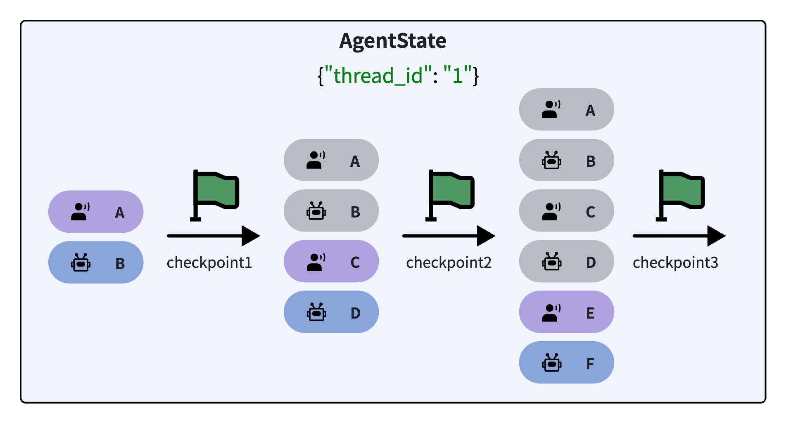
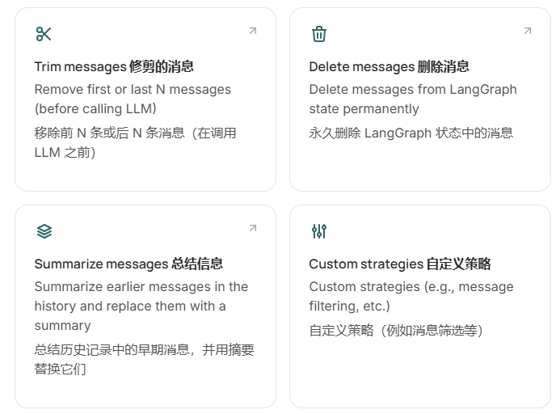
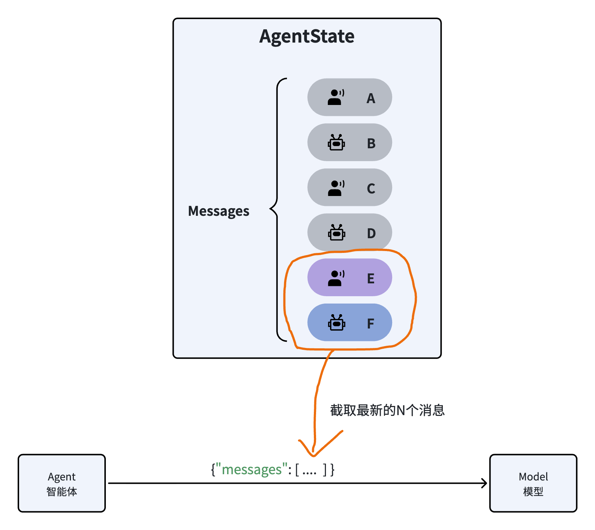
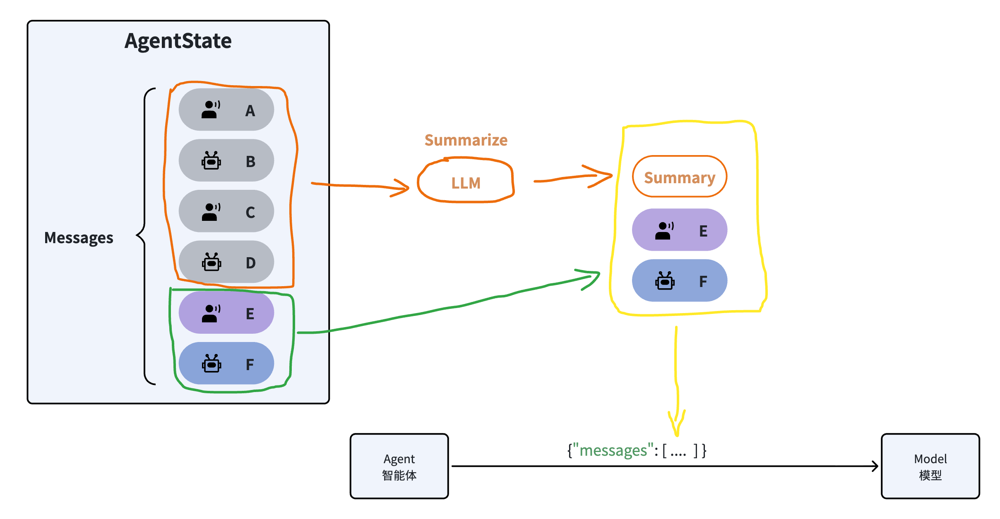

# 11.1.8 记忆

对于智能体而言，记忆分为了两类：

- 短期记忆（short-term memory）
- 长期记忆（long-term memory)

注意，大家不要被字面上的意思误导了，很多人看到名字就误以为：*短期记忆就是临时记忆，断电就没了；长期记忆就是永久记忆，持久保存*。

对于智能体而言，这是完全错误的理解！！！

简单用一句话概括的话：

- **短期记忆**：当前任务或会话的上下文（Working Memory 或 Session Memory）
- **长期记忆**：跨任务或会话的**经验与知识**（Persistent Memory）


比如，一个公司数据分析的Agent。

用户提出需求：

> “帮我写Q1的销售分析报告”

Agent：

短期记忆：

- 对话历史
- 查询到Q1的销售数据
- 任务目标及执行状态

长期记忆：

- 公司的KPI算法
- 用户偏好的报告形式

总结：

|            | **短期记忆**     | **长期记忆**           |
| :--------- | :--------------- | :--------------------- |
| 生命周期   | 当前会话（短暂） | 跨任务、跨会话（永久） |
| 内容       | 当前任务状态     | 知识、经验、用户偏好   |
| 是否跨任务 | ❌                | ✅                      |
| 存储       | Redis/内存       | DB/Vector DB           |

接下来，我们先学习LangChain中的短期记忆管理。

## 1、短期记忆

由于**短期记忆**通常生命周期是当前会话，所以我们也可以称为**会话记忆**。Agent的会话记忆通常包含三部分：

- 对话历史
- 查询结果
- 任务状态

对于简单的Agent来说，任务没有做拆分，也就不需要记录任务状态，只用考虑**会话历史**和**查询结果**就可以了。后续我们会学习如何自定义更复杂的Agent会话记忆。

LangChain提供了自动化的记忆管理方案：

- 首先，LangChain把会话记忆（也就是Messages列表）记录为**AgentState**的一部分
- AgentState通过**Checkpointer**对象来保存，每一次与AI的交互都会生成一个快照，记录为一个checkpoint，把同一会话的所有checkpoint组合在一起，就是完整的会话历史了。
- 为了区分不同的会话记忆，不同会话需要设定各自的`thread_id`，相同会话则使用相同`thread_id`
- 向Agent发起会话时必须指定自己的`thread_id`以唤起对应的会话记忆



接下来，我们以LangChain提供的基于内存的Checkpointer为例来演示会话记忆。

## 2、InMemorySaver

基于内存存储

具体示例：

```python
from langchain.agents import create_agent
from langchain.chat_models import init_chat_model
from langchain_core.messages import HumanMessage
# langchain提供的checkpointer的默认实现，基于内存存储
from langgraph.checkpoint.memory import InMemorySaver

import httpx
import os
from dotenv import load_dotenv

load_dotenv()

base_url = os.getenv("DASHSCOPE_BASE_URL")
api_key = os.getenv("DASHSCOPE_API_KEY")


# model
model = init_chat_model(
    model="qwen-plus",# 注意，这里用qwen3.7-plus不得行，因为不适合 agent + tools
    model_provider="openai",
    base_url=base_url,
    api_key=api_key,
    http_client=httpx.Client(trust_env=False),
    temperature=0
)

# agent
agent = create_agent(
    model=model,
    tools=[search_tool],
    system_prompt="你是一个智能助手，你使用工具来解决用户问题。",
    checkpointer=InMemorySaver()# 创建智能体时指定checkpointer，LangChain会自动帮我们管理历史会话记忆
)

# 设定thread_id，作为会话标识
config = {"configurable": {"thread_id": "thread_1"}}

# 第一次调用，告知AI我的信息
response = agent.invoke(
    {"messages": [HumanMessage(content="你好，我叫多多，我在重庆")]},
    config # 调用时添加thread_id，区分不同会话
)
print(response)

# 第二次调用，询问我的信息，这次带上thread_id，唤起记忆
response = agent.invoke(
    {"messages": [HumanMessage(content="我在哪里")]},
    config # 调用时添加thread_id
)
print(response)

```

**注意**：

目前我们使用的checkpointer是基于内存的InMemorySaver，LangChain也提供了很多持久化存储的checkpointer，例如：

- SqlLiteSaver ：基于sqlite存储
- PostgresSaver ：基于Postgres存储
- CosmosDBSaver ：使用Azure Cosmos DB的实现

具体可以查看文档：

https://docs.langchain.com/oss/python/langgraph/persistence#checkpointer-libraries

## 3、持久化Memory

LangChain也提供了很多持久化存储的checkpointer，例如：

- SqlLiteSaver ：基于sqlite存储
- PostgresSaver ：基于Postgres存储
- CosmosDBSaver ：使用Azure Cosmos DB的实现

例如以SqlLiteSaver 为例来讲解如何自定义Memory存储方案。

先安装依赖

```bash
# uv安装
uv add langgraph-checkpoint-sqlite
```

## 4、记忆管理策略

由于会话记忆要保存会话的历史，并且在调用LLM时携带历史消息列表。而当会话越来越长时，历史消息就可能超过LLM的上下文限制。例如，DeepSeek的上下文不能超过128K.

一旦会话历史超过上下文窗口，就会出现上下文丢失的情况，从而导致丢失记忆。而且即便不丢失，太长的上下文容易让模型出现“注意力分散”问题，模型的响应速度、回答质量会大大降低。

未来解决这一问题，通常有以下几种手段：



具体可参考官网：https://docs.langchain.com/oss/python/langchain/short-term-memory#common-patterns

### 4.1 修剪消息

修剪消息并不是真正的删除消息，在AgentState中的消息列表依然是完整的，只不过发送给LLM之前会进行修剪，只保留一部分消息



具体示例参考：

https://docs.langchain.com/oss/python/langchain/short-term-memory#trim-messages

### 4.2 删除消息

删除消息与修剪不同：

- 修剪消息：只是从State中选取一部分消息发送给模型
- 删除消息：直接删除State中保存的消息，也就是说消息历史中不再存在！

所以一定要谨慎使用。

具体参考：

https://docs.langchain.com/oss/python/langchain/short-term-memory#delete-messages

### 4.3 总结消息

不管是修剪还是删除，都会导致一部分消息丢失，从而丢失记忆。所以就有了第三种策略：**总结消息（Summarize Messages）**

它的思路很简单，就是把历史的消息利用大模型总结出摘要，然后把最新的消息拼接在一起作为新的消息列表发送给大模型，这样既不会超出模型的上下文窗口限制，还能尽量保留所有的记忆。



LangChain提供了总结消息的默认实现：**SummarizationMiddleware**

用法很简单：

1. 初始化SummarizationMiddleware和checkpointer
   1. ```Python
      rom langchain.agents import create_agent
      from langchain.agents.middleware import SummarizationMiddleware
      from langgraph.checkpoint.memory import InMemorySaver
      from langchain_core.runnables import RunnableConfig
      
      # 初始化checkpointer
      checkpointer = InMemorySaver()
      # 初始化中间件
      middleware = SummarizationMiddleware(
          model="deepseek-chat",
          trigger=("messages", 3), #  触发时机，当消息数超过3时，进行总结
          keep=("messages", 1) #  保留的会话数，超过2条
      )
      ```

   2.  注意这里SummarizationMiddleware的参数（详细内容参考官网链接：[summarization](https://docs.langchain.com/oss/python/langchain/middleware/built-in#summarization)）：

   3. model：会话摘要时要使用的模型
   4. trigger：会话摘要的触发时机，有三种设置：
      - `fraction` (float): 模型上下文大小的比例（0-1）
      - `tokens` (int): 令牌数量
      - `messages` (int): 消息数量
   5. keep：是指触发摘要后要保留的消息
      - `fraction` (float): 要保留的消息占模型上下文大小的比例（0-1）
      - `tokens` (int): 要保留的消息的令牌数量
      - `messages` (int): 要保留的消息数量
2. 创建Agent，设置middleware和checkpointer
   1. ```Python
      # 创建agent
      agent = create_agent(
          model="deepseek-chat",
          middleware=[middleware],
          checkpointer=checkpointer,
      )
      ```
3. 调用Agent即可
   1. ```Python
      config: RunnableConfig = {"configurable": {"thread_id": "1"}}
      # 制造长会话历史
      agent.invoke({"messages": "你好，我是虎哥."}, config)
      agent.invoke({"messages": "我最喜欢的运动是乒乓"}, config)
      agent.invoke({"messages": "我最喜欢的动物是猫猫"}, config)
      # 测试效果
      final_response = agent.invoke({"messages": "你还记得我吗？"}, config)
      
      
      for message in final_response["messages"]:
          message.pretty_print()
      ```

测试结果：

```Python
================================ Human Message =================================

Here is a summary of the conversation to date:

用户名为“虎哥”。最喜欢的运动是乒乓球。最喜欢的动物是猫。AI已询问用户打乒乓球的时长、偏好（单打/双打）以及是否有喜欢的运动员。AI也已询问用户是否养猫或“云吸猫”。用户尚未回答关于乒乓球的后续问题。
================================ Human Message =================================

你还记得我吗？
================================== Ai Message ==================================

当然记得，虎哥！你最喜欢的运动是乒乓球，最喜欢的动物是猫。之前我们聊到一半，还在等你分享打乒乓球的细节呢——比如打了多久、喜欢单打还是双打，有没有崇拜的运动员？另外也很好奇你是有自己的猫，还是喜欢“云吸猫”？

今天想继续聊乒乓球，还是想聊聊猫？或者有其他新话题？ 😄
```

