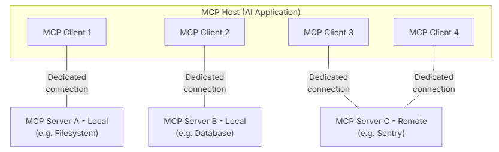

# 11.2.1 MCP

**MCP** (**M**odel **C**ontext **P**rotocol) 是由 Anthropic 推出的开放标准，用于便捷的将AI应用连接外部系统。

在没有MCP的时候，必须手动定义工具，用工具实现文件操作、web搜索、查询航班、查询天气等功能，从而让AI连接外部系统。

这就存在两个问题：

- 不同Agent可能有同样的tool需求，每次都重复定义，复用性差
- 全世界有各种不同的服务，不同服务接口不同，定义Tool非常麻烦

MCP就像是AI世界的USB接口协议：

- 所有外部服务提供者都可以遵循MCP协议提供Tool，分享自己的Tool服务
- AI应用基于MCP协议对接任意遵循MCP的外部服务，无需自己定义Tool

这样一来就解决了重复定义工具的复用性问题、以及对接全世界各种公共服务的问题。

## 1、MCP核心概念

在MCP中有三个核心概念：

| 概念           | 说明                                                       |
| :------------- | :--------------------------------------------------------- |
| **MCP Server** | 提供MCP服务的应用，可以是远程服务，也可以是本地服务        |
| **MCP Client** | 连接到MCP服务器，读取MCP信息（特别是Tool信息），供Host使用 |
| **MCP Host**   | 协调和管理多个MCP Client的AI应用，比如LangChain的Agent     |

例如，一个AI应用，也就是MCP Host，它需要三个功能：

- 文件操作
- 数据库操作
- Sentry远程服务

此时，它可以定义3个不通的MCP Client，分别对接3个MCP Server，包含一个操作本地文件的MCP、一个访问数据库的MCP、一个访问Sentry服务的MCP

MCP Client 与 MCP Server之间有两种通信协议：

- stdio
- streamable_http

stdio就是标准输入输出，MCP Client运行时，分两种情况：

- 外部服务：Client会把这个MCP服务的脚本下载到本地，然后作为一个子进程运行。
- 本地服务：Client会把本地脚本直接加载，作为一个子进程运行

也就是说，stdio模式中，MCP Client 和 MCP Server之间的通信就是进程通信，没有网络延迟。

streamable_http其实就是可以用event stream来发送数据的http模式，本质还是Server Event Stream，也就是SSE。也就是说MCP client通过发送http请求与MCP server交互。因此存在一定的网络延迟。

详细的MCP说明可以参考Anthropic公司的MCP官方文档：

https://modelcontextprotocol.io/docs/getting-started/intro

有关通信协议可以查看：

https://modelcontextprotocol.io/specification/2025-11-25/basic/transports

LangChain本身实现了对MCP的支持，本节我们就来学习如何在LangChain中使用MCP

