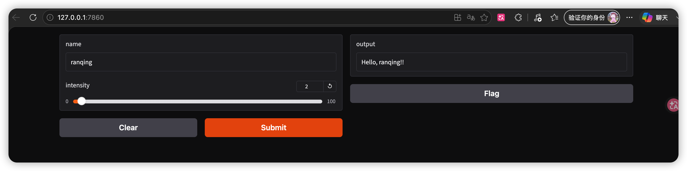
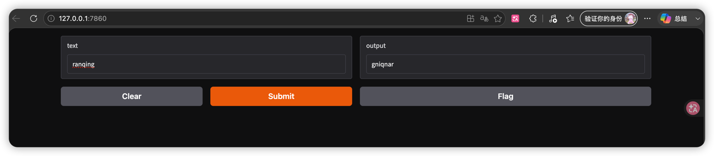
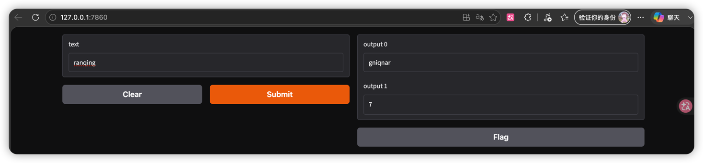
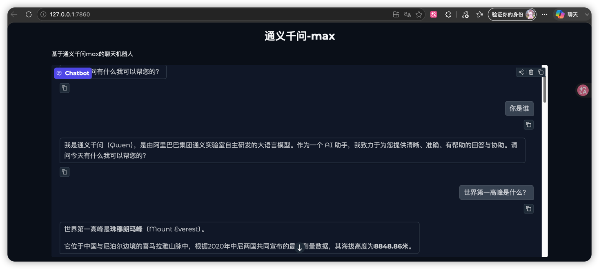

# 11.2.1.1 Gradio工具

官网地址：https://gradio.app/

## 1、案例1

```python
# author：Ran Qing
# date：2026/7/5 19:54
import os

os.environ["NO_PROXY"] = "localhost,127.0.0.1"
os.environ["no_proxy"] = "localhost,127.0.0.1"

os.environ["HTTP_PROXY"] = ""
os.environ["HTTPS_PROXY"] = ""
os.environ["ALL_PROXY"] = ""
import gradio as gr

def greet(name, intensity):
    return "Hello, " + name + "!" * int(intensity)

demo = gr.Interface(
    fn=greet,
    inputs=["text", "slider"],
    outputs=["text"],
    api_name="predict"
)

demo.launch(
    server_name="127.0.0.1",
    server_port=7860
)
```

效果：



## 2、案例2

一个接收文本输入并返回改文本倒序输出的应用

```python
# author：Ran Qing
# date：2026/7/5 19:54
import os

os.environ["NO_PROXY"] = "localhost,127.0.0.1"
os.environ["no_proxy"] = "localhost,127.0.0.1"

os.environ["HTTP_PROXY"] = ""
os.environ["HTTPS_PROXY"] = ""
os.environ["ALL_PROXY"] = ""
import gradio as gr

# 功能实现
def reverse_text(text):
    return text[::-1]

demo = gr.Interface(
    fn=reverse_text, # 调用reverse_text函数
    inputs=["text"], #输入组件类型为文本
    outputs=["text"] # 输出组件类型为文本
)

demo.launch(
    server_name="127.0.0.1",
    server_port=7860
)
```

效果：



## 3、案例3

```python
# author：Ran Qing
# date：2026/7/5 19:54
import os

os.environ["NO_PROXY"] = "localhost,127.0.0.1"
os.environ["no_proxy"] = "localhost,127.0.0.1"

os.environ["HTTP_PROXY"] = ""
os.environ["HTTPS_PROXY"] = ""
os.environ["ALL_PROXY"] = ""
import gradio as gr

# 功能实现
def reverse_and_count(text):
    reversed_text= text[::-1]
    length=len(text)
    return reversed_text,length

demo = gr.Interface(
    fn=reverse_and_count,
    inputs=["text"],
    outputs=["text","number"] # 第一个输出是文本，第二个输出是一个数字
)

demo.launch(
    server_name="127.0.0.1",
    server_port=7860
)
```

效果：



## 4、案例4-实战案例

```python
# author：Ran Qing
# date：2026/7/5 19:54
import os
import gradio as gr
from dotenv import load_dotenv
from openai import OpenAI

load_dotenv()
api_key=os.getenv("DASHSCOPE_API_KEY")
base_url=os.getenv("DASHSCOPE_BASE_URL")

os.environ["NO_PROXY"] = "localhost,127.0.0.1"
os.environ["no_proxy"] = "localhost,127.0.0.1"

os.environ["HTTP_PROXY"] = ""
os.environ["HTTPS_PROXY"] = ""
os.environ["ALL_PROXY"] = ""

# 定义一个函数，用于调用通义千问max模型生成回复
def call_qwen(message,history):
    """
    调用通义千问max模型的函数

    参数：
        message(str)：用户当前输入的消息内容
        history(list)：聊天历史记录，支持两种格式
            - 格式1:（用户消息，助手回复）
            - 格式2：({"role":"user","content":"消息内容"},...) - 字典列表形式

    返回：
        str：模型生成的回复内容，如果发生错误则返回格式化的错误信息

    功能说明：
        1. 验证API密钥是否存在，确保服务可用性
        2. 创建OpenAI客户端，配置DashScope的兼容模式API端点
        3. 构建包含历史对话和当前消息的完整消息列表，维护对话上下文
        4. 处理不同格式的历史消息，确保兼容性
        5. 调用通义千问模型qwen-max生成回复
        6. 捕获并处理可能的异常，返回友好的错误信息

    错误处理：
        - API密钥不存在：返回错误提示，指导用户设置环境变量
        - 历史记录格式错误：尝试多种格式解析，出错时记录日志但不中断执行
        - API调用失败：返回原始错误信息，便于调试
    """
    if not api_key:
        return "错误：未设置DASHSCOPE_API_KEY环境变量，请设置后重试"

    client = OpenAI(
        api_key=api_key,
        base_url=base_url,
    )
    messages=[]

    if history:
        try:
            for msg in history:
                if isinstance(msg,dict) and 'role' in msg and 'content' in msg:
                    messages.append(msg)
                elif isinstance(msg,(list,tuple)) and len(msg)==2:
                    user_msg,assistant_msg=msg
                    messages.append({"role":"user","content":user_msg})
                    messages.append({"role":"assistant","content":assistant_msg})
        except Exception as e:
            print(f"处理历史记录时出错：{e}")

    messages.append({"role":"user","content":message})

    try:
        response = client.chat.completions.create(
            model="qwen3.7-plus",
            messages=messages,
            stream=False
        )
        return response.choices[0].message.content
    except Exception as e:
        return "Error: "+str(e)

demo=gr.ChatInterface(
    fn=call_qwen, # 指定处理聊天消息的回调函数，将调用通义千问API
    title="通义千问-max", # 界面标题
    description="基于通义千问max的聊天机器人" ,# 界面描述
    # 示例问题列表，供用户快速体验
    examples=[
        ["你好"],
        ["你叫什么名字？"],
        ["给我讲一个笑话呗"]
    ]

)

if __name__ == '__main__':
    demo.launch(
        theme=gr.themes.Soft(),
        server_name="127.0.0.1",
        server_port=7860
    )
```

效果：

