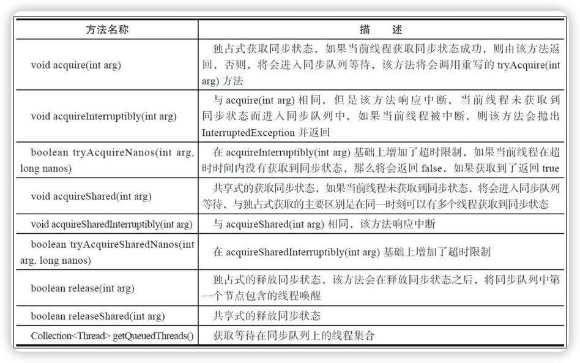
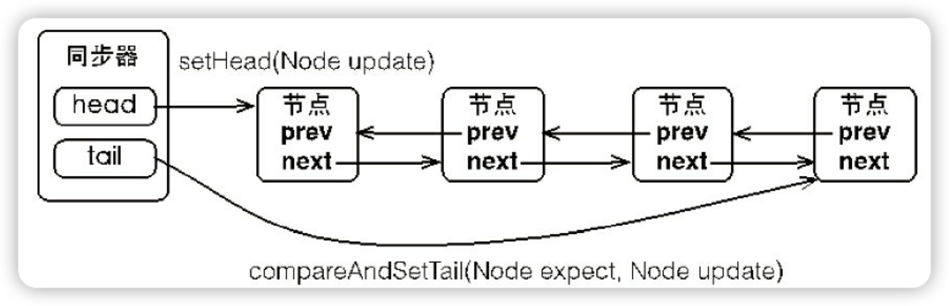
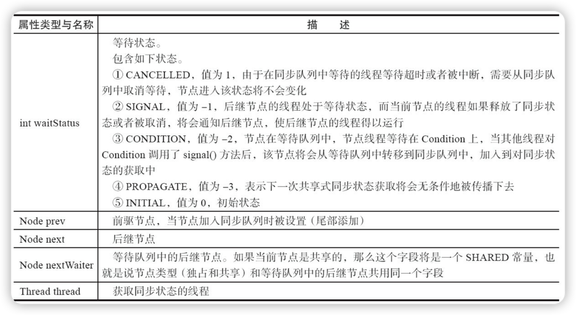
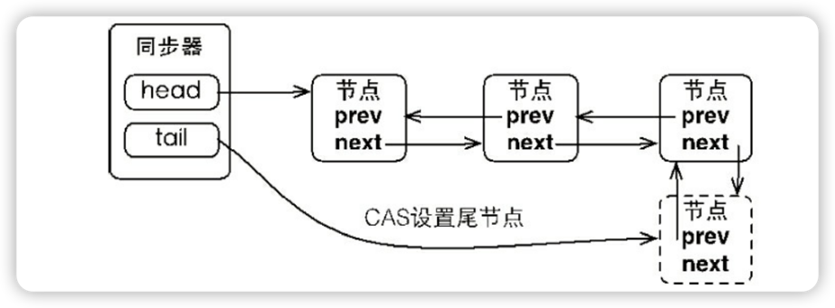
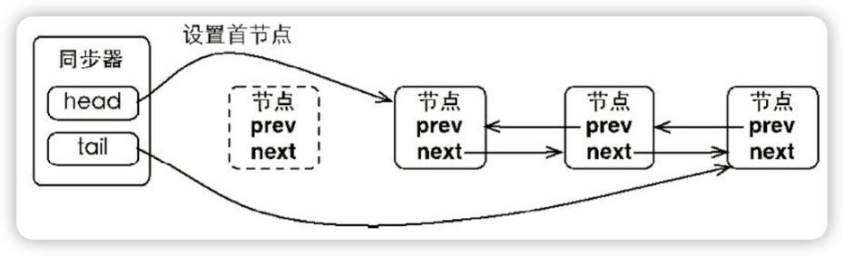
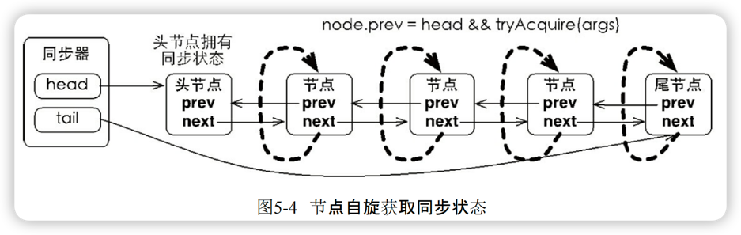
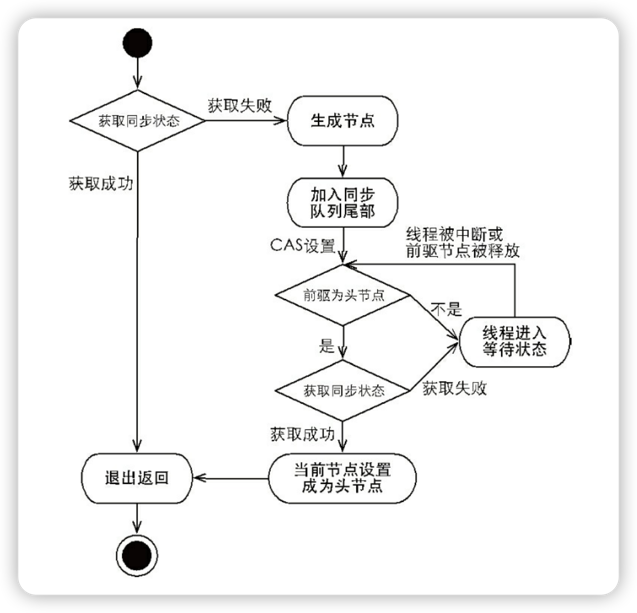
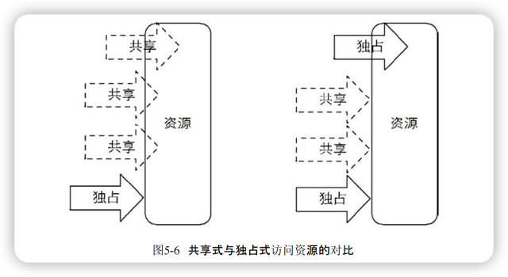
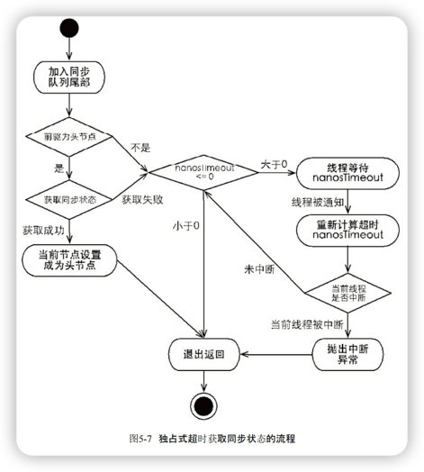

# 4.5.2 队列同步器

队列同步器（AbstractQueuedSynchronizer）简称AQS，是用来构建锁或者其他同步组件的基础框架，它使用了一个int成员变量表示同步状态，通过内置FIFO队列来完成资源获取线程的排队工作。

同步器的主要使用方式是继承，子类通过继承同步器并实现它的抽象方法来管理同步状态，抽象方法实现的过程中免不了要对同步状态进行更改，这时就需要同步器AbstractQueuedSynchronizer提供的3个方法进行操作，因为它们能够保证状态的改变是安全的：

- getState()
- setState(int newState)
- compareAndSetState(int expect,int update)

同步器即可以支持独占式地获取同步状态，也可以支持共享式地获取同步状态，它的实现有

- ReentrantLock
- ReentrantReadWriteLock
- CountDownLatch
- Semaphore
- CyclicBarrier

## 一、AQS的接口与示例

AQS的设计是基于[模板方法](https://ranqingisfine.github.io/myBlog/%E4%B8%89%E3%80%81%E8%AE%BE%E8%AE%A1%E6%A8%A1%E5%BC%8F/3.6%20%E6%A8%A1%E6%9D%BF%E6%96%B9%E6%B3%95%E6%A8%A1%E5%BC%8F.html)的，也就是说，使用者需要继承同步器并重写指定的方法，随后将同步器组合在自定义同步组件的实现中，并调用同步器提供的模板方法，而这些模板方法将会调用使用者重写的方法。

重写同步器指定的方法时，需要使用同步器提供的如下3个方法来访问或修改同步状态

- getState()：获取当前同步状态
- setState(int newState)：设置当前同步状态
- compareAndSetState(int expect,int update)：使用CAS设置当前状态，该方法能够保证状态设置的原子性

理解一波儿：简单说就是自己使用AQS来实现锁的话，需要重写同步器里面**可重写的方法**（重写的时候可以通过上面3个方法来修改同步器的状态），锁调用的时候要调用AQS提供的**模板方法**。

**独占锁**：同一时刻只能有一个线程获取到锁，而其他获取锁的线程只能处于同步队列中等待，只有获取锁的线程释放了锁，后继的线程才能获取锁。比如写锁、ReentrantLock等互斥锁

**共享锁**：允许多个线程同时获取锁，比如读锁。

表：同步器可重写的方法

| 方法名称                                   | 描述                                                         |
| ------------------------------------------ | ------------------------------------------------------------ |
| potected boolean tryAcquire(int arg)       | 独占式获取同步状态，实现该方法需要查询当前状态并判断同步状态是否符合预期，然后再进行CAS设置同步状态。（arg：线程试图获取的资源数量） |
| potected boolean tryRelease(int arg)       | 独占式释放同步状态，等待获取同步状态的线程将有机会获取同步状态 |
| potected int tryAcquireShared(int arg)     | 共享式获取同步状态，返回大于等于0的值，表示获取成功，反之获取失败 |
| potected boolean tryReleaseShared(int arg) | 共享式释放同步状态                                           |
| potected boolean isHeldExclusively()       | 当前同步器是否在独占模式下被线程占用，一般该方法表示是否被当前线程所独占 |

同步器可重写的方法可归纳为独占式和共享式。

表：同步器提供的模板方法



AQS提供的模板方法基本上分为3类：

- 独占式获取与释放同步状态
- 共享式获取与释放同步状态
- 查询同步队列中的等待线程情况

下面是基于AQS实现独占锁的示例：

```java
/**
 * @Author Ran Qing
 * @Date 2024/11/26 10:00
 */
public class Mutex implements Lock {

    @Override
    public void lock() {
      //如果当前线程获取同步状态成功，则由该方法返回，否则，将会进入同步队列等待，该方法将会调用tryAcquire(int arg)方法。
        sync.acquire(1);
    }

    @Override
    public void lockInterruptibly() throws InterruptedException {
        sync.acquireInterruptibly(1);
    }

    @Override
    public boolean tryLock() {
        return sync.tryAcquire(1);
    }

    @Override
    public boolean tryLock(long time, TimeUnit unit) throws InterruptedException {
        return sync.tryAcquireNanos(1,unit.toNanos(time));
    }

    @Override
    public void unlock() {
        sync.release(1);
    }

    @Override
    public Condition newCondition() {
        return sync.newCondition();
    }

    private static class Sync extends AbstractQueuedSynchronizer{
        //当状态为0的时候获取锁
        @Override
        protected boolean tryAcquire(int acquires) {
          //如果cas设置成功，同步状态设置为1
            if (compareAndSetState(0,1)){
                setExclusiveOwnerThread(Thread.currentThread());
                return true;
            }
            return false;
        }
        //释放锁，将状态设置为0
        @Override
        protected boolean tryRelease(int arg) {
            if (getState()==0){
                throw new IllegalMonitorStateException(null);
            }
            setExclusiveOwnerThread(null);
          //释放锁，同步状态设置为0
            setState(0);
            return true;
        }
        //是否处于占用状态
        @Override
        protected boolean isHeldExclusively() {
            return getState()==1;
        }
        //返回一个Condition，每个condition都包含了一个condition队列
        Condition newCondition(){
            return new ConditionObject();
        }
    }
    //需要将操作代理到Sync上即可
    private final Sync sync=new Sync();
    
}
```

看了ReentrantLock源码，它的实现结构和这个是一样的。

## 二、队列同步器的实现分析

同步器是如何完成线程同步的，主要包括**同步队列**，**独占式同步状态获取与释放**，**共享式同步状态获取与释放**，**超时获取同步状态**等同步器的核心数据结构与模板方法。

### 1、同步队列

当前线程获取同步状态失败时，同步器会将**当前线程以及等待状态**等信息构造成为一个节点（Node）并将其加入同步队列，同时会阻塞当前线程，当同步状态释放时，会把首节点中的线程唤醒使其再次尝试获取同步状态。所以同步器依赖内部的同步队列（一个FIFO双向队列）。



同步队列中的节点（Node）属性如下图：



节点是构成同步队列的基础，同步器拥有首节点（head）和尾节点（tail），没有成功获取同步状态的线程将会成为节点加入该队列的尾部。

因为同步器包含头节点和尾节点的引用，试想一下，当一个线程成功地获取了同步状态（或者锁），其它线程将无法获取到同步状态，转而被构造成为节点并加入到同步队列中，而这个加入队列的过程必须要保证线程安全，因此同步器提供了一个基于CAS的设置尾节点的方法：`compareAndSetTail(Node expect,Node update)`，它需要传递当前线程“认为”的尾节点和当前节点，只有设置成功后，当前节点猜正式与之前的尾节点建立关联。同步器将节点加入到同步队列的过程如图：



同步队列遵循FIFO，首节点是获取同步状态成功的节点，首节点的线程在释放同步状态时，将会唤醒后继节点，而后继节点将会在获取同步状态成功时将自己设置为首节点，该过程如下：



因为首节点是通过获取同步状态成功的线程来完成的，由于只有一个线程能够成功获取到同步状态，因此设置头节点的方法并不需要使用CAS来保证，它只需要将首节点设置成为原首节点的后继节点并断开原首节点的next引用即可。

**注意**：AQS使用的是更高效的方式 `LockSupport.park()` 和 `LockSupport.unpark()` 方法来挂起和唤醒线程，然后线程节点再自旋检查自己是否为头节点和获取同步状态。

### 2、独占式同步状态获取与释放

通过调用同步器的模板方法`acquire(int arg)`方法可以获取同步状态，该方法**对中断不敏感**。理解：线程进入等待状态被中断，acquireQueued该线程在节点自旋的时候检查到中断会取消节点。

```java
//作用：完成同步状态获取、节点构造、加入同步队列以及在同步队列中自旋等待的相关工作
//Node.EXCLUSIVE：同一时刻只能有一个线程成功获取同步状态
public final void acquire(int arg) {
        if (!tryAcquire(arg) &&
            acquireQueued(addWaiter(Node.EXCLUSIVE), arg))
            selfInterrupt();
    }
```

主要逻辑：

- 首先调用自定义同步器实现的tryAcquire(int arg)方法，该方法保证线程安全的获取同步状态
- 如果同步状态获取失败，则构造同步节点并通过addWaiter(Node node)方法将该节点加入到同步队列的尾部。
- 最后调用acquireQueued(Node node,int arg)方法，使得该节点以**死循环**（相当于该线程就一直被循环阻塞）的方式获取同步状态。如果获取不到则阻塞节点中的线程，而被阻塞线程的唤醒主要依靠前驱节点的出队或阻塞线程被中断来实现。

同步器`addWaiter和enq方法`

```java
    private Node addWaiter(Node mode) {
        Node node = new Node(Thread.currentThread(), mode);
        // 快速尝试在尾部添加
        Node pred = tail;
        if (pred != null) {
            node.prev = pred;
          //compareAndSetTail确保节点能够被线程安全添加。
            if (compareAndSetTail(pred, node)) {
                pred.next = node;
                return node;
            }
        }
        enq(node);
        return node;
    }
    private Node enq(final Node node) {
      //通过死循环来保证节点的正确添加
        for (;;) {
            Node t = tail;
            if (t == null) { // Must initialize
                if (compareAndSetHead(new Node()))
                    tail = head;
            } else {
                node.prev = t;
                if (compareAndSetTail(t, node)) {
                    t.next = node;
                    return t;
                }
            }
        }
    }
```

节点进入同步队列后，就进入了一个自旋的过程，每个节点（或者说每个线程）都在自省地观察，当条件满足，获取到了同步状态，就可以从这个自旋过程中退出，否则依旧留在这个自旋过程中（并会阻塞节点的线程）。

**有个问题，线程在自旋的过程中是如何按照FIFO顺序进行的**

```java
    final boolean acquireQueued(final Node node, int arg) {
        boolean failed = true;
        try {
            boolean interrupted = false;
            for (;;) {
                final Node p = node.predecessor();
              //如果当前节点是头节点，才能获取到同步状态
                if (p == head && tryAcquire(arg)) {
                  //设置当前节点为头节点
                    setHead(node);
                    p.next = null; // help GC，方便回收
                    failed = false;
                    return interrupted;
                }
              //如果当前节点被中断，也会从等待中返回
                if (shouldParkAfterFailedAcquire(p, node) &&
                    parkAndCheckInterrupt())
                    interrupted = true;
            }
        } finally {
          //当前节点中断，移除该节点
            if (failed)
                cancelAcquire(node);
        }
    }
```

在acquireQueued中，当前线程在“死循环”中尝试获取同步状态，而只有前驱节点是头节点才能够尝试获取同步状态，原因：

- 头节点是成功获取到同步状态的节点，而头节点释放了同步状态之后，将会唤醒其后继线程，后继节点的线程被唤醒后需要检查自己的前驱节点是否是头节点，如果是则获取同步状态
- 维护同步队列FIFO原则，该方法中自旋获取同步状态的行为如图：



可以看到节点和节点之间基本不互相通信，而是简单地判断自己的前驱是否为头节点，这使得节点的释放规则符合FIFO，也便于对过早通知的处理（过早通知是指前驱节点不是头节点的线程由于中断而被唤醒）。

独占式同步状态获取流程，也就是acquire(int arg)方法调用流程如图：



注意：线程进入等待状态被中断，acquireQueued该线程在节点自旋的时候检查到中断会取消节点。

当前线程获取同步状态并执行了相应逻辑之后，就需要释放同步状态，使得后续节点能够继续获取同步状态。通过调用同步器的release(int arg)方法可以释放同步状态，该方法释放了同步状态之后，会唤醒其后继节点（进而后继节点重新尝试获取同步状态），该方法的代码如下：

```java
    public final boolean release(int arg) {
        if (tryRelease(arg)) {
            Node h = head;
            if (h != null && h.waitStatus != 0)
                unparkSuccessor(h);
            return true;
        }
        return false;
    }
```

该方法执行时，会唤醒头节点的后继节点线程，unparkSuccessor(Node node)方法使用LockSupport来唤醒处于等待状态的线程。

**独占式同步状态获取和释放总结**：在获取同步状态时，同步器维护了一个同步队列，获取状态失败的线程都会被加入到队列中并在队列中进行自旋；移除队列（或停止自旋）的条件时前驱节点为头节点且成功获取了同步状态。在释放同步状态时，同步器调用`tryRelease(int arg)`方法释放同步状态，然后唤醒头节点的后继节点。

### 3、共享式同步状态获取与释放

共享式获取与独占式获取最主要的区别在于同一时刻能否有多个线程同时获取到同步状态。

以文件的读写为例，如果一个程序在对文件进行读操作，那么这一时刻对于该文件的写操作均被阻塞，而读操作能够同时进行。写操作要求对资源独占式访问，而读操作可以共享式访问。如下图：



通过调用同步器的`acquireShared(int arg)`方法可以共享式获取同步状态，代码如下：

```java
public final void acquireShared(int arg) {
  //tryAcquireShared(arg)作用：尝试获取同步状态，返回值大于等于0时，表示能获取到同步状态；小于0则需要添加到同步队列里等待
        if (tryAcquireShared(arg) < 0)
            doAcquireShared(arg);
    }

private void doAcquireShared(int arg) {
        final Node node = addWaiter(Node.SHARED);
        boolean failed = true;
        try {
            boolean interrupted = false;
          //自旋
            for (;;) {
                final Node p = node.predecessor();
              //如果当前节点的前驱为头节点时，尝试获取同步状态
                if (p == head) {
                  //尝试获取同步状态如果返回值大于等于0，表示该次获取同步状态成功并从自旋过程中退出
                    int r = tryAcquireShared(arg);
                    if (r >= 0) {
                        setHeadAndPropagate(node, r);
                        p.next = null; // help GC
                        if (interrupted)
                            selfInterrupt();
                        failed = false;
                        return;
                    }
                }
                if (shouldParkAfterFailedAcquire(p, node) &&
                    parkAndCheckInterrupt())
                    interrupted = true;
            }
        } finally {
            if (failed)
                cancelAcquire(node);
        }
    }
```

共享式获取同步状态也是通过FIFO双向队列数据结构进行的。

与独占式一样，共享式获取也需要释放同步状态，通过调用`releaseShared(int arg)`方法可以释放同步状态，代码入下：

```java
    public final boolean releaseShared(int arg) {
        if (tryReleaseShared(arg)) {
            doReleaseShared();
            return true;
        }
        return false;
    }
```

该方法在释放同步状态后，将会唤醒后续处于等待状态的节点。对于能够支持多个线程同时访问的并发组件（比如Semaphore），它和独占式主要区别在于`tryReleaseShared(int arg)`方法必须确保同步状态（或者资源数）线程安全释放，一般是通过循环和CAS来保证的，因为释放同步状态的操作会同时来自多个线程。

### 4、独占式超时获取同步状态

通过调用同步器的`doAcquireNanos(int arg, long nanosTimeout)`方法可以超时获取同步状态。即在指定时间内获取同步状态，如果获取到同步状态则返回true，否则，返回false。该方法提供了传统Java同步操作（比如Synchronized）所不具备的特性。

在分析该方法的实现之前，先了解下响应中断的同步状态获取过程。当一个线程获取不到锁而被阻塞在synchronized之外时，对该线程进行中断操作，此时线程的中断标志位会被修改，但线程依旧会阻塞在synchronized上，等待着获取锁。而同步器提供了`acquireInterruptibly(int arg)`方法，这个方法在等待获取同步状态时，如果当前线程被中断，会立刻返回，并抛出`InterruptedException`。

```java
private boolean doAcquireNanos(int arg, long nanosTimeout)
            throws InterruptedException {
        if (nanosTimeout <= 0L)
            return false;
  			//计算最终时间
        final long deadline = System.nanoTime() + nanosTimeout;
        final Node node = addWaiter(Node.EXCLUSIVE);
        boolean failed = true;
        try {
          //自旋
            for (;;) {
                final Node p = node.predecessor();
              //当节点的前驱节点为头节点并尝试获取同步状态
                if (p == head && tryAcquire(arg)) {
                    setHead(node);
                    p.next = null; // help GC
                    failed = false;
                    return true;
                }
              //如果当前获取同步状态失败，则判断是否超时
                nanosTimeout = deadline - System.nanoTime();
              //超时时间到了仍没获取到锁，返回false
                if (nanosTimeout <= 0L)
                    return false;
                if (shouldParkAfterFailedAcquire(p, node) &&
                    nanosTimeout > spinForTimeoutThreshold)
                  	//让线程还应当睡眠nanosTimeout
                    LockSupport.parkNanos(this, nanosTimeout);
                if (Thread.interrupted())
                    throw new InterruptedException();
            }
        } finally {
            if (failed)
                cancelAcquire(node);
        }
    }
```

如果`nanosTimeout`小于等于`spinForTimeoutThreshold`（1000纳秒）时将不会使该线程进行超时等待，而是进入快速的自旋。原因在于，非常短的超时等待无法做到十分精确，如果这时再进行超时等待，相反会让`nanosTimeout`的超时从整体上表现得反而不精确。因此在超时非常短的场景下，同步器会进入无条件的快速自旋。

独占式超时获取同步状态的流程图如下：



### 5、练习：自定义同步组件-TwinsLock

通过上面AQS的学习，编写一个自定义同步组件来加深对AQS的理解。

设计一个同步工具：该工具在同一时刻，只允许至多两个线程同时访问，超过两个线程的访问将被阻塞，我们将这个同步工具命名为TwinsLock。

思路：

- 首先，确定反问模式。TwinsLock能够在同一时刻支持多个线程的访问，这显然是共享式访问，因此需要使用AQS提供的`acquireShared(int args)`方法等和Share相关的方法，这就要求TwinsLock必须重写`tryAcquireShared(int args)`方法和`tryReleaseShared(int args)`方法，这样才能保证同步器的共享式同步状态的获取与释放方法得以执行。
- 其次，定义资源数。TwinsLock在同一时刻允许至多两个线程的同时访问，表明同步资源数为2，这样可以设置初始状态status为2，当一个线程进行获取，status减1，该线程释放，则status加1，状态的合法范围为0、1、2，其中0表示当前已经有两个线程获取了同步资源，此时再有其他线程对同步状态进行获取，该线程只能被阻塞，在同步状态变更时需要使用`compareAndSet(int expect,int update)`方法做原子性保障。
- 最后，组合自定义同步器。

```java
public class TwinsLock implements Lock {
    private static final class Sync extends AbstractQueuedSynchronizer{
        Sync(int count){
            if (count < 0){
                throw new IllegalArgumentException("count must large than zero");
            }
            setState(count);
        }

        //返回值大于等于0则表示获取成功，反之则失败
        //线程试图获取的资源数量或信号量的数量
        @Override
        protected int tryAcquireShared(int reduceCount) {
            for (;;){
                int current = getState();
                int newCount=current-reduceCount;
                //用CAS进行同步状态变更
                if (newCount <0 || compareAndSetState(current,newCount)){
                    return newCount;
                }
            }
        }

        //returnCount表示要释放的资源数量或信号量
        @Override
        protected boolean tryReleaseShared(int returnCount) {
            for (;;){
                int count=getState();
                int newCount=count+returnCount;
                if (compareAndSetState(count,newCount)){
                    return true;
                }
            }
        }
    }

    private final Sync sync=new Sync(2);
    @Override
    public void lock() {
        sync.acquireShared(1);
    }
    

    @Override
    public void unlock() {
        sync.releaseShared(1);
    }
    
}
```

上述示例中，TwinsLock实现了Lock接口，提供了面向使用者的借口，使用者调用lock()方法获取锁，随后调用unlock()方法释放锁，而同一时刻只能有两个线程同时获取到锁。TwinsLock同时包含了一个自定义同步器Sync，而该同步器面向线程访问和同步状态控制。以共享式获取同步状态为例：同步器会先计算出获取后的同步状态，然后通过CAS确保状态的正确设置，当`tryAcquireShared(int reduceCount)`方法返回值大于等于0时，当前线程才获取同步状态，对于上层的TwinsLock而言，则表示当前线程获得了锁。

这里看到共享式同步状态状态获取和释放里面用了死循环，下面是原因：

- **死循环的优势**：使用死循环可以简化逻辑，减少不必要的入队操作，并且在高并发环境下更高效。
- **不使用死循环的实现**：如果不使用死循环，可以在 CAS 失败时将线程加入同步队列，并通过自旋循环继续尝试获取同步状态。这种方式增加了代码的复杂性，但也是可行的。


